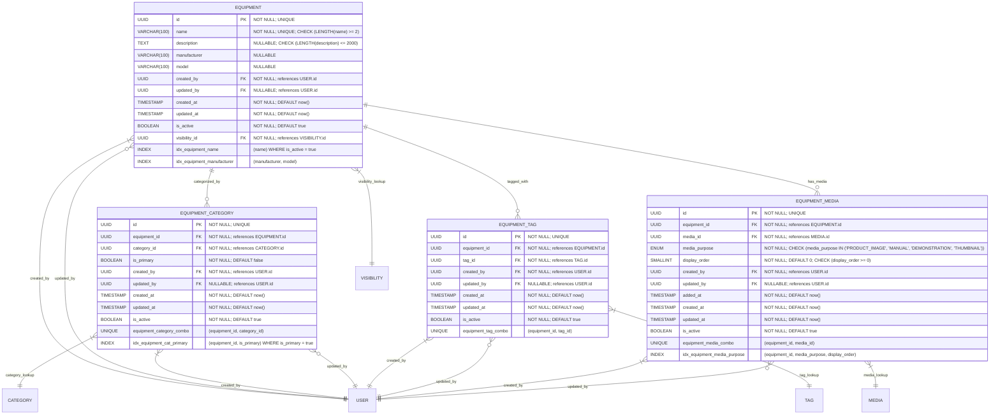

# Equipment Management
**Domain:** Equipment
**Layer:** Core

```mermaid
erDiagram
  EQUIPMENT {
    UUID id PK                        "NOT NULL; UNIQUE"
    VARCHAR(100) name                 "NOT NULL; UNIQUE; CHECK (LENGTH(name) >= 2)"
    TEXT description                  "NULLABLE; CHECK (LENGTH(description) <= 2000)"
    VARCHAR(100) manufacturer         "NULLABLE"
    VARCHAR(100) model                "NULLABLE"
    UUID created_by FK                "NOT NULL; references USER.id"
    UUID updated_by FK                "NULLABLE; references USER.id"
    TIMESTAMP created_at              "NOT NULL; DEFAULT now()"
    TIMESTAMP updated_at              "NOT NULL; DEFAULT now()"
    BOOLEAN is_active                 "NOT NULL; DEFAULT true"
    UUID visibility_id FK             "NOT NULL; references VISIBILITY.id"
    INDEX idx_equipment_name          "(name) WHERE is_active = true"
    INDEX idx_equipment_manufacturer  "(manufacturer, model)"
  }
  
  EQUIPMENT_CATEGORY {
    UUID id PK                        "NOT NULL; UNIQUE"
    UUID equipment_id FK              "NOT NULL; references EQUIPMENT.id"
    UUID category_id FK               "NOT NULL; references CATEGORY.id"
    BOOLEAN is_primary                "NOT NULL; DEFAULT false"
    UUID created_by FK                "NOT NULL; references USER.id"
    UUID updated_by FK                "NULLABLE; references USER.id"
    TIMESTAMP created_at              "NOT NULL; DEFAULT now()"
    TIMESTAMP updated_at              "NOT NULL; DEFAULT now()"
    BOOLEAN is_active                 "NOT NULL; DEFAULT true"
    UNIQUE equipment_category_combo   "(equipment_id, category_id)"
    INDEX idx_equipment_cat_primary   "(equipment_id, is_primary) WHERE is_primary = true"
  }
  
  EQUIPMENT_TAG {
    UUID id PK                        "NOT NULL; UNIQUE"
    UUID equipment_id FK              "NOT NULL; references EQUIPMENT.id"
    UUID tag_id FK                    "NOT NULL; references TAG.id"
    UUID created_by FK                "NOT NULL; references USER.id"
    UUID updated_by FK                "NULLABLE; references USER.id"
    TIMESTAMP created_at              "NOT NULL; DEFAULT now()"
    TIMESTAMP updated_at              "NOT NULL; DEFAULT now()"
    BOOLEAN is_active                 "NOT NULL; DEFAULT true"
    UNIQUE equipment_tag_combo        "(equipment_id, tag_id)"
  }
  
  EQUIPMENT_MEDIA {
    UUID id PK                        "NOT NULL; UNIQUE"
    UUID equipment_id FK              "NOT NULL; references EQUIPMENT.id"
    UUID media_id FK                  "NOT NULL; references MEDIA.id"
    ENUM media_purpose                "NOT NULL; CHECK (media_purpose IN ('PRODUCT_IMAGE', 'MANUAL', 'DEMONSTRATION', 'THUMBNAIL'))"
    SMALLINT display_order            "NOT NULL; DEFAULT 0; CHECK (display_order >= 0)"
    UUID created_by FK                "NOT NULL; references USER.id"
    UUID updated_by FK                "NULLABLE; references USER.id"
    TIMESTAMP added_at                "NOT NULL; DEFAULT now()"
    TIMESTAMP created_at              "NOT NULL; DEFAULT now()"
    TIMESTAMP updated_at              "NOT NULL; DEFAULT now()"
    BOOLEAN is_active                 "NOT NULL; DEFAULT true"
    UNIQUE equipment_media_combo      "(equipment_id, media_id)"
    INDEX idx_equipment_media_purpose "(equipment_id, media_purpose, display_order)"
  }

  EQUIPMENT }|--|| VISIBILITY : "visibility_lookup"
  EQUIPMENT ||--o{ EQUIPMENT_CATEGORY : "categorized_by"
  EQUIPMENT ||--o{ EQUIPMENT_TAG : "tagged_with"
  EQUIPMENT ||--o{ EQUIPMENT_MEDIA : "has_media"
  EQUIPMENT_CATEGORY }|--|| CATEGORY : "category_lookup"
  EQUIPMENT_TAG }|--|| TAG : "tag_lookup"
  EQUIPMENT_MEDIA }|--|| MEDIA : "media_lookup"
  EQUIPMENT }|--|| USER : "created_by"
  EQUIPMENT }o--|| USER : "updated_by"
  EQUIPMENT_CATEGORY }|--|| USER : "created_by"
  EQUIPMENT_CATEGORY }o--|| USER : "updated_by"
  EQUIPMENT_TAG }|--|| USER : "created_by"
  EQUIPMENT_TAG }o--|| USER : "updated_by"
  EQUIPMENT_MEDIA }|--|| USER : "created_by"
  EQUIPMENT_MEDIA }o--|| USER : "updated_by"
```