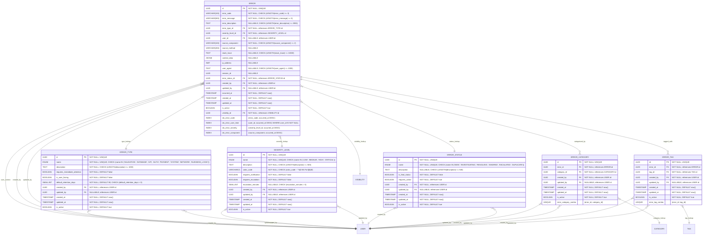

# Error Handling & Monitoring
**Domain:** Error
**Layer:** Core

```mermaid
erDiagram
  ERROR {
    UUID id PK                        "NOT NULL; UNIQUE"
    VARCHAR(100) error_code           "NOT NULL; CHECK (LENGTH(error_code) >= 3)"
    VARCHAR(500) error_message        "NOT NULL; CHECK (LENGTH(error_message) >= 5)"
    TEXT error_description            "NULLABLE; CHECK (LENGTH(error_description) <= 2000)"
    UUID error_type_id FK             "NOT NULL; references ERROR_TYPE.id"
    UUID severity_level_id FK         "NOT NULL; references SEVERITY_LEVEL.id"
    UUID user_id FK                   "NULLABLE; references USER.id"
    VARCHAR(100) source_component     "NOT NULL; CHECK (LENGTH(source_component) >= 2)"
    VARCHAR(200) source_method        "NULLABLE"
    TEXT stack_trace                  "NULLABLE; CHECK (LENGTH(stack_trace) <= 10000)"
    JSONB context_data                "NULLABLE"
    INET ip_address                   "NULLABLE"
    TEXT user_agent                   "NULLABLE; CHECK (LENGTH(user_agent) <= 1000)"
    UUID session_id                   "NULLABLE"
    UUID error_status_id FK           "NOT NULL; references ERROR_STATUS.id"
    UUID created_by FK                "NOT NULL; references USER.id"
    UUID updated_by FK                "NULLABLE; references USER.id"
    TIMESTAMP occurred_at             "NOT NULL; DEFAULT now()"
    TIMESTAMP created_at              "NOT NULL; DEFAULT now()"
    TIMESTAMP updated_at              "NOT NULL; DEFAULT now()"
    BOOLEAN is_active                 "NOT NULL; DEFAULT true"
    UUID visibility_id FK             "NOT NULL; references VISIBILITY.id"
    INDEX idx_error_code              "(error_code, occurred_at DESC)"
    INDEX idx_error_user_time         "(user_id, occurred_at DESC) WHERE user_id IS NOT NULL"
    INDEX idx_error_severity          "(severity_level_id, occurred_at DESC)"
    INDEX idx_error_component         "(source_component, occurred_at DESC)"
  }
  
  ERROR_TYPE {
    UUID id PK                        "NOT NULL; UNIQUE"
    ENUM name                         "NOT NULL; UNIQUE; CHECK (name IN ('VALIDATION', 'DATABASE', 'API', 'AUTH', 'PAYMENT', 'SYSTEM', 'NETWORK', 'BUSINESS_LOGIC'))"
    TEXT description                  "NOT NULL; CHECK (LENGTH(description) <= 1000)"
    BOOLEAN requires_immediate_attention "NOT NULL; DEFAULT false"
    BOOLEAN is_user_facing            "NOT NULL; DEFAULT false"
    SMALLINT default_retention_days   "NOT NULL; DEFAULT 90; CHECK (default_retention_days > 0)"
    UUID created_by FK                "NOT NULL; references USER.id"
    UUID updated_by FK                "NULLABLE; references USER.id"
    TIMESTAMP created_at              "NOT NULL; DEFAULT now()"
    TIMESTAMP updated_at              "NOT NULL; DEFAULT now()"
    BOOLEAN is_active                 "NOT NULL; DEFAULT true"
  }
  
  SEVERITY_LEVEL {
    UUID id PK                        "NOT NULL; UNIQUE"
    ENUM name                         "NOT NULL; UNIQUE; CHECK (name IN ('LOW', 'MEDIUM', 'HIGH', 'CRITICAL'))"
    TEXT description                  "NOT NULL; CHECK (LENGTH(description) <= 500)"
    VARCHAR(7) color_code             "NOT NULL; CHECK (color_code ~ '^#[0-9A-Fa-f]{6}$')"
    BOOLEAN requires_notification     "NOT NULL; DEFAULT false"
    BOOLEAN requires_escalation       "NOT NULL; DEFAULT false"
    SMALLINT escalation_minutes       "NULLABLE; CHECK (escalation_minutes > 0)"
    UUID created_by FK                "NOT NULL; references USER.id"
    UUID updated_by FK                "NULLABLE; references USER.id"
    TIMESTAMP created_at              "NOT NULL; DEFAULT now()"
    TIMESTAMP updated_at              "NOT NULL; DEFAULT now()"
    BOOLEAN is_active                 "NOT NULL; DEFAULT true"
  }
  
  ERROR_STATUS {
    UUID id PK                        "NOT NULL; UNIQUE"
    ENUM name                         "NOT NULL; UNIQUE; CHECK (name IN ('NEW', 'INVESTIGATING', 'RESOLVED', 'IGNORED', 'ESCALATED', 'DUPLICATE'))"
    TEXT description                  "NULLABLE; CHECK (LENGTH(description) <= 500)"
    BOOLEAN is_final_status           "NOT NULL; DEFAULT false"
    BOOLEAN requires_action           "NOT NULL; DEFAULT true"
    UUID created_by FK                "NOT NULL; references USER.id"
    UUID updated_by FK                "NULLABLE; references USER.id"
    TIMESTAMP created_at              "NOT NULL; DEFAULT now()"
    TIMESTAMP updated_at              "NOT NULL; DEFAULT now()"
    BOOLEAN is_active                 "NOT NULL; DEFAULT true"
  }
  
  ERROR_CATEGORY {
    UUID id PK                        "NOT NULL; UNIQUE"
    UUID error_id FK                  "NOT NULL; references ERROR.id"
    UUID category_id FK               "NOT NULL; references CATEGORY.id"
    UUID created_by FK                "NOT NULL; references USER.id"
    UUID updated_by FK                "NULLABLE; references USER.id"
    TIMESTAMP created_at              "NOT NULL; DEFAULT now()"
    TIMESTAMP updated_at              "NOT NULL; DEFAULT now()"
    BOOLEAN is_active                 "NOT NULL; DEFAULT true"
    UNIQUE error_category_combo       "(error_id, category_id)"
  }
  
  ERROR_TAG {
    UUID id PK                        "NOT NULL; UNIQUE"
    UUID error_id FK                  "NOT NULL; references ERROR.id"
    UUID tag_id FK                    "NOT NULL; references TAG.id"
    UUID created_by FK                "NOT NULL; references USER.id"
    UUID updated_by FK                "NULLABLE; references USER.id"
    TIMESTAMP created_at              "NOT NULL; DEFAULT now()"
    TIMESTAMP updated_at              "NOT NULL; DEFAULT now()"
    BOOLEAN is_active                 "NOT NULL; DEFAULT true"
    UNIQUE error_tag_combo            "(error_id, tag_id)"
  }

  ERROR }|--|| ERROR_TYPE : "type_lookup"
  ERROR }|--|| SEVERITY_LEVEL : "severity_lookup"
  ERROR }|--|| ERROR_STATUS : "status_lookup"
  ERROR }|--|| VISIBILITY : "visibility_lookup"
  ERROR }o--|| USER : "user_context"
  ERROR ||--o{ ERROR_CATEGORY : "categorized_by"
  ERROR ||--o{ ERROR_TAG : "tagged_with"
  ERROR_CATEGORY }|--|| CATEGORY : "category_lookup"
  ERROR_TAG }|--|| TAG : "tag_lookup"
  ERROR }|--|| USER : "created_by"
  ERROR }o--|| USER : "updated_by"
  ERROR_TYPE }|--|| USER : "created_by"
  ERROR_TYPE }o--|| USER : "updated_by"
  SEVERITY_LEVEL }|--|| USER : "created_by"
  SEVERITY_LEVEL }o--|| USER : "updated_by"
  ERROR_STATUS }|--|| USER : "created_by"
  ERROR_STATUS }o--|| USER : "updated_by"
  ERROR_CATEGORY }|--|| USER : "created_by"
  ERROR_CATEGORY }o--|| USER : "updated_by"
  ERROR_TAG }|--|| USER : "created_by"
  ERROR_TAG }o--|| USER : "updated_by"
```

