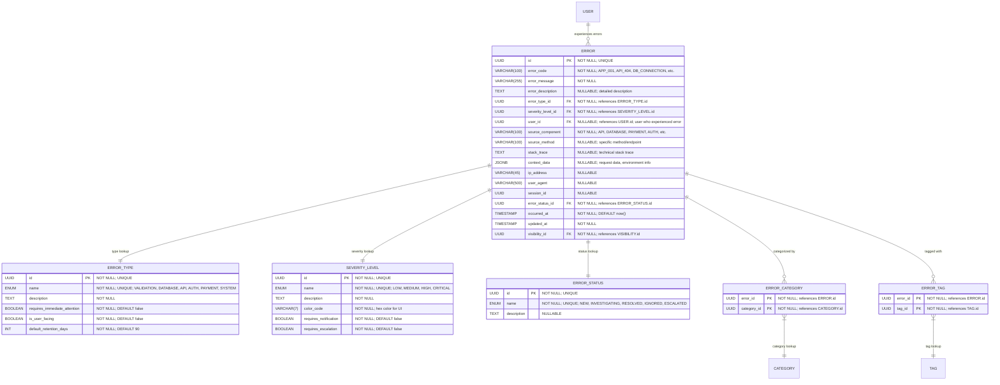

# Core "Error" Definition & Classification

**Section:** Error
**Subsection:** Core "Error" Definition & Classification

## Diagram

## Notes

This diagram represents the core "error" definition & classification structure and relationships within the error domain.

---
*Generated from diagram extraction script*
