# Error Analytics & Monitoring

**Section:** Error
**Subsection:** Error Analytics & Monitoring

## Diagram

```mermaid
erDiagram
  %%=== Layer 3: Error Analytics & Monitoring ===%%

  ERROR_FREQUENCY {
    UUID error_id PK                   "NOT NULL; references ERROR.id"
    DATE frequency_date PK             "NOT NULL"
    INT occurrence_count               "NOT NULL; DEFAULT 0"
    INT unique_users_affected          "NOT NULL; DEFAULT 0"
    INT unique_sessions_affected       "NOT NULL; DEFAULT 0"
    TIMESTAMP first_occurrence         "NOT NULL"
    TIMESTAMP last_occurrence          "NOT NULL"
    TIMESTAMP calculated_at            "NOT NULL; DEFAULT now()"
  }

  ERROR_TREND {
    UUID id PK                         "NOT NULL; UNIQUE"
    UUID error_type_id FK              "NOT NULL; references ERROR_TYPE.id"
    DATE trend_date                    "NOT NULL"
    INT total_errors                   "NOT NULL; DEFAULT 0"
    INT new_errors                     "NOT NULL; DEFAULT 0"
    INT resolved_errors                "NOT NULL; DEFAULT 0"
    FLOAT resolution_time_avg_hours    "NOT NULL; DEFAULT 0"
    FLOAT trend_direction              "NOT NULL; positive/negative trend"
    TIMESTAMP calculated_at            "NOT NULL; DEFAULT now()"
  }

  ERROR_ALERT {
    UUID id PK                         "NOT NULL; UNIQUE"
    VARCHAR(100) alert_name            "NOT NULL"
    TEXT alert_description             "NULLABLE"
    UUID error_type_id FK              "NULLABLE; references ERROR_TYPE.id; NULL = all types"
    UUID severity_level_id FK          "NULLABLE; references SEVERITY_LEVEL.id; NULL = all"
    INT threshold_count                "NOT NULL; error count threshold"
    INT threshold_time_minutes         "NOT NULL; time window for threshold"
    JSONB alert_recipients             "NOT NULL; user IDs or email addresses"
    BOOLEAN is_active                  "NOT NULL; DEFAULT true"
    TIMESTAMP last_triggered           "NULLABLE"
    TIMESTAMP created_at               "NOT NULL; DEFAULT now()"
  }

  ERROR_ALERT_TRIGGER {
    UUID id PK                         "NOT NULL; UNIQUE"
    UUID error_alert_id FK             "NOT NULL; references ERROR_ALERT.id"
    INT trigger_count                  "NOT NULL; errors that triggered alert"
    JSONB trigger_errors               "NOT NULL; array of error IDs"
    BOOLEAN alert_sent                 "NOT NULL; DEFAULT false"
    TIMESTAMP triggered_at             "NOT NULL; DEFAULT now()"
    TIMESTAMP alert_sent_at            "NULLABLE"
  }

  ERROR_EXPORT {
    UUID id PK                         "NOT NULL; UNIQUE"
    UUID requested_by FK               "NOT NULL; references USER.id"
    DATE export_start_date             "NOT NULL"
    DATE export_end_date               "NOT NULL"
    JSONB export_filters               "NULLABLE; filtering criteria"
    ENUM export_format                 "NOT NULL; CSV, JSON, PDF"
    ENUM export_scope                  "NOT NULL; ALL_ERRORS, BY_TYPE, BY_SEVERITY, UNRESOLVED"
    VARCHAR export_url                 "NULLABLE; download link"
    ENUM export_status                 "NOT NULL; REQUESTED, PROCESSING, COMPLETED, FAILED"
    TIMESTAMP requested_at             "NOT NULL; DEFAULT now()"
    TIMESTAMP completed_at             "NULLABLE"
    TIMESTAMP expires_at               "NULLABLE; when download expires"
  }

  %%— Relationships in Layer 3 —
  ERROR ||--o{ ERROR_FREQUENCY        : "frequency tracking"
  ERROR_TYPE ||--o{ ERROR_TREND       : "trend analysis"
  ERROR_TYPE ||--o{ ERROR_ALERT       : "monitored by alerts"
  SEVERITY_LEVEL ||--o{ ERROR_ALERT   : "severity-based alerts"
  ERROR_ALERT ||--o{ ERROR_ALERT_TRIGGER : "triggered instances"
  USER ||--o{ ERROR_EXPORT            : "requests exports"

```

## Notes

This diagram represents the error analytics & monitoring structure and relationships within the error domain.

---
*Generated from diagram extraction script*
