# Error Resolution & Tracking

**Section:** Error
**Subsection:** Error Resolution & Tracking

## Diagram

```mermaid
erDiagram
  %%=== Layer 2: Error Resolution & Tracking ===%%

  ERROR_ASSIGNMENT {
    UUID id PK                         "NOT NULL; UNIQUE"
    UUID error_id FK                   "NOT NULL; references ERROR.id"
    UUID assigned_to FK                "NOT NULL; references USER.id"
    UUID assigned_by FK                "NOT NULL; references USER.id"
    TEXT assignment_notes              "NULLABLE"
    TIMESTAMP assigned_at              "NOT NULL; DEFAULT now()"
    TIMESTAMP due_date                 "NULLABLE"
    BOOLEAN is_active                  "NOT NULL; DEFAULT true"
  }

  ERROR_RESOLUTION {
    UUID id PK                         "NOT NULL; UNIQUE"
    UUID error_id FK                   "NOT NULL; references ERROR.id"
    UUID resolved_by FK                "NOT NULL; references USER.id"
    UUID resolution_type_id FK         "NOT NULL; references RESOLUTION_TYPE.id"
    TEXT resolution_description        "NOT NULL"
    TEXT steps_taken                   "NULLABLE"
    TEXT prevention_measures           "NULLABLE"
    BOOLEAN requires_code_change       "NOT NULL; DEFAULT false"
    BOOLEAN requires_documentation     "NOT NULL; DEFAULT false"
    TIMESTAMP resolved_at              "NOT NULL; DEFAULT now()"
  }

  RESOLUTION_TYPE {
    UUID id PK                         "NOT NULL; UNIQUE"
    ENUM name                          "NOT NULL; UNIQUE; FIXED, DUPLICATE, INVALID, WONT_FIX, CONFIGURATION"
    TEXT description                   "NOT NULL"
    BOOLEAN requires_testing           "NOT NULL; DEFAULT false"
  }

  ERROR_OCCURRENCE {
    UUID id PK                         "NOT NULL; UNIQUE"
    UUID error_id FK                   "NOT NULL; references ERROR.id"
    UUID user_id FK                    "NULLABLE; references USER.id"
    JSONB occurrence_context           "NULLABLE; specific context for this occurrence"
    VARCHAR(45) ip_address             "NULLABLE"
    UUID session_id                    "NULLABLE"
    TIMESTAMP occurred_at              "NOT NULL; DEFAULT now()"
  }

  ERROR_DUPLICATE {
    UUID primary_error_id PK           "NOT NULL; references ERROR.id"
    UUID duplicate_error_id PK         "NOT NULL; references ERROR.id"
    UUID marked_by FK                  "NOT NULL; references USER.id"
    TEXT similarity_reason             "NULLABLE"
    TIMESTAMP marked_at                "NOT NULL; DEFAULT now()"
  }

  ERROR_ESCALATION {
    UUID id PK                         "NOT NULL; UNIQUE"
    UUID error_id FK                   "NOT NULL; references ERROR.id"
    UUID escalated_by FK               "NOT NULL; references USER.id"
    UUID escalated_to FK               "NOT NULL; references USER.id"
    TEXT escalation_reason             "NOT NULL"
    ENUM escalation_level              "NOT NULL; TEAM_LEAD, MANAGER, DIRECTOR, URGENT"
    TIMESTAMP escalated_at             "NOT NULL; DEFAULT now()"
    TIMESTAMP acknowledged_at          "NULLABLE"
  }

  %%— Relationships in Layer 2 —
  ERROR ||--o{ ERROR_ASSIGNMENT       : "can be assigned"
  ERROR ||--o{ ERROR_RESOLUTION       : "can be resolved"
  ERROR ||--o{ ERROR_OCCURRENCE       : "multiple occurrences"
  ERROR ||--o{ ERROR_DUPLICATE        : "primary error"
  ERROR ||--o{ ERROR_DUPLICATE        : "duplicate error"
  ERROR ||--o{ ERROR_ESCALATION       : "can be escalated"
  ERROR_ASSIGNMENT }|--|| USER        : "assigned to"
  ERROR_ASSIGNMENT }|--|| USER        : "assigned by"
  ERROR_RESOLUTION }|--|| USER        : "resolved by"
  ERROR_RESOLUTION }|--|| RESOLUTION_TYPE : "resolution type"
  ERROR_OCCURRENCE }o--|| USER        : "user context"
  ERROR_DUPLICATE }|--|| USER         : "marked by"
  ERROR_ESCALATION }|--|| USER        : "escalated by"
  ERROR_ESCALATION }|--|| USER        : "escalated to"

```

## Notes

This diagram represents the error resolution & tracking structure and relationships within the error domain.

---
*Generated from diagram extraction script*
