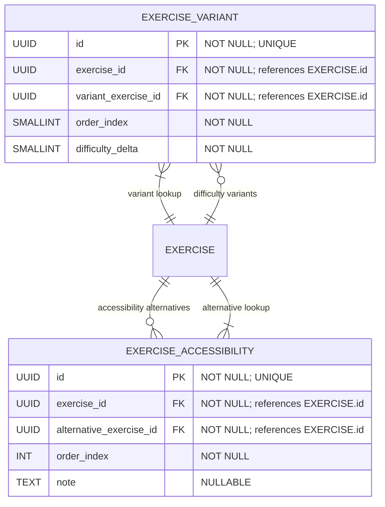

# Composition “Variants & Accessibility”

**Section:** Exercise
**Subsection:** Composition “Variants & Accessibility”

## Diagram

## Notes

This diagram represents the composition “variants & accessibility” structure and relationships within the exercise domain.

---
*Generated from diagram extraction script*
