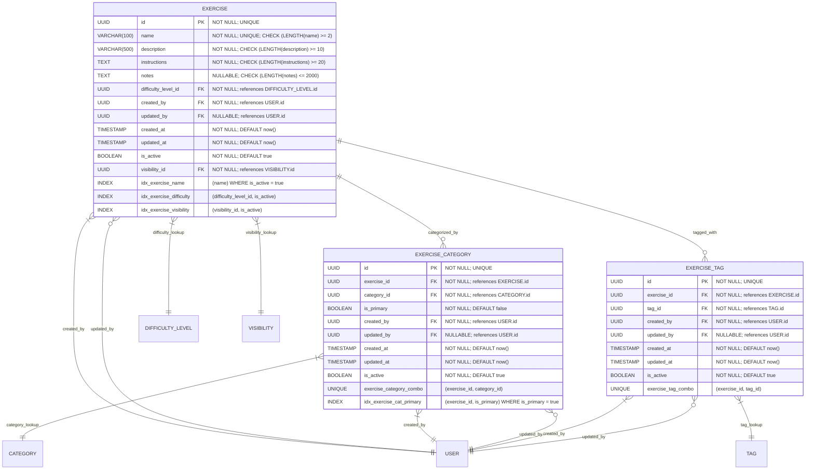

# Exercise Core Definition
**Domain:** Exercise
**Layer:** Core

```mermaid
erDiagram
  EXERCISE {
    UUID id PK                        "NOT NULL; UNIQUE"
    VARCHAR(100) name                 "NOT NULL; UNIQUE; CHECK (LENGTH(name) >= 2)"
    VARCHAR(500) description          "NOT NULL; CHECK (LENGTH(description) >= 10)"
    TEXT instructions                 "NOT NULL; CHECK (LENGTH(instructions) >= 20)"
    TEXT notes                        "NULLABLE; CHECK (LENGTH(notes) <= 2000)"
    UUID difficulty_level_id FK       "NOT NULL; references DIFFICULTY_LEVEL.id"
    UUID created_by FK                "NOT NULL; references USER.id"
    UUID updated_by FK                "NULLABLE; references USER.id"
    TIMESTAMP created_at              "NOT NULL; DEFAULT now()"
    TIMESTAMP updated_at              "NOT NULL; DEFAULT now()"
    BOOLEAN is_active                 "NOT NULL; DEFAULT true"
    UUID visibility_id FK             "NOT NULL; references VISIBILITY.id"
    INDEX idx_exercise_name           "(name) WHERE is_active = true"
    INDEX idx_exercise_difficulty     "(difficulty_level_id, is_active)"
    INDEX idx_exercise_visibility     "(visibility_id, is_active)"
  }
  
  EXERCISE_CATEGORY {
    UUID id PK                        "NOT NULL; UNIQUE"
    UUID exercise_id FK               "NOT NULL; references EXERCISE.id"
    UUID category_id FK               "NOT NULL; references CATEGORY.id"
    BOOLEAN is_primary                "NOT NULL; DEFAULT false"
    UUID created_by FK                "NOT NULL; references USER.id"
    UUID updated_by FK                "NULLABLE; references USER.id"
    TIMESTAMP created_at              "NOT NULL; DEFAULT now()"
    TIMESTAMP updated_at              "NOT NULL; DEFAULT now()"
    BOOLEAN is_active                 "NOT NULL; DEFAULT true"
    UNIQUE exercise_category_combo    "(exercise_id, category_id)"
    INDEX idx_exercise_cat_primary    "(exercise_id, is_primary) WHERE is_primary = true"
  }
  
  EXERCISE_TAG {
    UUID id PK                        "NOT NULL; UNIQUE"
    UUID exercise_id FK               "NOT NULL; references EXERCISE.id"
    UUID tag_id FK                    "NOT NULL; references TAG.id"
    UUID created_by FK                "NOT NULL; references USER.id"
    UUID updated_by FK                "NULLABLE; references USER.id"
    TIMESTAMP created_at              "NOT NULL; DEFAULT now()"
    TIMESTAMP updated_at              "NOT NULL; DEFAULT now()"
    BOOLEAN is_active                 "NOT NULL; DEFAULT true"
    UNIQUE exercise_tag_combo         "(exercise_id, tag_id)"
  }

  EXERCISE }|--|| DIFFICULTY_LEVEL : "difficulty_lookup"
  EXERCISE }|--|| VISIBILITY : "visibility_lookup"
  EXERCISE ||--o{ EXERCISE_CATEGORY : "categorized_by"
  EXERCISE ||--o{ EXERCISE_TAG : "tagged_with"
  EXERCISE_CATEGORY }|--|| CATEGORY : "category_lookup"
  EXERCISE_TAG }|--|| TAG : "tag_lookup"
  EXERCISE }|--|| USER : "created_by"
  EXERCISE }o--|| USER : "updated_by"
  EXERCISE_CATEGORY }|--|| USER : "created_by"
  EXERCISE_CATEGORY }o--|| USER : "updated_by"
  EXERCISE_TAG }|--|| USER : "created_by"
  EXERCISE_TAG }o--|| USER : "updated_by"
```

