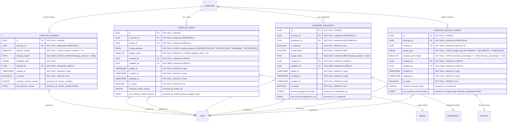

# Exercise Extensions & Media
**Domain:** Exercise
**Layer:** Extensions

```mermaid
erDiagram
  EXERCISE_VERSION {
    UUID id PK                        "NOT NULL; UNIQUE"
    UUID exercise_id FK               "NOT NULL; references EXERCISE.id"
    SMALLINT version_number           "NOT NULL; CHECK (version_number >= 1)"
    TEXT change_reason                "NULLABLE; CHECK (LENGTH(change_reason) <= 1000)"
    JSONB snapshot_data               "NOT NULL"
    UUID created_by FK                "NOT NULL; references USER.id"
    TIMESTAMP created_at              "NOT NULL; DEFAULT now()"
    BOOLEAN is_active                 "NOT NULL; DEFAULT true"
    UNIQUE exercise_version_number    "(exercise_id, version_number)"
    INDEX idx_exercise_version        "(exercise_id, version_number DESC)"
  }
  
  EXERCISE_MEDIA {
    UUID id PK                        "NOT NULL; UNIQUE"
    UUID exercise_id FK               "NOT NULL; references EXERCISE.id"
    UUID media_id FK                  "NOT NULL; references MEDIA.id"
    ENUM media_purpose                "NOT NULL; CHECK (media_purpose IN ('DEMONSTRATION', 'INSTRUCTION', 'THUMBNAIL', 'REFERENCE'))"
    SMALLINT display_order            "NOT NULL; DEFAULT 0; CHECK (display_order >= 0)"
    UUID created_by FK                "NOT NULL; references USER.id"
    UUID updated_by FK                "NULLABLE; references USER.id"
    TIMESTAMP added_at                "NOT NULL; DEFAULT now()"
    TIMESTAMP created_at              "NOT NULL; DEFAULT now()"
    TIMESTAMP updated_at              "NOT NULL; DEFAULT now()"
    BOOLEAN is_active                 "NOT NULL; DEFAULT true"
    UNIQUE exercise_media_combo       "(exercise_id, media_id)"
    INDEX idx_exercise_media_purpose  "(exercise_id, media_purpose, display_order)"
  }
  
  EXERCISE_EQUIPMENT {
    UUID id PK                        "NOT NULL; UNIQUE"
    UUID exercise_id FK               "NOT NULL; references EXERCISE.id"
    UUID equipment_id FK              "NOT NULL; references EQUIPMENT.id"
    BOOLEAN is_required               "NOT NULL; DEFAULT true"
    BOOLEAN is_alternative            "NOT NULL; DEFAULT false"
    TEXT usage_notes                  "NULLABLE; CHECK (LENGTH(usage_notes) <= 500)"
    UUID created_by FK                "NOT NULL; references USER.id"
    UUID updated_by FK                "NULLABLE; references USER.id"
    TIMESTAMP added_at                "NOT NULL; DEFAULT now()"
    TIMESTAMP created_at              "NOT NULL; DEFAULT now()"
    TIMESTAMP updated_at              "NOT NULL; DEFAULT now()"
    BOOLEAN is_active                 "NOT NULL; DEFAULT true"
    UNIQUE exercise_equipment_combo   "(exercise_id, equipment_id)"
    INDEX idx_exercise_equipment_req  "(exercise_id, is_required)"
  }
  
  EXERCISE_MUSCLE_TARGET {
    UUID id PK                        "NOT NULL; UNIQUE"
    UUID exercise_id FK               "NOT NULL; references EXERCISE.id"
    UUID muscle_id FK                 "NOT NULL; references MUSCLE.id"
    ENUM target_type                  "NOT NULL; CHECK (target_type IN ('PRIMARY', 'SECONDARY', 'STABILIZER'))"
    SMALLINT intensity_percentage     "NOT NULL; CHECK (intensity_percentage >= 1 AND intensity_percentage <= 100)"
    UUID created_by FK                "NOT NULL; references USER.id"
    UUID updated_by FK                "NULLABLE; references USER.id"
    TIMESTAMP created_at              "NOT NULL; DEFAULT now()"
    TIMESTAMP updated_at              "NOT NULL; DEFAULT now()"
    BOOLEAN is_active                 "NOT NULL; DEFAULT true"
    UNIQUE exercise_muscle_combo      "(exercise_id, muscle_id)"
    INDEX idx_exercise_muscle_target  "(exercise_id, target_type, intensity_percentage DESC)"
  }

  EXERCISE ||--o{ EXERCISE_VERSION : "version_history"
  EXERCISE ||--o{ EXERCISE_MEDIA : "has_media"
  EXERCISE ||--o{ EXERCISE_EQUIPMENT : "uses_equipment"
  EXERCISE ||--o{ EXERCISE_MUSCLE_TARGET : "targets_muscles"
  EXERCISE_MEDIA }|--|| MEDIA : "media_lookup"
  EXERCISE_EQUIPMENT }|--|| EQUIPMENT : "equipment_lookup"
  EXERCISE_MUSCLE_TARGET }|--|| MUSCLE : "muscle_lookup"
  EXERCISE_VERSION }|--|| USER : "created_by"
  EXERCISE_MEDIA }|--|| USER : "created_by"
  EXERCISE_MEDIA }o--|| USER : "updated_by"
  EXERCISE_EQUIPMENT }|--|| USER : "created_by"
  EXERCISE_EQUIPMENT }o--|| USER : "updated_by"
  EXERCISE_MUSCLE_TARGET }|--|| USER : "created_by"
  EXERCISE_MUSCLE_TARGET }o--|| USER : "updated_by"
```

