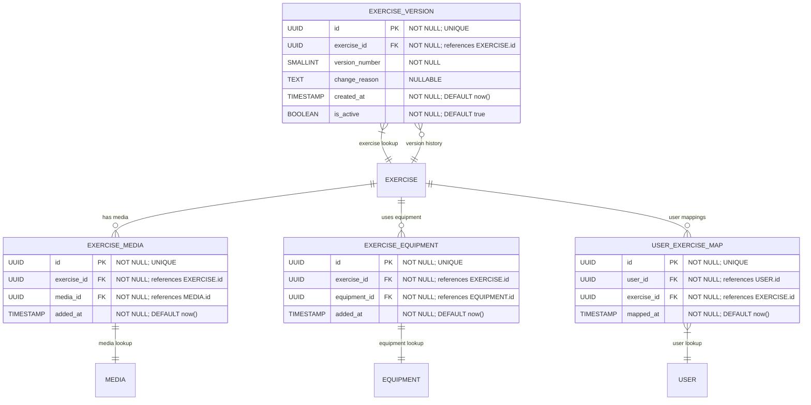

# Metadata & Extensions (Versioning, Media, Equipment, User Mapping)

**Section:** Exercise
**Subsection:** Metadata & Extensions (Versioning, Media, Equipment, User Mapping)

## Diagram

## Notes

This diagram represents the metadata & extensions (versioning, media, equipment, user mapping) structure and relationships within the exercise domain.

---
*Generated from diagram extraction script*
