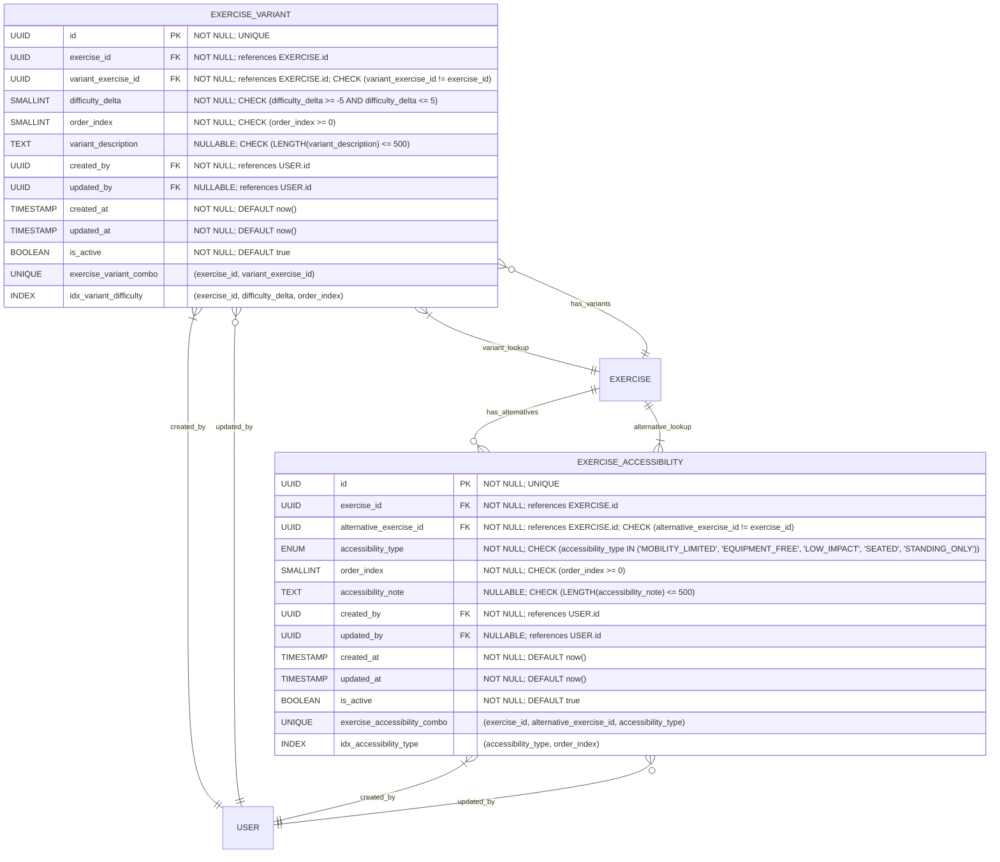

# Exercise Variants & Accessibility
**Domain:** Exercise
**Layer:** Composition

```mermaid
erDiagram
  EXERCISE_VARIANT {
    UUID id PK                        "NOT NULL; UNIQUE"
    UUID exercise_id FK               "NOT NULL; references EXERCISE.id"
    UUID variant_exercise_id FK       "NOT NULL; references EXERCISE.id; CHECK (variant_exercise_id != exercise_id)"
    SMALLINT difficulty_delta         "NOT NULL; CHECK (difficulty_delta >= -5 AND difficulty_delta <= 5)"
    SMALLINT order_index              "NOT NULL; CHECK (order_index >= 0)"
    TEXT variant_description          "NULLABLE; CHECK (LENGTH(variant_description) <= 500)"
    UUID created_by FK                "NOT NULL; references USER.id"
    UUID updated_by FK                "NULLABLE; references USER.id"
    TIMESTAMP created_at              "NOT NULL; DEFAULT now()"
    TIMESTAMP updated_at              "NOT NULL; DEFAULT now()"
    BOOLEAN is_active                 "NOT NULL; DEFAULT true"
    UNIQUE exercise_variant_combo     "(exercise_id, variant_exercise_id)"
    INDEX idx_variant_difficulty      "(exercise_id, difficulty_delta, order_index)"
  }
  
  EXERCISE_ACCESSIBILITY {
    UUID id PK                        "NOT NULL; UNIQUE"
    UUID exercise_id FK               "NOT NULL; references EXERCISE.id"
    UUID alternative_exercise_id FK   "NOT NULL; references EXERCISE.id; CHECK (alternative_exercise_id != exercise_id)"
    ENUM accessibility_type           "NOT NULL; CHECK (accessibility_type IN ('MOBILITY_LIMITED', 'EQUIPMENT_FREE', 'LOW_IMPACT', 'SEATED', 'STANDING_ONLY'))"
    SMALLINT order_index              "NOT NULL; CHECK (order_index >= 0)"
    TEXT accessibility_note           "NULLABLE; CHECK (LENGTH(accessibility_note) <= 500)"
    UUID created_by FK                "NOT NULL; references USER.id"
    UUID updated_by FK                "NULLABLE; references USER.id"
    TIMESTAMP created_at              "NOT NULL; DEFAULT now()"
    TIMESTAMP updated_at              "NOT NULL; DEFAULT now()"
    BOOLEAN is_active                 "NOT NULL; DEFAULT true"
    UNIQUE exercise_accessibility_combo "(exercise_id, alternative_exercise_id, accessibility_type)"
    INDEX idx_accessibility_type      "(accessibility_type, order_index)"
  }

  EXERCISE ||--o{ EXERCISE_VARIANT : "has_variants"
  EXERCISE ||--o{ EXERCISE_ACCESSIBILITY : "has_alternatives"
  EXERCISE_VARIANT }|--|| EXERCISE : "variant_lookup"
  EXERCISE_ACCESSIBILITY }|--|| EXERCISE : "alternative_lookup"
  EXERCISE_VARIANT }|--|| USER : "created_by"
  EXERCISE_VARIANT }o--|| USER : "updated_by"
  EXERCISE_ACCESSIBILITY }|--|| USER : "created_by"
  EXERCISE_ACCESSIBILITY }o--|| USER : "updated_by"
```

