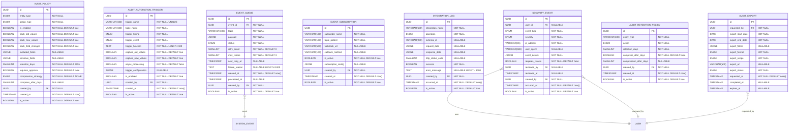

# Audit Extensions

```mermaid
erDiagram
    AUDIT_POLICY {
        UUID id PK
        ENUM entity_type "NOT NULL"
        ENUM action_type "NOT NULL"
        BOOLEAN is_enabled "NOT NULL DEFAULT true"
        BOOLEAN track_old_values "NOT NULL DEFAULT true"
        BOOLEAN track_new_values "NOT NULL DEFAULT true"
        BOOLEAN track_field_changes "NOT NULL DEFAULT true"
        JSONB excluded_fields "NULLABLE"
        JSONB sensitive_fields "NULLABLE"
        SMALLINT retention_days "NOT NULL DEFAULT 2555"
        BOOLEAN requires_approval "NOT NULL DEFAULT false"
        ENUM compression_strategy "NOT NULL DEFAULT 'NONE'"
        SMALLINT compress_after_days "NULLABLE"
        UUID created_by FK "NOT NULL"
        TIMESTAMP created_at "NOT NULL DEFAULT now()"
        BOOLEAN is_active "NOT NULL DEFAULT true"
    }
    AUDIT_AUTOMATION_TRIGGER {
        UUID id PK
        VARCHAR(100) trigger_name "NOT NULL UNIQUE"
        VARCHAR(100) table_name "NOT NULL"
        ENUM trigger_timing "NOT NULL"
        ENUM trigger_event "NOT NULL"
        TEXT trigger_function "NOT NULL LENGTH 100"
        BOOLEAN capture_old_values "NOT NULL DEFAULT true"
        BOOLEAN capture_new_values "NOT NULL DEFAULT true"
        BOOLEAN async_processing "NOT NULL DEFAULT false"
        JSONB trigger_configuration "NULLABLE"
        BOOLEAN is_enabled "NOT NULL DEFAULT true"
        UUID created_by FK "NOT NULL"
        TIMESTAMP created_at "NOT NULL DEFAULT now()"
        BOOLEAN is_active "NOT NULL DEFAULT true"
    }
    EVENT_QUEUE {
        UUID id PK
        UUID event_id FK "NOT NULL"
        VARCHAR(100) topic "NOT NULL"
        JSONB payload "NOT NULL"
        ENUM status "NOT NULL"
        SMALLINT retry_count "NOT NULL DEFAULT 0"
        SMALLINT max_retries "NOT NULL DEFAULT 3"
        TIMESTAMP next_retry_at "NULLABLE"
        TEXT failure_reason "NULLABLE LENGTH 1000"
        TIMESTAMP created_at "NOT NULL DEFAULT now()"
        TIMESTAMP processed_at "NULLABLE"
        UUID created_by FK "NOT NULL"
        BOOLEAN is_active "NOT NULL DEFAULT true"
    }
    EVENT_SUBSCRIPTION {
        UUID id PK
        VARCHAR(100) subscriber_name "NOT NULL"
        VARCHAR(100) topic_pattern "NOT NULL"
        VARCHAR(500) webhook_url "NULLABLE"
        VARCHAR(100) callback_method "NULLABLE"
        BOOLEAN is_active "NOT NULL DEFAULT true"
        JSONB subscription_config "NULLABLE"
        UUID created_by FK "NOT NULL"
        TIMESTAMP created_at "NOT NULL DEFAULT now()"
        BOOLEAN is_active "NOT NULL DEFAULT true"
    }
    INTEGRATION_LOG {
        UUID id PK
        VARCHAR(100) integration_name "NOT NULL"
        ENUM operation "NOT NULL"
        VARCHAR(255) external_id "NULLABLE"
        JSONB request_data "NULLABLE"
        JSONB response_data "NULLABLE"
        SMALLINT http_status_code "NULLABLE"
        BOOLEAN success "NOT NULL"
        TEXT error_message "NULLABLE LENGTH 1000"
        UUID created_by FK "NOT NULL"
        TIMESTAMP occurred_at "NOT NULL DEFAULT now()"
        BOOLEAN is_active "NOT NULL DEFAULT true"
    }
    SECURITY_EVENT {
        UUID id PK
        UUID user_id FK "NULLABLE"
        ENUM event_type "NOT NULL"
        ENUM severity "NOT NULL"
        VARCHAR(45) ip_address "NOT NULL"
        VARCHAR(500) user_agent "NULLABLE"
        JSONB event_details "NOT NULL"
        BOOLEAN requires_review "NOT NULL DEFAULT false"
        UUID reviewed_by FK "NULLABLE"
        TIMESTAMP reviewed_at "NULLABLE"
        UUID created_by FK "NOT NULL"
        TIMESTAMP occurred_at "NOT NULL DEFAULT now()"
        BOOLEAN is_active "NOT NULL DEFAULT true"
    }
    AUDIT_RETENTION_POLICY {
        UUID id PK
        VARCHAR(100) entity_type "NOT NULL"
        ENUM action "NOT NULL"
        SMALLINT retention_days "NOT NULL"
        BOOLEAN compress_after_days "NOT NULL DEFAULT false"
        SMALLINT compression_after_days "NULLABLE"
        UUID created_by FK "NOT NULL"
        TIMESTAMP created_at "NOT NULL DEFAULT now()"
        BOOLEAN is_active "NOT NULL DEFAULT true"
    }
    AUDIT_EXPORT {
        UUID id PK
        UUID requested_by FK "NOT NULL"
        DATE export_start_date "NOT NULL"
        DATE export_end_date "NOT NULL"
        JSONB export_filters "NULLABLE"
        ENUM export_format "NOT NULL"
        ENUM export_scope "NOT NULL"
        VARCHAR(500) export_url "NULLABLE"
        ENUM export_status "NOT NULL"
        TIMESTAMP requested_at "NOT NULL DEFAULT now()"
        TIMESTAMP completed_at "NULLABLE"
        TIMESTAMP expires_at "NULLABLE"
    }
    EVENT_QUEUE }|--|| SYSTEM_EVENT : "event"
    SECURITY_EVENT }|--|| USER : "user"
    SECURITY_EVENT }|--|| USER : "reviewed_by"
    AUDIT_EXPORT }|--|| USER : "requested_by"
```