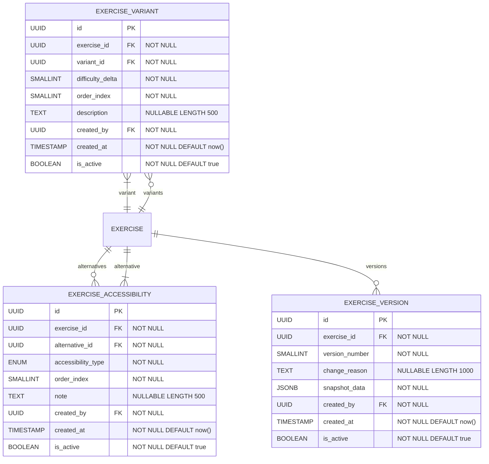

# Exercise Extensions

```mermaid
erDiagram
    EXERCISE_VARIANT {
        UUID id PK
        UUID exercise_id FK "NOT NULL"
        UUID variant_id FK "NOT NULL"
        SMALLINT difficulty_delta "NOT NULL"
        SMALLINT order_index "NOT NULL"
        TEXT description "NULLABLE LENGTH 500"
        UUID created_by FK "NOT NULL"
        TIMESTAMP created_at "NOT NULL DEFAULT now()"
        BOOLEAN is_active "NOT NULL DEFAULT true"
    }
    EXERCISE_ACCESSIBILITY {
        UUID id PK
        UUID exercise_id FK "NOT NULL"
        UUID alternative_id FK "NOT NULL"
        ENUM accessibility_type "NOT NULL"
        SMALLINT order_index "NOT NULL"
        TEXT note "NULLABLE LENGTH 500"
        UUID created_by FK "NOT NULL"
        TIMESTAMP created_at "NOT NULL DEFAULT now()"
        BOOLEAN is_active "NOT NULL DEFAULT true"
    }
    EXERCISE_VERSION {
        UUID id PK
        UUID exercise_id FK "NOT NULL"
        SMALLINT version_number "NOT NULL"
        TEXT change_reason "NULLABLE LENGTH 1000"
        JSONB snapshot_data "NOT NULL"
        UUID created_by FK "NOT NULL"
        TIMESTAMP created_at "NOT NULL DEFAULT now()"
        BOOLEAN is_active "NOT NULL DEFAULT true"
    }
    EXERCISE ||--o{ EXERCISE_VARIANT : "variants"
    EXERCISE ||--o{ EXERCISE_ACCESSIBILITY : "alternatives"
    EXERCISE ||--o{ EXERCISE_VERSION : "versions"
    EXERCISE_VARIANT }|--|| EXERCISE : "variant"
    EXERCISE_ACCESSIBILITY }|--|| EXERCISE : "alternative"
```

