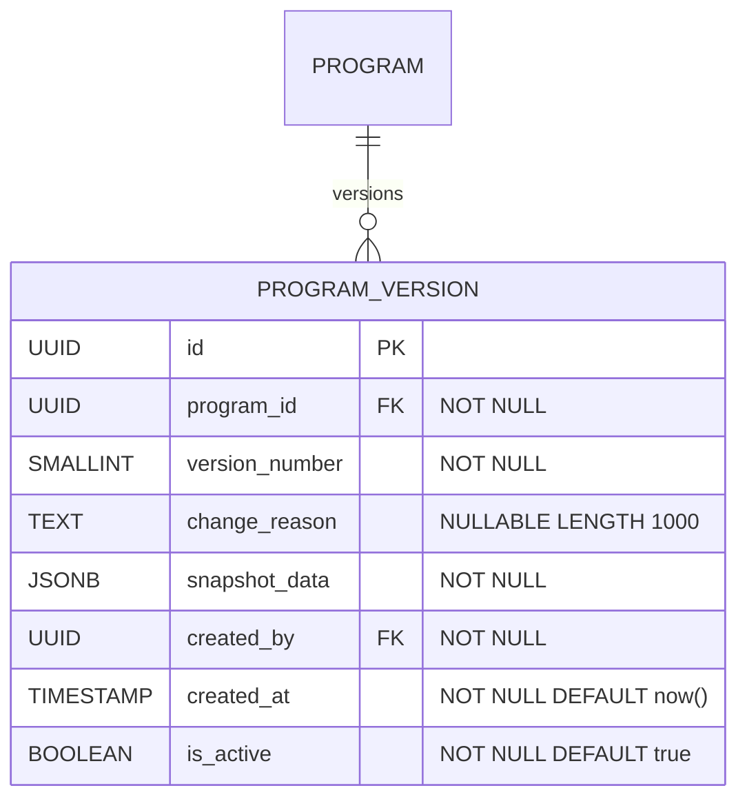

# Program Extensions

```mermaid
erDiagram
    PROGRAM_VERSION {
        UUID id PK
        UUID program_id FK "NOT NULL"
        SMALLINT version_number "NOT NULL"
        TEXT change_reason "NULLABLE LENGTH 1000"
        JSONB snapshot_data "NOT NULL"
        UUID created_by FK "NOT NULL"
        TIMESTAMP created_at "NOT NULL DEFAULT now()"
        BOOLEAN is_active "NOT NULL DEFAULT true"
    }
    PROGRAM ||--o{ PROGRAM_VERSION : "versions"
```

