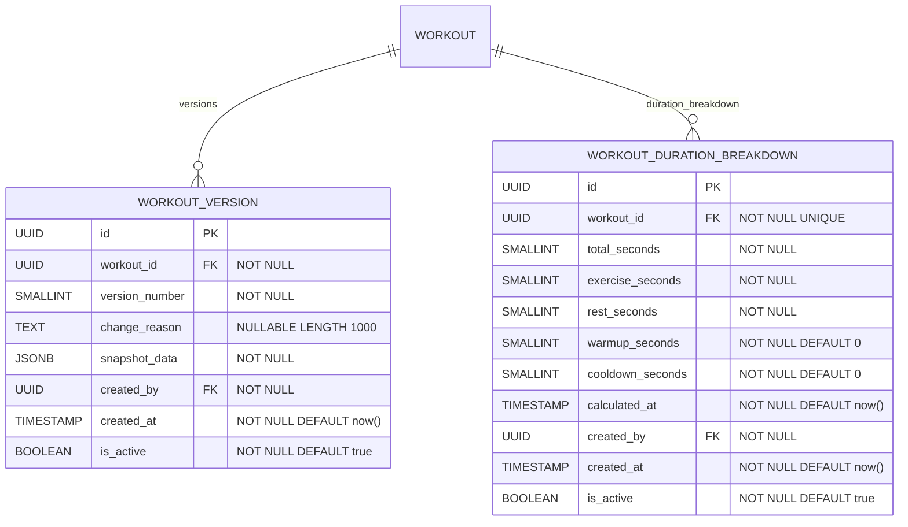

# Workout Extensions

```mermaid
erDiagram
    WORKOUT_VERSION {
        UUID id PK
        UUID workout_id FK "NOT NULL"
        SMALLINT version_number "NOT NULL"
        TEXT change_reason "NULLABLE LENGTH 1000"
        JSONB snapshot_data "NOT NULL"
        UUID created_by FK "NOT NULL"
        TIMESTAMP created_at "NOT NULL DEFAULT now()"
        BOOLEAN is_active "NOT NULL DEFAULT true"
    }
    WORKOUT_DURATION_BREAKDOWN {
        UUID id PK
        UUID workout_id FK "NOT NULL UNIQUE"
        SMALLINT total_seconds "NOT NULL"
        SMALLINT exercise_seconds "NOT NULL"
        SMALLINT rest_seconds "NOT NULL"
        SMALLINT warmup_seconds "NOT NULL DEFAULT 0"
        SMALLINT cooldown_seconds "NOT NULL DEFAULT 0"
        TIMESTAMP calculated_at "NOT NULL DEFAULT now()"
        UUID created_by FK "NOT NULL"
        TIMESTAMP created_at "NOT NULL DEFAULT now()"
        BOOLEAN is_active "NOT NULL DEFAULT true"
    }
    WORKOUT ||--o{ WORKOUT_VERSION : "versions"
    WORKOUT ||--o{ WORKOUT_DURATION_BREAKDOWN : "duration_breakdown"
```

