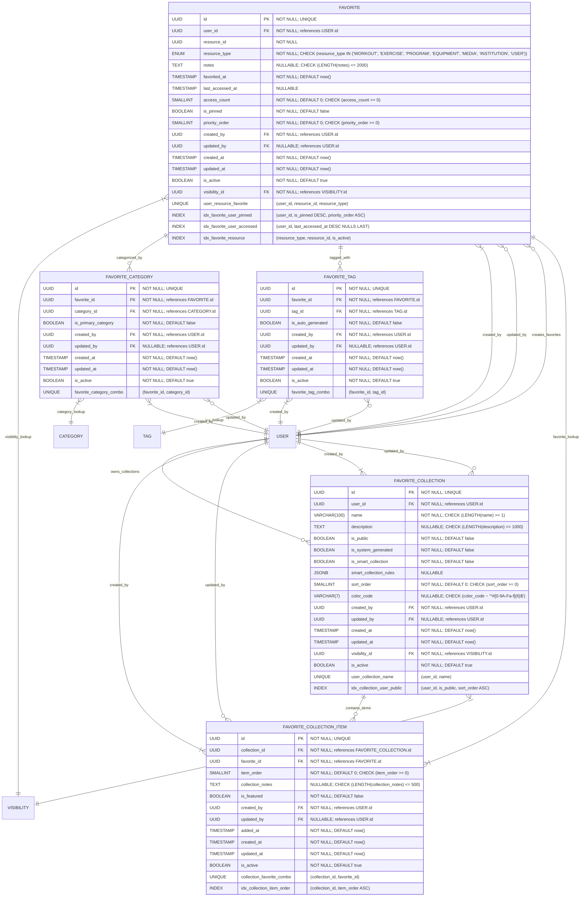

# Favorite Management System
**Domain:** Favorite
**Layer:** Core

```mermaid
erDiagram
  FAVORITE {
    UUID id PK                        "NOT NULL; UNIQUE"
    UUID user_id FK                   "NOT NULL; references USER.id"
    UUID resource_id                  "NOT NULL"
    ENUM resource_type                "NOT NULL; CHECK (resource_type IN ('WORKOUT', 'EXERCISE', 'PROGRAM', 'EQUIPMENT', 'MEDIA', 'INSTITUTION', 'USER'))"
    TEXT notes                        "NULLABLE; CHECK (LENGTH(notes) <= 2000)"
    TIMESTAMP favorited_at            "NOT NULL; DEFAULT now()"
    TIMESTAMP last_accessed_at        "NULLABLE"
    SMALLINT access_count             "NOT NULL; DEFAULT 0; CHECK (access_count >= 0)"
    BOOLEAN is_pinned                 "NOT NULL; DEFAULT false"
    SMALLINT priority_order           "NOT NULL; DEFAULT 0; CHECK (priority_order >= 0)"
    UUID created_by FK                "NOT NULL; references USER.id"
    UUID updated_by FK                "NULLABLE; references USER.id"
    TIMESTAMP created_at              "NOT NULL; DEFAULT now()"
    TIMESTAMP updated_at              "NOT NULL; DEFAULT now()"
    BOOLEAN is_active                 "NOT NULL; DEFAULT true"
    UUID visibility_id FK             "NOT NULL; references VISIBILITY.id"
    UNIQUE user_resource_favorite     "(user_id, resource_id, resource_type)"
    INDEX idx_favorite_user_pinned    "(user_id, is_pinned DESC, priority_order ASC)"
    INDEX idx_favorite_user_accessed  "(user_id, last_accessed_at DESC NULLS LAST)"
    INDEX idx_favorite_resource       "(resource_type, resource_id, is_active)"
  }
  
  FAVORITE_CATEGORY {
    UUID id PK                        "NOT NULL; UNIQUE"
    UUID favorite_id FK               "NOT NULL; references FAVORITE.id"
    UUID category_id FK               "NOT NULL; references CATEGORY.id"
    BOOLEAN is_primary_category       "NOT NULL; DEFAULT false"
    UUID created_by FK                "NOT NULL; references USER.id"
    UUID updated_by FK                "NULLABLE; references USER.id"
    TIMESTAMP created_at              "NOT NULL; DEFAULT now()"
    TIMESTAMP updated_at              "NOT NULL; DEFAULT now()"
    BOOLEAN is_active                 "NOT NULL; DEFAULT true"
    UNIQUE favorite_category_combo    "(favorite_id, category_id)"
  }
  
  FAVORITE_TAG {
    UUID id PK                        "NOT NULL; UNIQUE"
    UUID favorite_id FK               "NOT NULL; references FAVORITE.id"
    UUID tag_id FK                    "NOT NULL; references TAG.id"
    BOOLEAN is_auto_generated         "NOT NULL; DEFAULT false"
    UUID created_by FK                "NOT NULL; references USER.id"
    UUID updated_by FK                "NULLABLE; references USER.id"
    TIMESTAMP created_at              "NOT NULL; DEFAULT now()"
    TIMESTAMP updated_at              "NOT NULL; DEFAULT now()"
    BOOLEAN is_active                 "NOT NULL; DEFAULT true"
    UNIQUE favorite_tag_combo         "(favorite_id, tag_id)"
  }
  
  FAVORITE_COLLECTION {
    UUID id PK                        "NOT NULL; UNIQUE"
    UUID user_id FK                   "NOT NULL; references USER.id"
    VARCHAR(100) name                 "NOT NULL; CHECK (LENGTH(name) >= 1)"
    TEXT description                  "NULLABLE; CHECK (LENGTH(description) <= 1000)"
    BOOLEAN is_public                 "NOT NULL; DEFAULT false"
    BOOLEAN is_system_generated       "NOT NULL; DEFAULT false"
    BOOLEAN is_smart_collection       "NOT NULL; DEFAULT false"
    JSONB smart_collection_rules      "NULLABLE"
    SMALLINT sort_order               "NOT NULL; DEFAULT 0; CHECK (sort_order >= 0)"
    VARCHAR(7) color_code             "NULLABLE; CHECK (color_code ~ '^#[0-9A-Fa-f]{6}$')"
    UUID created_by FK                "NOT NULL; references USER.id"
    UUID updated_by FK                "NULLABLE; references USER.id"
    TIMESTAMP created_at              "NOT NULL; DEFAULT now()"
    TIMESTAMP updated_at              "NOT NULL; DEFAULT now()"
    UUID visibility_id FK             "NOT NULL; references VISIBILITY.id"
    BOOLEAN is_active                 "NOT NULL; DEFAULT true"
    UNIQUE user_collection_name       "(user_id, name)"
    INDEX idx_collection_user_public  "(user_id, is_public, sort_order ASC)"
  }
  
  FAVORITE_COLLECTION_ITEM {
    UUID id PK                        "NOT NULL; UNIQUE"
    UUID collection_id FK             "NOT NULL; references FAVORITE_COLLECTION.id"
    UUID favorite_id FK               "NOT NULL; references FAVORITE.id"
    SMALLINT item_order               "NOT NULL; DEFAULT 0; CHECK (item_order >= 0)"
    TEXT collection_notes             "NULLABLE; CHECK (LENGTH(collection_notes) <= 500)"
    BOOLEAN is_featured               "NOT NULL; DEFAULT false"
    UUID created_by FK                "NOT NULL; references USER.id"
    UUID updated_by FK                "NULLABLE; references USER.id"
    TIMESTAMP added_at                "NOT NULL; DEFAULT now()"
    TIMESTAMP created_at              "NOT NULL; DEFAULT now()"
    TIMESTAMP updated_at              "NOT NULL; DEFAULT now()"
    BOOLEAN is_active                 "NOT NULL; DEFAULT true"
    UNIQUE collection_favorite_combo  "(collection_id, favorite_id)"
    INDEX idx_collection_item_order   "(collection_id, item_order ASC)"
  }

  USER ||--o{ FAVORITE : "creates_favorites"
  USER ||--o{ FAVORITE_COLLECTION : "owns_collections"
  FAVORITE }|--|| VISIBILITY : "visibility_lookup"
  FAVORITE ||--o{ FAVORITE_CATEGORY : "categorized_by"
  FAVORITE ||--o{ FAVORITE_TAG : "tagged_with"
  FAVORITE_COLLECTION ||--o{ FAVORITE_COLLECTION_ITEM : "contains_items"
  FAVORITE_COLLECTION }|--|| VISIBILITY : "collection_visibility"
  FAVORITE_COLLECTION_ITEM }|--|| FAVORITE : "favorite_lookup"
  FAVORITE_CATEGORY }|--|| CATEGORY : "category_lookup"
  FAVORITE_TAG }|--|| TAG : "tag_lookup"
  FAVORITE }|--|| USER : "created_by"
  FAVORITE }o--|| USER : "updated_by"
  FAVORITE_CATEGORY }|--|| USER : "created_by"
  FAVORITE_CATEGORY }o--|| USER : "updated_by"
  FAVORITE_TAG }|--|| USER : "created_by"
  FAVORITE_TAG }o--|| USER : "updated_by"
  FAVORITE_COLLECTION }|--|| USER : "created_by"
  FAVORITE_COLLECTION }o--|| USER : "updated_by"
  FAVORITE_COLLECTION_ITEM }|--|| USER : "created_by"
  FAVORITE_COLLECTION_ITEM }o--|| USER : "updated_by"
```

