# Core "Favorite" Definition & Classification
**Section:** Favorite
**Subsection:** Core "Favorite" Definition & Classification

## Diagram

```mermaid
erDiagram
  %%=== Layer 1: Core Favorite & Classification ===%%
  FAVORITE {
    UUID id PK                         "NOT NULL; UNIQUE"
    UUID user_id FK                    "NOT NULL; references USER.id"
    TEXT notes                         "NULLABLE; personal notes about why it's favorited"
    TIMESTAMP favorited_at             "NOT NULL; DEFAULT now()"
    TIMESTAMP last_accessed_at         "NULLABLE; when last viewed/used"
    INT access_count                   "NOT NULL; DEFAULT 0"
    UUID created_by FK                 "NOT NULL; references USER.id"
    UUID updated_by FK                 "NULLABLE; references USER.id"
    TIMESTAMP created_at               "NOT NULL; DEFAULT now()"
    TIMESTAMP updated_at               "NOT NULL; DEFAULT now()"
    BOOLEAN is_active                  "NOT NULL; DEFAULT true"
    UUID visibility_id FK              "NOT NULL; references VISIBILITY.id"
  }
  
  %%— Resource-specific favorite relationships —
  FAVORITE_WORKOUT {
    UUID favorite_id PK,FK             "NOT NULL; references FAVORITE.id"
    UUID workout_id PK,FK              "NOT NULL; references WORKOUT.id"
    UUID created_by FK                 "NOT NULL; references USER.id"
    UUID updated_by FK                 "NULLABLE; references USER.id"
    TIMESTAMP created_at               "NOT NULL; DEFAULT now()"
    TIMESTAMP updated_at               "NOT NULL; DEFAULT now()"
    BOOLEAN is_active                  "NOT NULL; DEFAULT true"
  }
  
  FAVORITE_EXERCISE {
    UUID favorite_id PK,FK             "NOT NULL; references FAVORITE.id"
    UUID exercise_id PK,FK             "NOT NULL; references EXERCISE.id"
    UUID created_by FK                 "NOT NULL; references USER.id"
    UUID updated_by FK                 "NULLABLE; references USER.id"
    TIMESTAMP created_at               "NOT NULL; DEFAULT now()"
    TIMESTAMP updated_at               "NOT NULL; DEFAULT now()"
    BOOLEAN is_active                  "NOT NULL; DEFAULT true"
  }
  
  FAVORITE_PROGRAM {
    UUID favorite_id PK,FK             "NOT NULL; references FAVORITE.id"
    UUID program_id PK,FK              "NOT NULL; references PROGRAM.id"
    UUID created_by FK                 "NOT NULL; references USER.id"
    UUID updated_by FK                 "NULLABLE; references USER.id"
    TIMESTAMP created_at               "NOT NULL; DEFAULT now()"
    TIMESTAMP updated_at               "NOT NULL; DEFAULT now()"
    BOOLEAN is_active                  "NOT NULL; DEFAULT true"
  }
  
  FAVORITE_EQUIPMENT {
    UUID favorite_id PK,FK             "NOT NULL; references FAVORITE.id"
    UUID equipment_id PK,FK            "NOT NULL; references EQUIPMENT.id"
    UUID created_by FK                 "NOT NULL; references USER.id"
    UUID updated_by FK                 "NULLABLE; references USER.id"
    TIMESTAMP created_at               "NOT NULL; DEFAULT now()"
    TIMESTAMP updated_at               "NOT NULL; DEFAULT now()"
    BOOLEAN is_active                  "NOT NULL; DEFAULT true"
  }
  
  FAVORITE_MEDIA {
    UUID favorite_id PK,FK             "NOT NULL; references FAVORITE.id"
    UUID media_id PK,FK                "NOT NULL; references MEDIA.id"
    UUID created_by FK                 "NOT NULL; references USER.id"
    UUID updated_by FK                 "NULLABLE; references USER.id"
    TIMESTAMP created_at               "NOT NULL; DEFAULT now()"
    TIMESTAMP updated_at               "NOT NULL; DEFAULT now()"
    BOOLEAN is_active                  "NOT NULL; DEFAULT true"
  }
  
  FAVORITE_INSTITUTION {
    UUID favorite_id PK,FK             "NOT NULL; references FAVORITE.id"
    UUID institution_id PK,FK          "NOT NULL; references INSTITUTION.id"
    UUID created_by FK                 "NOT NULL; references USER.id"
    UUID updated_by FK                 "NULLABLE; references USER.id"
    TIMESTAMP created_at               "NOT NULL; DEFAULT now()"
    TIMESTAMP updated_at               "NOT NULL; DEFAULT now()"
    BOOLEAN is_active                  "NOT NULL; DEFAULT true"
  }
  
  %%— Classification —
  FAVORITE_CATEGORY {
    UUID favorite_id PK,FK             "NOT NULL; references FAVORITE.id"
    UUID category_id PK,FK             "NOT NULL; references CATEGORY.id"
    UUID created_by FK                 "NOT NULL; references USER.id"
    UUID updated_by FK                 "NULLABLE; references USER.id"
    TIMESTAMP created_at               "NOT NULL; DEFAULT now()"
    TIMESTAMP updated_at               "NOT NULL; DEFAULT now()"
    BOOLEAN is_active                  "NOT NULL; DEFAULT true"
  }
  
  FAVORITE_TAG {
    UUID favorite_id PK,FK             "NOT NULL; references FAVORITE.id"
    UUID tag_id PK,FK                  "NOT NULL; references TAG.id"
    UUID created_by FK                 "NOT NULL; references USER.id"
    UUID updated_by FK                 "NULLABLE; references USER.id"
    TIMESTAMP created_at               "NOT NULL; DEFAULT now()"
    TIMESTAMP updated_at               "NOT NULL; DEFAULT now()"
    BOOLEAN is_active                  "NOT NULL; DEFAULT true"
  }
  
  %%— Relationships —
  USER ||--o{ FAVORITE                : "creates favorites"
  FAVORITE ||--o{ FAVORITE_WORKOUT    : "workout favorites"
  FAVORITE ||--o{ FAVORITE_EXERCISE   : "exercise favorites"
  FAVORITE ||--o{ FAVORITE_PROGRAM    : "program favorites"
  FAVORITE ||--o{ FAVORITE_EQUIPMENT  : "equipment favorites"
  FAVORITE ||--o{ FAVORITE_MEDIA      : "media favorites"
  FAVORITE ||--o{ FAVORITE_INSTITUTION : "institution favorites"
  FAVORITE ||--o{ FAVORITE_CATEGORY   : "categorized by"
  FAVORITE ||--o{ FAVORITE_TAG        : "tagged with"
  FAVORITE_WORKOUT }|--|| WORKOUT     : "workout lookup"
  FAVORITE_EXERCISE }|--|| EXERCISE   : "exercise lookup"
  FAVORITE_PROGRAM }|--|| PROGRAM     : "program lookup"
  FAVORITE_EQUIPMENT }|--|| EQUIPMENT : "equipment lookup"
  FAVORITE_MEDIA }|--|| MEDIA         : "media lookup"
  FAVORITE_INSTITUTION }|--|| INSTITUTION : "institution lookup"
  FAVORITE_CATEGORY }|--|| CATEGORY   : "category lookup"
  FAVORITE_TAG }|--|| TAG             : "tag lookup"
```

## Notes
This diagram represents the core "favorite" definition & classification structure and relationships within the favorite domain.

---
*Generated from diagram extraction script*