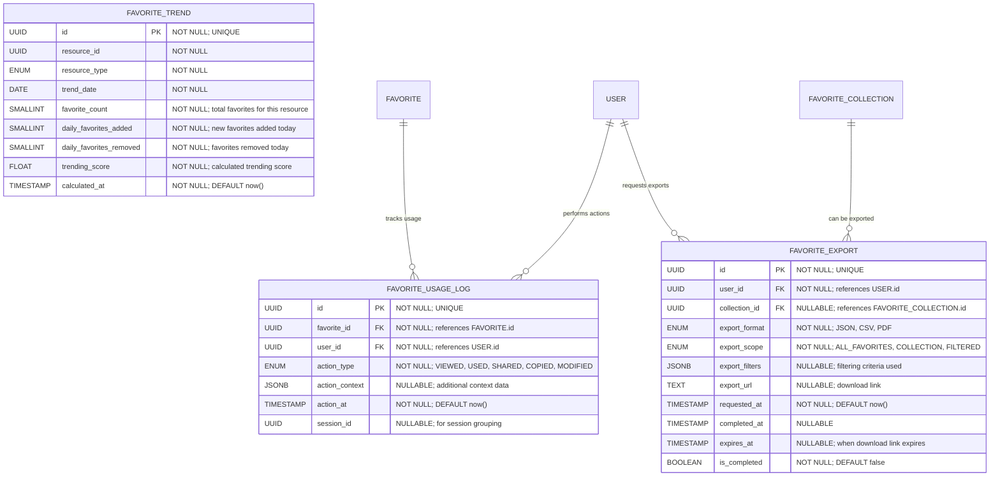

# Favorite Analytics & History

**Section:** Favorite
**Subsection:** Favorite Analytics & History

## Diagram

## Notes

This diagram represents the favorite analytics & history structure and relationships within the favorite domain.

---
*Generated from diagram extraction script*
