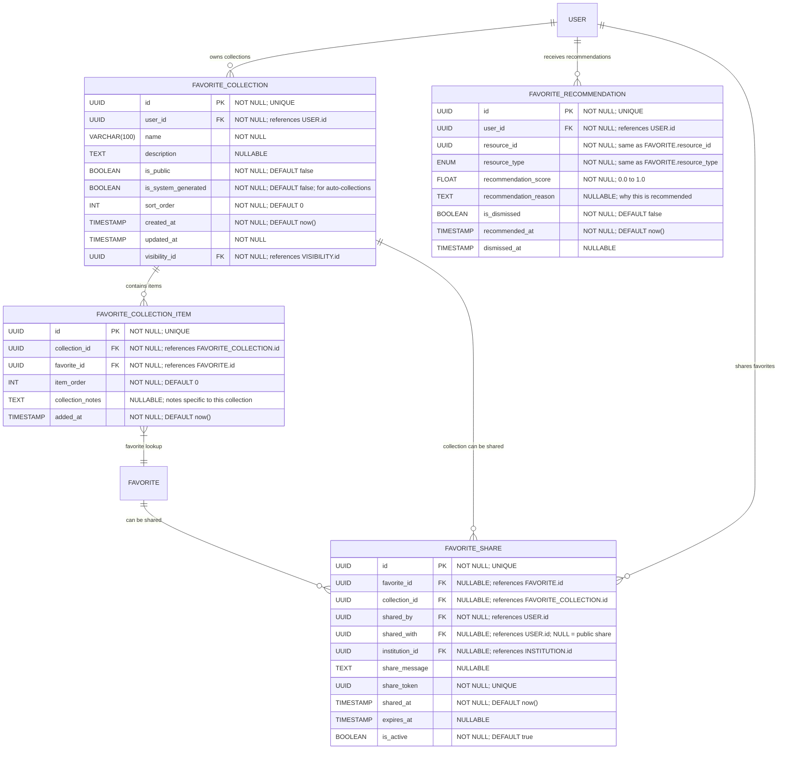

# Favorite Collections & Sharing

**Section:** Favorite
**Subsection:** Favorite Collections & Sharing

## Diagram

## Notes

This diagram represents the favorite collections & sharing structure and relationships within the favorite domain.

---
*Generated from diagram extraction script*
