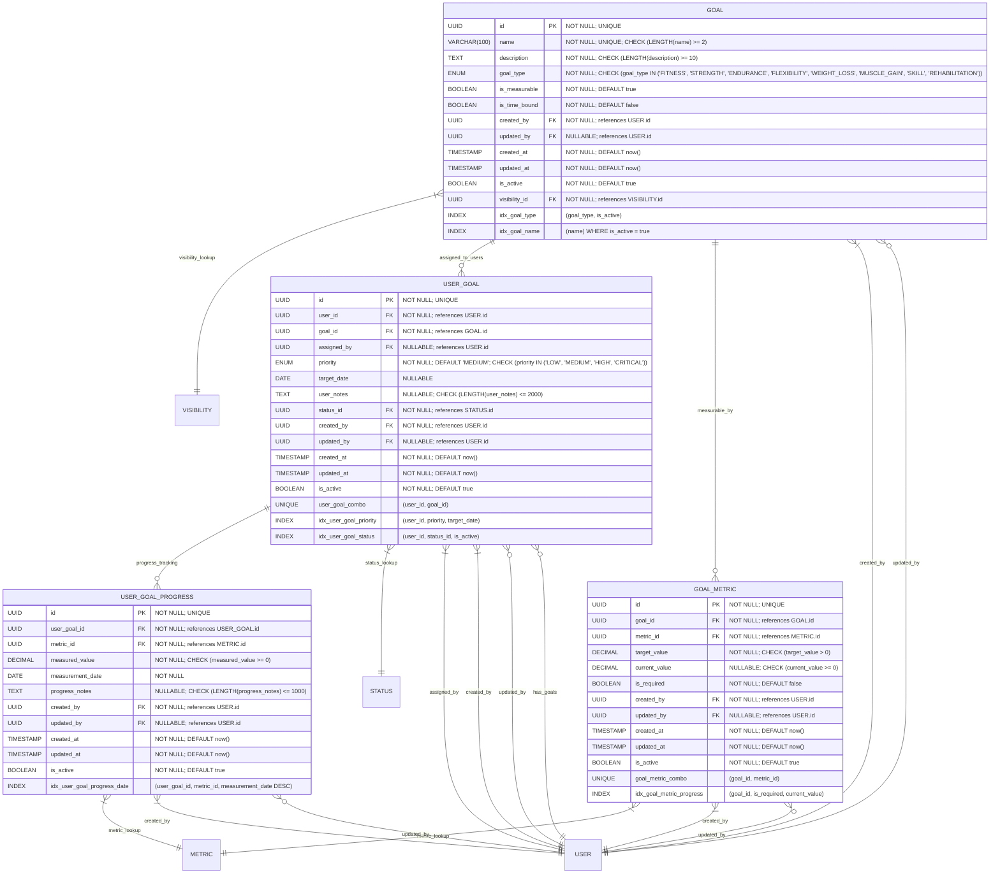

# Goals & Objectives
**Domain:** Goals
**Layer:** Core

```mermaid
erDiagram
  GOAL {
    UUID id PK                        "NOT NULL; UNIQUE"
    VARCHAR(100) name                 "NOT NULL; UNIQUE; CHECK (LENGTH(name) >= 2)"
    TEXT description                  "NOT NULL; CHECK (LENGTH(description) >= 10)"
    ENUM goal_type                    "NOT NULL; CHECK (goal_type IN ('FITNESS', 'STRENGTH', 'ENDURANCE', 'FLEXIBILITY', 'WEIGHT_LOSS', 'MUSCLE_GAIN', 'SKILL', 'REHABILITATION'))"
    BOOLEAN is_measurable             "NOT NULL; DEFAULT true"
    BOOLEAN is_time_bound             "NOT NULL; DEFAULT false"
    UUID created_by FK                "NOT NULL; references USER.id"
    UUID updated_by FK                "NULLABLE; references USER.id"
    TIMESTAMP created_at              "NOT NULL; DEFAULT now()"
    TIMESTAMP updated_at              "NOT NULL; DEFAULT now()"
    BOOLEAN is_active                 "NOT NULL; DEFAULT true"
    UUID visibility_id FK             "NOT NULL; references VISIBILITY.id"
    INDEX idx_goal_type               "(goal_type, is_active)"
    INDEX idx_goal_name               "(name) WHERE is_active = true"
  }
  
  USER_GOAL {
    UUID id PK                        "NOT NULL; UNIQUE"
    UUID user_id FK                   "NOT NULL; references USER.id"
    UUID goal_id FK                   "NOT NULL; references GOAL.id"
    UUID assigned_by FK               "NULLABLE; references USER.id"
    ENUM priority                     "NOT NULL; DEFAULT 'MEDIUM'; CHECK (priority IN ('LOW', 'MEDIUM', 'HIGH', 'CRITICAL'))"
    DATE target_date                  "NULLABLE"
    TEXT user_notes                   "NULLABLE; CHECK (LENGTH(user_notes) <= 2000)"
    UUID status_id FK                 "NOT NULL; references STATUS.id"
    UUID created_by FK                "NOT NULL; references USER.id"
    UUID updated_by FK                "NULLABLE; references USER.id"
    TIMESTAMP created_at              "NOT NULL; DEFAULT now()"
    TIMESTAMP updated_at              "NOT NULL; DEFAULT now()"
    BOOLEAN is_active                 "NOT NULL; DEFAULT true"
    UNIQUE user_goal_combo            "(user_id, goal_id)"
    INDEX idx_user_goal_priority      "(user_id, priority, target_date)"
    INDEX idx_user_goal_status        "(user_id, status_id, is_active)"
  }
  
  GOAL_METRIC {
    UUID id PK                        "NOT NULL; UNIQUE"
    UUID goal_id FK                   "NOT NULL; references GOAL.id"
    UUID metric_id FK                 "NOT NULL; references METRIC.id"
    DECIMAL target_value              "NOT NULL; CHECK (target_value > 0)"
    DECIMAL current_value             "NULLABLE; CHECK (current_value >= 0)"
    BOOLEAN is_required               "NOT NULL; DEFAULT false"
    UUID created_by FK                "NOT NULL; references USER.id"
    UUID updated_by FK                "NULLABLE; references USER.id"
    TIMESTAMP created_at              "NOT NULL; DEFAULT now()"
    TIMESTAMP updated_at              "NOT NULL; DEFAULT now()"
    BOOLEAN is_active                 "NOT NULL; DEFAULT true"
    UNIQUE goal_metric_combo          "(goal_id, metric_id)"
    INDEX idx_goal_metric_progress    "(goal_id, is_required, current_value)"
  }
  
  USER_GOAL_PROGRESS {
    UUID id PK                        "NOT NULL; UNIQUE"
    UUID user_goal_id FK              "NOT NULL; references USER_GOAL.id"
    UUID metric_id FK                 "NOT NULL; references METRIC.id"
    DECIMAL measured_value            "NOT NULL; CHECK (measured_value >= 0)"
    DATE measurement_date             "NOT NULL"
    TEXT progress_notes               "NULLABLE; CHECK (LENGTH(progress_notes) <= 1000)"
    UUID created_by FK                "NOT NULL; references USER.id"
    UUID updated_by FK                "NULLABLE; references USER.id"
    TIMESTAMP created_at              "NOT NULL; DEFAULT now()"
    TIMESTAMP updated_at              "NOT NULL; DEFAULT now()"
    BOOLEAN is_active                 "NOT NULL; DEFAULT true"
    INDEX idx_user_goal_progress_date "(user_goal_id, metric_id, measurement_date DESC)"
  }

  GOAL }|--|| VISIBILITY : "visibility_lookup"
  USER ||--o{ USER_GOAL : "has_goals"
  GOAL ||--o{ USER_GOAL : "assigned_to_users"
  GOAL ||--o{ GOAL_METRIC : "measurable_by"
  USER_GOAL ||--o{ USER_GOAL_PROGRESS : "progress_tracking"
  USER_GOAL }|--|| STATUS : "status_lookup"
  GOAL_METRIC }|--|| METRIC : "metric_lookup"
  USER_GOAL_PROGRESS }|--|| METRIC : "metric_lookup"
  USER_GOAL }|--|| USER : "assigned_by"
  GOAL }|--|| USER : "created_by"
  GOAL }o--|| USER : "updated_by"
  USER_GOAL }|--|| USER : "created_by"
  USER_GOAL }o--|| USER : "updated_by"
  GOAL_METRIC }|--|| USER : "created_by"
  GOAL_METRIC }o--|| USER : "updated_by"
  USER_GOAL_PROGRESS }|--|| USER : "created_by"
  USER_GOAL_PROGRESS }o--|| USER : "updated_by"
```

