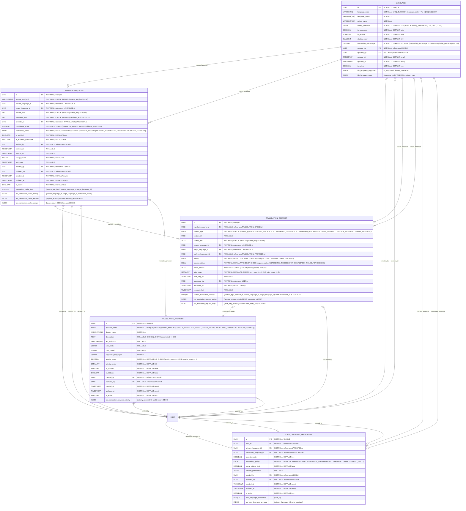

# Translation & Internationalization System
**Domain:** i18n
**Layer:** Core

```mermaid
erDiagram
  LANGUAGE {
    UUID id PK                        "NOT NULL; UNIQUE"
    VARCHAR(5) language_code          "NOT NULL; UNIQUE; CHECK (language_code ~ '^[a-z]{2}(-[A-Z]{2})?$')"
    VARCHAR(100) language_name        "NOT NULL"
    VARCHAR(100) native_name          "NOT NULL"
    ENUM writing_direction            "NOT NULL; DEFAULT 'LTR'; CHECK (writing_direction IN ('LTR', 'RTL', 'TTB'))"
    BOOLEAN is_supported              "NOT NULL; DEFAULT false"
    BOOLEAN is_default                "NOT NULL; DEFAULT false"
    SMALLINT display_order            "NOT NULL; DEFAULT 100"
    DECIMAL completion_percentage     "NOT NULL; DEFAULT 0; CHECK (completion_percentage >= 0 AND completion_percentage <= 100)"
    UUID created_by FK                "NOT NULL; references USER.id"
    UUID updated_by FK                "NULLABLE; references USER.id"
    TIMESTAMP created_at              "NOT NULL; DEFAULT now()"
    TIMESTAMP updated_at              "NOT NULL; DEFAULT now()"
    BOOLEAN is_active                 "NOT NULL; DEFAULT true"
    INDEX idx_language_supported      "(is_supported, display_order ASC)"
    INDEX idx_language_code           "(language_code) WHERE is_active = true"
  }
  
  TRANSLATION_PROVIDER {
    UUID id PK                        "NOT NULL; UNIQUE"
    ENUM provider_name                "NOT NULL; UNIQUE; CHECK (provider_name IN ('GOOGLE_TRANSLATE', 'DEEPL', 'AZURE_TRANSLATOR', 'AWS_TRANSLATE', 'MANUAL', 'OPENAI'))"
    VARCHAR(255) display_name         "NOT NULL"
    TEXT description                  "NULLABLE; CHECK (LENGTH(description) <= 500)"
    VARCHAR(500) api_endpoint         "NULLABLE"
    JSONB rate_limits                 "NULLABLE"
    JSONB cost_model                  "NULLABLE"
    JSONB supported_languages         "NOT NULL"
    DECIMAL quality_score             "NOT NULL; DEFAULT 0.8; CHECK (quality_score >= 0 AND quality_score <= 1)"
    SMALLINT priority_order           "NOT NULL; DEFAULT 100"
    BOOLEAN is_primary                "NOT NULL; DEFAULT false"
    BOOLEAN is_fallback               "NOT NULL; DEFAULT false"
    UUID created_by FK                "NOT NULL; references USER.id"
    UUID updated_by FK                "NULLABLE; references USER.id"
    TIMESTAMP created_at              "NOT NULL; DEFAULT now()"
    TIMESTAMP updated_at              "NOT NULL; DEFAULT now()"
    BOOLEAN is_active                 "NOT NULL; DEFAULT true"
    INDEX idx_translation_provider_priority "(priority_order ASC, quality_score DESC)"
  }
  
  TRANSLATION_CACHE {
    UUID id PK                        "NOT NULL; UNIQUE"
    VARCHAR(64) source_text_hash      "NOT NULL; CHECK (LENGTH(source_text_hash) = 64)"
    UUID source_language_id FK        "NOT NULL; references LANGUAGE.id"
    UUID target_language_id FK        "NOT NULL; references LANGUAGE.id"
    TEXT source_text                  "NOT NULL; CHECK (LENGTH(source_text) <= 10000)"
    TEXT translated_text              "NOT NULL; CHECK (LENGTH(translated_text) <= 15000)"
    UUID provider_id FK               "NOT NULL; references TRANSLATION_PROVIDER.id"
    DECIMAL confidence_score          "NULLABLE; CHECK (confidence_score >= 0 AND confidence_score <= 1)"
    ENUM translation_status           "NOT NULL; DEFAULT 'PENDING'; CHECK (translation_status IN ('PENDING', 'COMPLETED', 'VERIFIED', 'REJECTED', 'EXPIRED'))"
    BOOLEAN is_verified               "NOT NULL; DEFAULT false"
    BOOLEAN is_machine_translated     "NOT NULL; DEFAULT true"
    UUID verified_by FK               "NULLABLE; references USER.id"
    TIMESTAMP verified_at             "NULLABLE"
    TIMESTAMP expires_at              "NULLABLE"
    BIGINT usage_count                "NOT NULL; DEFAULT 0"
    TIMESTAMP last_used               "NULLABLE"
    UUID created_by FK                "NOT NULL; references USER.id"
    UUID updated_by FK                "NULLABLE; references USER.id"
    TIMESTAMP created_at              "NOT NULL; DEFAULT now()"
    TIMESTAMP updated_at              "NOT NULL; DEFAULT now()"
    BOOLEAN is_active                 "NOT NULL; DEFAULT true"
    UNIQUE translation_cache_key      "(source_text_hash, source_language_id, target_language_id)"
    INDEX idx_translation_cache_lookup "(source_language_id, target_language_id, translation_status)"
    INDEX idx_translation_cache_expires "(expires_at ASC) WHERE expires_at IS NOT NULL"
    INDEX idx_translation_cache_usage  "(usage_count DESC, last_used DESC)"
  }
  
  TRANSLATION_REQUEST {
    UUID id PK                        "NOT NULL; UNIQUE"
    UUID translation_cache_id FK      "NULLABLE; references TRANSLATION_CACHE.id"
    ENUM content_type                 "NOT NULL; CHECK (content_type IN ('EXERCISE_INSTRUCTION', 'WORKOUT_DESCRIPTION', 'PROGRAM_DESCRIPTION', 'USER_CONTENT', 'SYSTEM_MESSAGE', 'ERROR_MESSAGE'))"
    UUID content_id                   "NULLABLE"
    TEXT source_text                  "NOT NULL; CHECK (LENGTH(source_text) <= 10000)"
    UUID source_language_id FK        "NOT NULL; references LANGUAGE.id"
    UUID target_language_id FK        "NOT NULL; references LANGUAGE.id"
    UUID preferred_provider_id FK     "NULLABLE; references TRANSLATION_PROVIDER.id"
    ENUM priority                     "NOT NULL; DEFAULT 'NORMAL'; CHECK (priority IN ('LOW', 'NORMAL', 'HIGH', 'URGENT'))"
    ENUM request_status               "NOT NULL; DEFAULT 'PENDING'; CHECK (request_status IN ('PENDING', 'PROCESSING', 'COMPLETED', 'FAILED', 'CANCELLED'))"
    TEXT failure_reason               "NULLABLE; CHECK (LENGTH(failure_reason) <= 1000)"
    SMALLINT retry_count              "NOT NULL; DEFAULT 0; CHECK (retry_count >= 0 AND retry_count <= 5)"
    TIMESTAMP next_retry_at           "NULLABLE"
    UUID requested_by FK              "NOT NULL; references USER.id"
    TIMESTAMP requested_at            "NOT NULL; DEFAULT now()"
    TIMESTAMP completed_at            "NULLABLE"
    UNIQUE content_translation_request "(content_type, content_id, source_language_id, target_language_id) WHERE content_id IS NOT NULL"
    INDEX idx_translation_request_status "(request_status, priority DESC, requested_at ASC)"
    INDEX idx_translation_request_retry "(next_retry_at ASC) WHERE next_retry_at IS NOT NULL"
  }
  
  USER_LANGUAGE_PREFERENCE {
    UUID id PK                        "NOT NULL; UNIQUE"
    UUID user_id FK                   "NOT NULL; references USER.id"
    UUID primary_language_id FK       "NOT NULL; references LANGUAGE.id"
    UUID secondary_language_id FK     "NULLABLE; references LANGUAGE.id"
    BOOLEAN auto_translate            "NOT NULL; DEFAULT true"
    ENUM translation_quality          "NOT NULL; DEFAULT 'STANDARD'; CHECK (translation_quality IN ('BASIC', 'STANDARD', 'HIGH', 'VERIFIED_ONLY'))"
    BOOLEAN show_original_text        "NOT NULL; DEFAULT false"
    JSONB content_preferences         "NULLABLE"
    UUID created_by FK                "NOT NULL; references USER.id"
    UUID updated_by FK                "NULLABLE; references USER.id"
    TIMESTAMP created_at              "NOT NULL; DEFAULT now()"
    TIMESTAMP updated_at              "NOT NULL; DEFAULT now()"
    BOOLEAN is_active                 "NOT NULL; DEFAULT true"
    UNIQUE user_language_preference   "(user_id)"
    INDEX idx_user_lang_pref_primary  "(primary_language_id, auto_translate)"
  }

  LANGUAGE ||--o{ TRANSLATION_CACHE : "source_language"
  LANGUAGE ||--o{ TRANSLATION_CACHE : "target_language"
  TRANSLATION_PROVIDER ||--o{ TRANSLATION_CACHE : "translation_provider"
  TRANSLATION_CACHE ||--o{ TRANSLATION_REQUEST : "cached_translation"
  TRANSLATION_REQUEST }|--|| LANGUAGE : "source_language"
  TRANSLATION_REQUEST }|--|| LANGUAGE : "target_language"
  TRANSLATION_REQUEST }o--|| TRANSLATION_PROVIDER : "preferred_provider"
  USER ||--o{ USER_LANGUAGE_PREFERENCE : "language_preferences"
  USER_LANGUAGE_PREFERENCE }|--|| LANGUAGE : "primary_language"
  USER_LANGUAGE_PREFERENCE }o--|| LANGUAGE : "secondary_language"
  TRANSLATION_CACHE }o--|| USER : "verified_by"
  TRANSLATION_REQUEST }|--|| USER : "requested_by"
  LANGUAGE }|--|| USER : "created_by"
  LANGUAGE }o--|| USER : "updated_by"
  TRANSLATION_PROVIDER }|--|| USER : "created_by"
  TRANSLATION_PROVIDER }o--|| USER : "updated_by"
  TRANSLATION_CACHE }|--|| USER : "created_by"
  TRANSLATION_CACHE }o--|| USER : "updated_by"
  USER_LANGUAGE_PREFERENCE }|--|| USER : "created_by"
  USER_LANGUAGE_PREFERENCE }o--|| USER : "updated_by"
```

