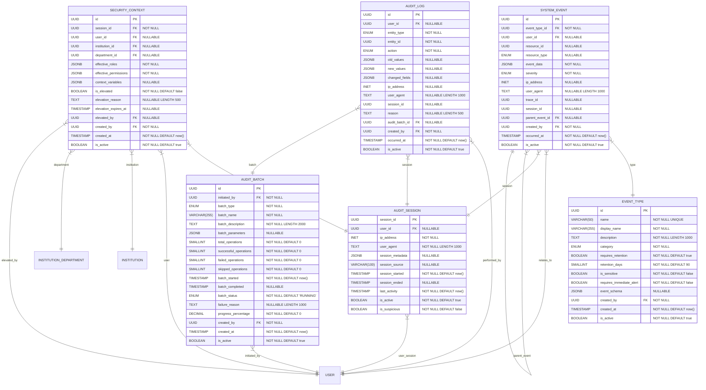

# Audit & Event Tracking

```mermaid
erDiagram
    EVENT_TYPE {
        UUID id PK
        VARCHAR(50) name "NOT NULL UNIQUE"
        VARCHAR(255) display_name "NOT NULL"
        TEXT description "NOT NULL LENGTH 1000"
        ENUM category "NOT NULL"
        BOOLEAN requires_retention "NOT NULL DEFAULT true"
        SMALLINT retention_days "NOT NULL DEFAULT 90"
        BOOLEAN is_sensitive "NOT NULL DEFAULT false"
        BOOLEAN requires_immediate_alert "NOT NULL DEFAULT false"
        JSONB event_schema "NULLABLE"
        UUID created_by FK "NOT NULL"
        TIMESTAMP created_at "NOT NULL DEFAULT now()"
        BOOLEAN is_active "NOT NULL DEFAULT true"
    }
    AUDIT_LOG {
        UUID id PK
        UUID user_id FK "NULLABLE"
        ENUM entity_type "NOT NULL"
        UUID entity_id "NOT NULL"
        ENUM action "NOT NULL"
        JSONB old_values "NULLABLE"
        JSONB new_values "NULLABLE"
        JSONB changed_fields "NULLABLE"
        INET ip_address "NULLABLE"
        TEXT user_agent "NULLABLE LENGTH 1000"
        UUID session_id "NULLABLE"
        TEXT reason "NULLABLE LENGTH 500"
        UUID audit_batch_id FK "NULLABLE"
        UUID created_by FK "NOT NULL"
        TIMESTAMP occurred_at "NOT NULL DEFAULT now()"
        BOOLEAN is_active "NOT NULL DEFAULT true"
    }
    SYSTEM_EVENT {
        UUID id PK
        UUID event_type_id FK "NOT NULL"
        UUID user_id FK "NULLABLE"
        UUID resource_id "NULLABLE"
        ENUM resource_type "NULLABLE"
        JSONB event_data "NOT NULL"
        ENUM severity "NOT NULL"
        INET ip_address "NULLABLE"
        TEXT user_agent "NULLABLE LENGTH 1000"
        UUID trace_id "NULLABLE"
        UUID session_id "NULLABLE"
        UUID parent_event_id FK "NULLABLE"
        UUID created_by FK "NOT NULL"
        TIMESTAMP occurred_at "NOT NULL DEFAULT now()"
        BOOLEAN is_active "NOT NULL DEFAULT true"
    }
    AUDIT_SESSION {
        UUID session_id PK
        UUID user_id FK "NULLABLE"
        INET ip_address "NOT NULL"
        TEXT user_agent "NOT NULL LENGTH 1000"
        JSONB session_metadata "NULLABLE"
        VARCHAR(100) session_source "NULLABLE"
        TIMESTAMP session_started "NOT NULL DEFAULT now()"
        TIMESTAMP session_ended "NULLABLE"
        TIMESTAMP last_activity "NOT NULL DEFAULT now()"
        BOOLEAN is_active "NOT NULL DEFAULT true"
        BOOLEAN is_suspicious "NOT NULL DEFAULT false"
    }
    AUDIT_BATCH {
        UUID id PK
        UUID initiated_by FK "NOT NULL"
        ENUM batch_type "NOT NULL"
        VARCHAR(255) batch_name "NOT NULL"
        TEXT batch_description "NOT NULL LENGTH 2000"
        JSONB batch_parameters "NULLABLE"
        SMALLINT total_operations "NOT NULL DEFAULT 0"
        SMALLINT successful_operations "NOT NULL DEFAULT 0"
        SMALLINT failed_operations "NOT NULL DEFAULT 0"
        SMALLINT skipped_operations "NOT NULL DEFAULT 0"
        TIMESTAMP batch_started "NOT NULL DEFAULT now()"
        TIMESTAMP batch_completed "NULLABLE"
        ENUM batch_status "NOT NULL DEFAULT 'RUNNING'"
        TEXT failure_reason "NULLABLE LENGTH 1000"
        DECIMAL progress_percentage "NOT NULL DEFAULT 0"
        UUID created_by FK "NOT NULL"
        TIMESTAMP created_at "NOT NULL DEFAULT now()"
        BOOLEAN is_active "NOT NULL DEFAULT true"
    }
    SECURITY_CONTEXT {
        UUID id PK
        UUID session_id FK "NOT NULL"
        UUID user_id FK "NULLABLE"
        UUID institution_id FK "NULLABLE"
        UUID department_id FK "NULLABLE"
        JSONB effective_roles "NOT NULL"
        JSONB effective_permissions "NOT NULL"
        JSONB context_variables "NULLABLE"
        BOOLEAN is_elevated "NOT NULL DEFAULT false"
        TEXT elevation_reason "NULLABLE LENGTH 500"
        TIMESTAMP elevation_expires_at "NULLABLE"
        UUID elevated_by FK "NULLABLE"
        UUID created_by FK "NOT NULL"
        TIMESTAMP created_at "NOT NULL DEFAULT now()"
        BOOLEAN is_active "NOT NULL DEFAULT true"
    }
    AUDIT_LOG }|--|| USER : "performed_by"
    AUDIT_LOG }|--|| AUDIT_SESSION : "session"
    AUDIT_LOG }|--|| AUDIT_BATCH : "batch"
    SYSTEM_EVENT }|--|| EVENT_TYPE : "type"
    SYSTEM_EVENT }|--|| USER : "relates_to"
    SYSTEM_EVENT }|--|| AUDIT_SESSION : "session"
    SYSTEM_EVENT }|--|| SYSTEM_EVENT : "parent_event"
    AUDIT_SESSION }|--|| USER : "user_session"
    AUDIT_BATCH }|--|| USER : "initiated_by"
    SECURITY_CONTEXT }|--|| AUDIT_SESSION : "session"
    SECURITY_CONTEXT }|--|| USER : "user"
    SECURITY_CONTEXT }|--|| INSTITUTION : "institution"
    SECURITY_CONTEXT }|--|| INSTITUTION_DEPARTMENT : "department"
    SECURITY_CONTEXT }|--|| USER : "elevated_by"
```