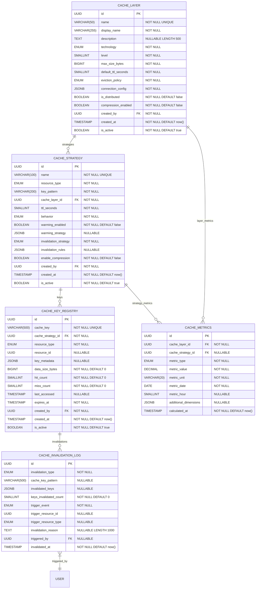

# Cache Management System

```mermaid
erDiagram
    CACHE_LAYER {
        UUID id PK
        VARCHAR(50) name "NOT NULL UNIQUE"
        VARCHAR(255) display_name "NOT NULL"
        TEXT description "NULLABLE LENGTH 500"
        ENUM technology "NOT NULL"
        SMALLINT level "NOT NULL"
        BIGINT max_size_bytes "NOT NULL"
        SMALLINT default_ttl_seconds "NOT NULL"
        ENUM eviction_policy "NOT NULL"
        JSONB connection_config "NOT NULL"
        BOOLEAN is_distributed "NOT NULL DEFAULT false"
        BOOLEAN compression_enabled "NOT NULL DEFAULT false"
        UUID created_by FK "NOT NULL"
        TIMESTAMP created_at "NOT NULL DEFAULT now()"
        BOOLEAN is_active "NOT NULL DEFAULT true"
    }
    CACHE_STRATEGY {
        UUID id PK
        VARCHAR(100) name "NOT NULL UNIQUE"
        ENUM resource_type "NOT NULL"
        VARCHAR(200) key_pattern "NOT NULL"
        UUID cache_layer_id FK "NOT NULL"
        SMALLINT ttl_seconds "NOT NULL"
        ENUM behavior "NOT NULL"
        BOOLEAN warming_enabled "NOT NULL DEFAULT false"
        JSONB warming_strategy "NULLABLE"
        ENUM invalidation_strategy "NOT NULL"
        JSONB invalidation_rules "NULLABLE"
        BOOLEAN enable_compression "NOT NULL DEFAULT false"
        UUID created_by FK "NOT NULL"
        TIMESTAMP created_at "NOT NULL DEFAULT now()"
        BOOLEAN is_active "NOT NULL DEFAULT true"
    }
    CACHE_KEY_REGISTRY {
        UUID id PK
        VARCHAR(500) cache_key "NOT NULL UNIQUE"
        UUID cache_strategy_id FK "NOT NULL"
        ENUM resource_type "NOT NULL"
        UUID resource_id "NULLABLE"
        JSONB key_metadata "NULLABLE"
        BIGINT data_size_bytes "NOT NULL DEFAULT 0"
        SMALLINT hit_count "NOT NULL DEFAULT 0"
        SMALLINT miss_count "NOT NULL DEFAULT 0"
        TIMESTAMP last_accessed "NULLABLE"
        TIMESTAMP expires_at "NOT NULL"
        UUID created_by FK "NOT NULL"
        TIMESTAMP created_at "NOT NULL DEFAULT now()"
        BOOLEAN is_active "NOT NULL DEFAULT true"
    }
    CACHE_METRICS {
        UUID id PK
        UUID cache_layer_id FK "NOT NULL"
        UUID cache_strategy_id FK "NULLABLE"
        ENUM metric_type "NOT NULL"
        DECIMAL metric_value "NOT NULL"
        VARCHAR(20) metric_unit "NOT NULL"
        DATE metric_date "NOT NULL"
        SMALLINT metric_hour "NULLABLE"
        JSONB additional_dimensions "NULLABLE"
        TIMESTAMP calculated_at "NOT NULL DEFAULT now()"
    }
    CACHE_INVALIDATION_LOG {
        UUID id PK
        ENUM invalidation_type "NOT NULL"
        VARCHAR(500) cache_key_pattern "NULLABLE"
        JSONB invalidated_keys "NULLABLE"
        SMALLINT keys_invalidated_count "NOT NULL DEFAULT 0"
        ENUM trigger_event "NOT NULL"
        UUID trigger_resource_id "NULLABLE"
        ENUM trigger_resource_type "NULLABLE"
        TEXT invalidation_reason "NULLABLE LENGTH 1000"
        UUID triggered_by FK "NULLABLE"
        TIMESTAMP invalidated_at "NOT NULL DEFAULT now()"
    }
    CACHE_LAYER ||--o{ CACHE_STRATEGY : "strategies"
    CACHE_STRATEGY ||--o{ CACHE_KEY_REGISTRY : "keys"
    CACHE_LAYER ||--o{ CACHE_METRICS : "layer_metrics"
    CACHE_STRATEGY ||--o{ CACHE_METRICS : "strategy_metrics"
    CACHE_KEY_REGISTRY ||--o{ CACHE_INVALIDATION_LOG : "invalidations"
    CACHE_INVALIDATION_LOG }|--|| USER : "triggered_by"
```

