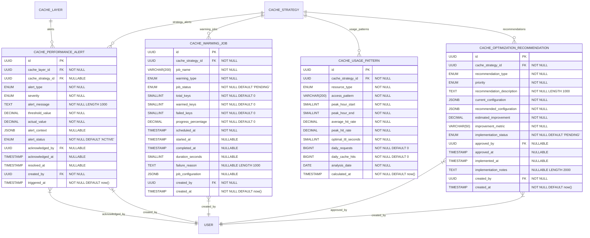

# Cache Monitoring & Analytics

```mermaid
erDiagram
    CACHE_PERFORMANCE_ALERT {
        UUID id PK
        UUID cache_layer_id FK "NOT NULL"
        UUID cache_strategy_id FK "NULLABLE"
        ENUM alert_type "NOT NULL"
        ENUM severity "NOT NULL"
        TEXT alert_message "NOT NULL LENGTH 1000"
        DECIMAL threshold_value "NOT NULL"
        DECIMAL actual_value "NOT NULL"
        JSONB alert_context "NULLABLE"
        ENUM alert_status "NOT NULL DEFAULT 'ACTIVE'"
        UUID acknowledged_by FK "NULLABLE"
        TIMESTAMP acknowledged_at "NULLABLE"
        TIMESTAMP resolved_at "NULLABLE"
        UUID created_by FK "NOT NULL"
        TIMESTAMP triggered_at "NOT NULL DEFAULT now()"
    }
    CACHE_WARMING_JOB {
        UUID id PK
        UUID cache_strategy_id FK "NOT NULL"
        VARCHAR(200) job_name "NOT NULL"
        ENUM warming_type "NOT NULL"
        ENUM job_status "NOT NULL DEFAULT 'PENDING'"
        SMALLINT total_keys "NOT NULL DEFAULT 0"
        SMALLINT warmed_keys "NOT NULL DEFAULT 0"
        SMALLINT failed_keys "NOT NULL DEFAULT 0"
        DECIMAL progress_percentage "NOT NULL DEFAULT 0"
        TIMESTAMP scheduled_at "NOT NULL"
        TIMESTAMP started_at "NULLABLE"
        TIMESTAMP completed_at "NULLABLE"
        SMALLINT duration_seconds "NULLABLE"
        TEXT failure_reason "NULLABLE LENGTH 1000"
        JSONB job_configuration "NULLABLE"
        UUID created_by FK "NOT NULL"
        TIMESTAMP created_at "NOT NULL DEFAULT now()"
    }
    CACHE_USAGE_PATTERN {
        UUID id PK
        UUID cache_strategy_id FK "NOT NULL"
        ENUM resource_type "NOT NULL"
        VARCHAR(200) access_pattern "NOT NULL"
        SMALLINT peak_hour_start "NOT NULL"
        SMALLINT peak_hour_end "NOT NULL"
        DECIMAL average_hit_rate "NOT NULL"
        DECIMAL peak_hit_rate "NOT NULL"
        SMALLINT optimal_ttl_seconds "NOT NULL"
        BIGINT daily_requests "NOT NULL DEFAULT 0"
        BIGINT daily_cache_hits "NOT NULL DEFAULT 0"
        DATE analysis_date "NOT NULL"
        TIMESTAMP calculated_at "NOT NULL DEFAULT now()"
    }
    CACHE_OPTIMIZATION_RECOMMENDATION {
        UUID id PK
        UUID cache_strategy_id FK "NOT NULL"
        ENUM recommendation_type "NOT NULL"
        ENUM priority "NOT NULL"
        TEXT recommendation_description "NOT NULL LENGTH 1000"
        JSONB current_configuration "NOT NULL"
        JSONB recommended_configuration "NOT NULL"
        DECIMAL estimated_improvement "NOT NULL"
        VARCHAR(50) improvement_metric "NOT NULL"
        ENUM implementation_status "NOT NULL DEFAULT 'PENDING'"
        UUID approved_by FK "NULLABLE"
        TIMESTAMP approved_at "NULLABLE"
        TIMESTAMP implemented_at "NULLABLE"
        TEXT implementation_notes "NULLABLE LENGTH 2000"
        UUID created_by FK "NOT NULL"
        TIMESTAMP created_at "NOT NULL DEFAULT now()"
    }
    CACHE_LAYER ||--o{ CACHE_PERFORMANCE_ALERT : "alerts"
    CACHE_STRATEGY ||--o{ CACHE_PERFORMANCE_ALERT : "strategy_alerts"
    CACHE_STRATEGY ||--o{ CACHE_WARMING_JOB : "warming_jobs"
    CACHE_STRATEGY ||--o{ CACHE_USAGE_PATTERN : "usage_patterns"
    CACHE_STRATEGY ||--o{ CACHE_OPTIMIZATION_RECOMMENDATION : "recommendations"
    CACHE_PERFORMANCE_ALERT }|--|| USER : "acknowledged_by"
    CACHE_WARMING_JOB }|--|| USER : "created_by"
    CACHE_OPTIMIZATION_RECOMMENDATION }|--|| USER : "approved_by"
    CACHE_PERFORMANCE_ALERT }|--|| USER : "created_by"
    CACHE_OPTIMIZATION_RECOMMENDATION }|--|| USER : "created_by"
```