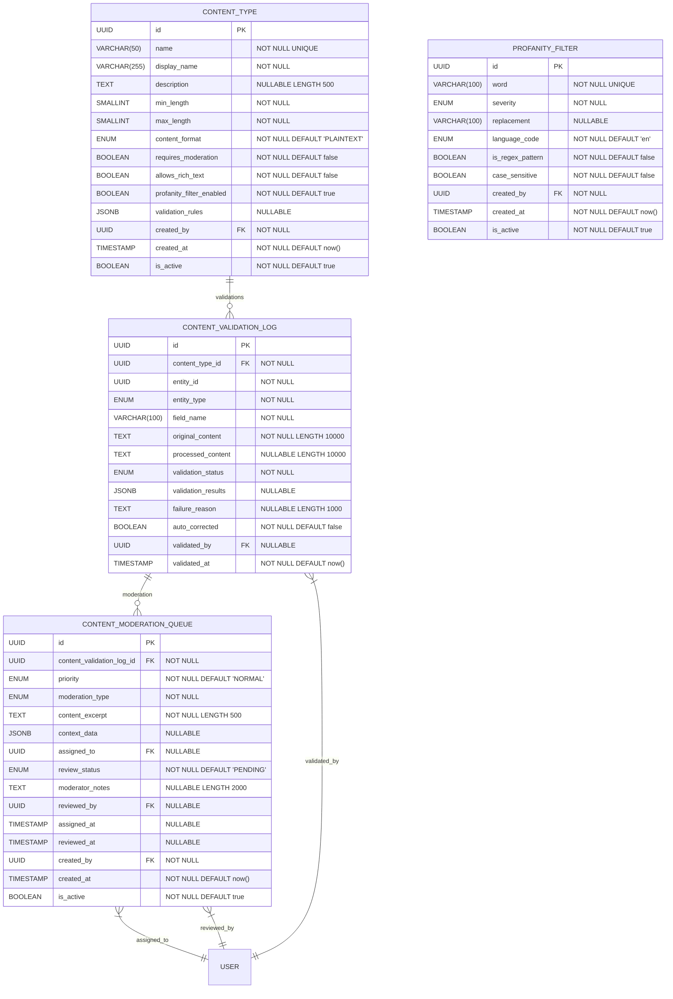

# Content Management & Validation

```mermaid
erDiagram
    CONTENT_TYPE {
        UUID id PK
        VARCHAR(50) name "NOT NULL UNIQUE"
        VARCHAR(255) display_name "NOT NULL"
        TEXT description "NULLABLE LENGTH 500"
        SMALLINT min_length "NOT NULL"
        SMALLINT max_length "NOT NULL"
        ENUM content_format "NOT NULL DEFAULT 'PLAINTEXT'"
        BOOLEAN requires_moderation "NOT NULL DEFAULT false"
        BOOLEAN allows_rich_text "NOT NULL DEFAULT false"
        BOOLEAN profanity_filter_enabled "NOT NULL DEFAULT true"
        JSONB validation_rules "NULLABLE"
        UUID created_by FK "NOT NULL"
        TIMESTAMP created_at "NOT NULL DEFAULT now()"
        BOOLEAN is_active "NOT NULL DEFAULT true"
    }
    CONTENT_VALIDATION_LOG {
        UUID id PK
        UUID content_type_id FK "NOT NULL"
        UUID entity_id "NOT NULL"
        ENUM entity_type "NOT NULL"
        VARCHAR(100) field_name "NOT NULL"
        TEXT original_content "NOT NULL LENGTH 10000"
        TEXT processed_content "NULLABLE LENGTH 10000"
        ENUM validation_status "NOT NULL"
        JSONB validation_results "NULLABLE"
        TEXT failure_reason "NULLABLE LENGTH 1000"
        BOOLEAN auto_corrected "NOT NULL DEFAULT false"
        UUID validated_by FK "NULLABLE"
        TIMESTAMP validated_at "NOT NULL DEFAULT now()"
    }
    CONTENT_MODERATION_QUEUE {
        UUID id PK
        UUID content_validation_log_id FK "NOT NULL"
        ENUM priority "NOT NULL DEFAULT 'NORMAL'"
        ENUM moderation_type "NOT NULL"
        TEXT content_excerpt "NOT NULL LENGTH 500"
        JSONB context_data "NULLABLE"
        UUID assigned_to FK "NULLABLE"
        ENUM review_status "NOT NULL DEFAULT 'PENDING'"
        TEXT moderator_notes "NULLABLE LENGTH 2000"
        UUID reviewed_by FK "NULLABLE"
        TIMESTAMP assigned_at "NULLABLE"
        TIMESTAMP reviewed_at "NULLABLE"
        UUID created_by FK "NOT NULL"
        TIMESTAMP created_at "NOT NULL DEFAULT now()"
        BOOLEAN is_active "NOT NULL DEFAULT true"
    }
    PROFANITY_FILTER {
        UUID id PK
        VARCHAR(100) word "NOT NULL UNIQUE"
        ENUM severity "NOT NULL"
        VARCHAR(100) replacement "NULLABLE"
        ENUM language_code "NOT NULL DEFAULT 'en'"
        BOOLEAN is_regex_pattern "NOT NULL DEFAULT false"
        BOOLEAN case_sensitive "NOT NULL DEFAULT false"
        UUID created_by FK "NOT NULL"
        TIMESTAMP created_at "NOT NULL DEFAULT now()"
        BOOLEAN is_active "NOT NULL DEFAULT true"
    }
    CONTENT_TYPE ||--o{ CONTENT_VALIDATION_LOG : "validations"
    CONTENT_VALIDATION_LOG ||--o{ CONTENT_MODERATION_QUEUE : "moderation"
    CONTENT_MODERATION_QUEUE }|--|| USER : "assigned_to"
    CONTENT_MODERATION_QUEUE }|--|| USER : "reviewed_by"
    CONTENT_VALIDATION_LOG }|--|| USER : "validated_by"
```

