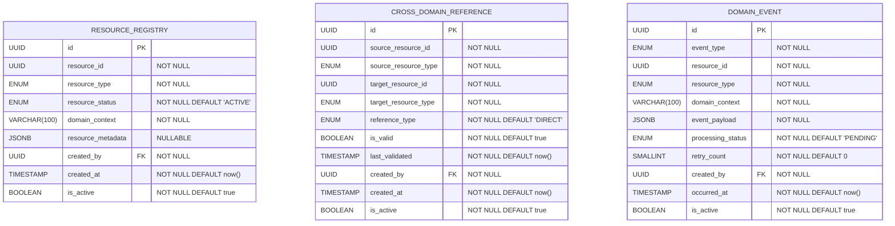

# Cross-Domain Relationships

```mermaid
erDiagram
    RESOURCE_REGISTRY {
        UUID id PK
        UUID resource_id "NOT NULL"
        ENUM resource_type "NOT NULL"
        ENUM resource_status "NOT NULL DEFAULT 'ACTIVE'"
        VARCHAR(100) domain_context "NOT NULL"
        JSONB resource_metadata "NULLABLE"
        UUID created_by FK "NOT NULL"
        TIMESTAMP created_at "NOT NULL DEFAULT now()"
        BOOLEAN is_active "NOT NULL DEFAULT true"
    }
    CROSS_DOMAIN_REFERENCE {
        UUID id PK
        UUID source_resource_id "NOT NULL"
        ENUM source_resource_type "NOT NULL"
        UUID target_resource_id "NOT NULL"
        ENUM target_resource_type "NOT NULL"
        ENUM reference_type "NOT NULL DEFAULT 'DIRECT'"
        BOOLEAN is_valid "NOT NULL DEFAULT true"
        TIMESTAMP last_validated "NOT NULL DEFAULT now()"
        UUID created_by FK "NOT NULL"
        TIMESTAMP created_at "NOT NULL DEFAULT now()"
        BOOLEAN is_active "NOT NULL DEFAULT true"
    }
    DOMAIN_EVENT {
        UUID id PK
        ENUM event_type "NOT NULL"
        UUID resource_id "NOT NULL"
        ENUM resource_type "NOT NULL"
        VARCHAR(100) domain_context "NOT NULL"
        JSONB event_payload "NOT NULL"
        ENUM processing_status "NOT NULL DEFAULT 'PENDING'"
        SMALLINT retry_count "NOT NULL DEFAULT 0"
        UUID created_by FK "NOT NULL"
        TIMESTAMP occurred_at "NOT NULL DEFAULT now()"
        BOOLEAN is_active "NOT NULL DEFAULT true"
    }
```

