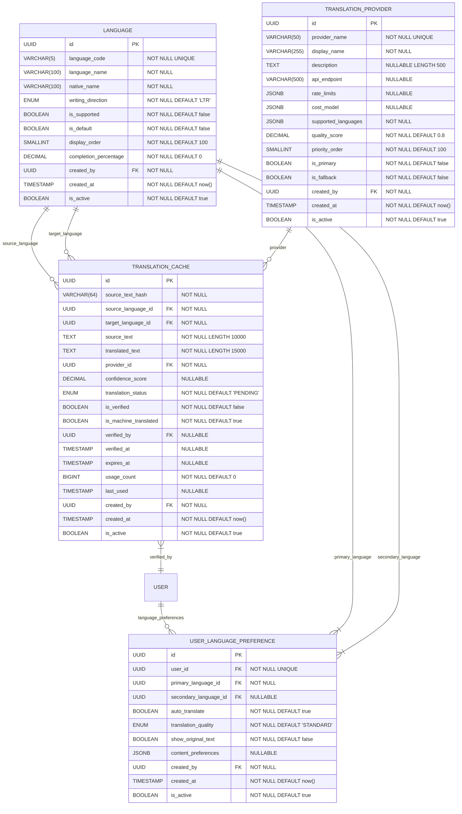

# Translation & Internationalization System

```mermaid
erDiagram
    LANGUAGE {
        UUID id PK
        VARCHAR(5) language_code "NOT NULL UNIQUE"
        VARCHAR(100) language_name "NOT NULL"
        VARCHAR(100) native_name "NOT NULL"
        ENUM writing_direction "NOT NULL DEFAULT 'LTR'"
        BOOLEAN is_supported "NOT NULL DEFAULT false"
        BOOLEAN is_default "NOT NULL DEFAULT false"
        SMALLINT display_order "NOT NULL DEFAULT 100"
        DECIMAL completion_percentage "NOT NULL DEFAULT 0"
        UUID created_by FK "NOT NULL"
        TIMESTAMP created_at "NOT NULL DEFAULT now()"
        BOOLEAN is_active "NOT NULL DEFAULT true"
    }
    TRANSLATION_PROVIDER {
        UUID id PK
        VARCHAR(50) provider_name "NOT NULL UNIQUE"
        VARCHAR(255) display_name "NOT NULL"
        TEXT description "NULLABLE LENGTH 500"
        VARCHAR(500) api_endpoint "NULLABLE"
        JSONB rate_limits "NULLABLE"
        JSONB cost_model "NULLABLE"
        JSONB supported_languages "NOT NULL"
        DECIMAL quality_score "NOT NULL DEFAULT 0.8"
        SMALLINT priority_order "NOT NULL DEFAULT 100"
        BOOLEAN is_primary "NOT NULL DEFAULT false"
        BOOLEAN is_fallback "NOT NULL DEFAULT false"
        UUID created_by FK "NOT NULL"
        TIMESTAMP created_at "NOT NULL DEFAULT now()"
        BOOLEAN is_active "NOT NULL DEFAULT true"
    }
    TRANSLATION_CACHE {
        UUID id PK
        VARCHAR(64) source_text_hash "NOT NULL"
        UUID source_language_id FK "NOT NULL"
        UUID target_language_id FK "NOT NULL"
        TEXT source_text "NOT NULL LENGTH 10000"
        TEXT translated_text "NOT NULL LENGTH 15000"
        UUID provider_id FK "NOT NULL"
        DECIMAL confidence_score "NULLABLE"
        ENUM translation_status "NOT NULL DEFAULT 'PENDING'"
        BOOLEAN is_verified "NOT NULL DEFAULT false"
        BOOLEAN is_machine_translated "NOT NULL DEFAULT true"
        UUID verified_by FK "NULLABLE"
        TIMESTAMP verified_at "NULLABLE"
        TIMESTAMP expires_at "NULLABLE"
        BIGINT usage_count "NOT NULL DEFAULT 0"
        TIMESTAMP last_used "NULLABLE"
        UUID created_by FK "NOT NULL"
        TIMESTAMP created_at "NOT NULL DEFAULT now()"
        BOOLEAN is_active "NOT NULL DEFAULT true"
    }
    USER_LANGUAGE_PREFERENCE {
        UUID id PK
        UUID user_id FK "NOT NULL UNIQUE"
        UUID primary_language_id FK "NOT NULL"
        UUID secondary_language_id FK "NULLABLE"
        BOOLEAN auto_translate "NOT NULL DEFAULT true"
        ENUM translation_quality "NOT NULL DEFAULT 'STANDARD'"
        BOOLEAN show_original_text "NOT NULL DEFAULT false"
        JSONB content_preferences "NULLABLE"
        UUID created_by FK "NOT NULL"
        TIMESTAMP created_at "NOT NULL DEFAULT now()"
        BOOLEAN is_active "NOT NULL DEFAULT true"
    }
    LANGUAGE ||--o{ TRANSLATION_CACHE : "source_language"
    LANGUAGE ||--o{ TRANSLATION_CACHE : "target_language"
    TRANSLATION_PROVIDER ||--o{ TRANSLATION_CACHE : "provider"
    USER ||--o{ USER_LANGUAGE_PREFERENCE : "language_preferences"
    USER_LANGUAGE_PREFERENCE }|--|| LANGUAGE : "primary_language"
    USER_LANGUAGE_PREFERENCE }|--|| LANGUAGE : "secondary_language"
    TRANSLATION_CACHE }|--|| USER : "verified_by"
```

