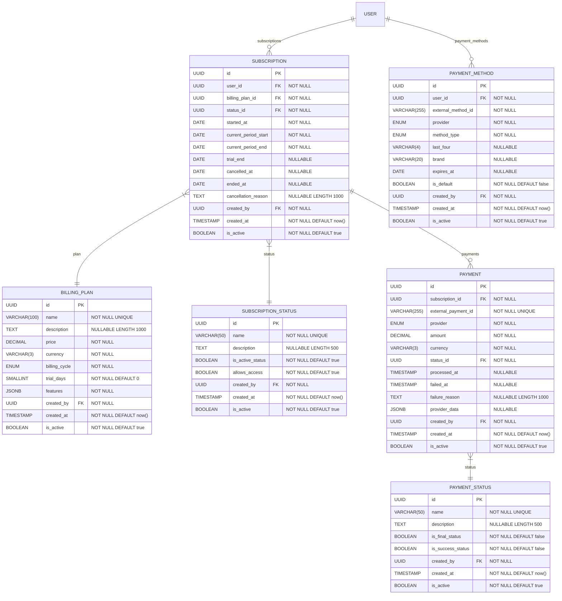

# Payment & Subscription Management

```mermaid
erDiagram
    BILLING_PLAN {
        UUID id PK
        VARCHAR(100) name "NOT NULL UNIQUE"
        TEXT description "NULLABLE LENGTH 1000"
        DECIMAL price "NOT NULL"
        VARCHAR(3) currency "NOT NULL"
        ENUM billing_cycle "NOT NULL"
        SMALLINT trial_days "NOT NULL DEFAULT 0"
        JSONB features "NOT NULL"
        UUID created_by FK "NOT NULL"
        TIMESTAMP created_at "NOT NULL DEFAULT now()"
        BOOLEAN is_active "NOT NULL DEFAULT true"
    }
    SUBSCRIPTION_STATUS {
        UUID id PK
        VARCHAR(50) name "NOT NULL UNIQUE"
        TEXT description "NULLABLE LENGTH 500"
        BOOLEAN is_active_status "NOT NULL DEFAULT true"
        BOOLEAN allows_access "NOT NULL DEFAULT true"
        UUID created_by FK "NOT NULL"
        TIMESTAMP created_at "NOT NULL DEFAULT now()"
        BOOLEAN is_active "NOT NULL DEFAULT true"
    }
    SUBSCRIPTION {
        UUID id PK
        UUID user_id FK "NOT NULL"
        UUID billing_plan_id FK "NOT NULL"
        UUID status_id FK "NOT NULL"
        DATE started_at "NOT NULL"
        DATE current_period_start "NOT NULL"
        DATE current_period_end "NOT NULL"
        DATE trial_end "NULLABLE"
        DATE cancelled_at "NULLABLE"
        DATE ended_at "NULLABLE"
        TEXT cancellation_reason "NULLABLE LENGTH 1000"
        UUID created_by FK "NOT NULL"
        TIMESTAMP created_at "NOT NULL DEFAULT now()"
        BOOLEAN is_active "NOT NULL DEFAULT true"
    }
    PAYMENT_STATUS {
        UUID id PK
        VARCHAR(50) name "NOT NULL UNIQUE"
        TEXT description "NULLABLE LENGTH 500"
        BOOLEAN is_final_status "NOT NULL DEFAULT false"
        BOOLEAN is_success_status "NOT NULL DEFAULT false"
        UUID created_by FK "NOT NULL"
        TIMESTAMP created_at "NOT NULL DEFAULT now()"
        BOOLEAN is_active "NOT NULL DEFAULT true"
    }
    PAYMENT {
        UUID id PK
        UUID subscription_id FK "NOT NULL"
        VARCHAR(255) external_payment_id "NOT NULL UNIQUE"
        ENUM provider "NOT NULL"
        DECIMAL amount "NOT NULL"
        VARCHAR(3) currency "NOT NULL"
        UUID status_id FK "NOT NULL"
        TIMESTAMP processed_at "NULLABLE"
        TIMESTAMP failed_at "NULLABLE"
        TEXT failure_reason "NULLABLE LENGTH 1000"
        JSONB provider_data "NULLABLE"
        UUID created_by FK "NOT NULL"
        TIMESTAMP created_at "NOT NULL DEFAULT now()"
        BOOLEAN is_active "NOT NULL DEFAULT true"
    }
    PAYMENT_METHOD {
        UUID id PK
        UUID user_id FK "NOT NULL"
        VARCHAR(255) external_method_id "NOT NULL"
        ENUM provider "NOT NULL"
        ENUM method_type "NOT NULL"
        VARCHAR(4) last_four "NULLABLE"
        VARCHAR(20) brand "NULLABLE"
        DATE expires_at "NULLABLE"
        BOOLEAN is_default "NOT NULL DEFAULT false"
        UUID created_by FK "NOT NULL"
        TIMESTAMP created_at "NOT NULL DEFAULT now()"
        BOOLEAN is_active "NOT NULL DEFAULT true"
    }
    USER ||--o{ SUBSCRIPTION : "subscriptions"
    USER ||--o{ PAYMENT_METHOD : "payment_methods"
    SUBSCRIPTION }|--|| BILLING_PLAN : "plan"
    SUBSCRIPTION }|--|| SUBSCRIPTION_STATUS : "status"
    SUBSCRIPTION ||--o{ PAYMENT : "payments"
    PAYMENT }|--|| PAYMENT_STATUS : "status"
```

