# Access Control, Policies & Invites

**Section:** Program
**Subsection:** Access Control, Policies & Invites

## Diagram

```mermaid
erDiagram
  %%=== Layer 3: Access Control, Policies & Invites ===%%

  INSTITUTION_POLICY {
    UUID institution_id PK,FK         "NOT NULL; references INSTITUTION.id"
    UUID policy_id PK,FK              "NOT NULL; references POLICY.id"
    UUID updated_by FK                "NOT NULL; references USER.id"
    TIMESTAMP updated_at             "NOT NULL; DEFAULT now()"
    TIMESTAMP created_at             "NOT NULL; DEFAULT now()"
    BOOLEAN is_active                "NOT NULL; DEFAULT false"
  }

  INSTITUTION_MEMBER_ROLE {
    UUID institution_member_id PK,FK  "NOT NULL; references INSTITUTION_MEMBER.id"
    UUID role_id PK,FK                "NOT NULL; references ROLE.id"
    UUID updated_by FK                "NOT NULL; references USER.id"
    TIMESTAMP created_at             "NOT NULL; DEFAULT now()"
    TIMESTAMP updated_at             "NOT NULL; DEFAULT now()"
    BOOLEAN is_active                "NOT NULL; DEFAULT false"
  }

  INSTITUTION_DEPARTMENT_PERMISSION {
    UUID institution_department_id PK,FK "NOT NULL; references INSTITUTION_DEPARTMENT.id"
    UUID permission_id PK,FK              "NOT NULL; references PERMISSION.id"
    UUID updated_by FK                    "NOT NULL; references USER.id"
    TIMESTAMP created_at                 "NOT NULL; DEFAULT now()"
    TIMESTAMP updated_at                 "NOT NULL; DEFAULT now()"
    BOOLEAN is_active                    "NOT NULL; DEFAULT false"
  }

  INSTITUTION_MEMBER_PERMISSION {
    UUID institution_member_id PK,FK    "NOT NULL; references INSTITUTION_MEMBER.id"
    UUID permission_id PK,FK            "NOT NULL; references PERMISSION.id"
    UUID updated_by FK                  "NOT NULL; references USER.id"
    TIMESTAMP created_at               "NOT NULL; DEFAULT now()"
    TIMESTAMP updated_at               "NOT NULL; DEFAULT now()"
    BOOLEAN is_active                  "NOT NULL; DEFAULT false"
  }

  INSTITUTION_INVITE {
    UUID id PK                        "NOT NULL; UNIQUE"
    UUID institution_id FK            "NOT NULL; references INSTITUTION.id"
    UUID invited_by FK                "NOT NULL; references USER.id"
    VARCHAR(255) email                "NOT NULL"
    UUID department_id FK             "NULLABLE; references INSTITUTION_DEPARTMENT.id; DEFAULT NULL"
    UUID role_id FK                   "NULLABLE; references ROLE.id; DEFAULT NULL"
    TEXT message                      "NULLABLE"
    UUID token                        "NOT NULL; UNIQUE"
    TIMESTAMP sent_at                 "NOT NULL; DEFAULT now()"
    TIMESTAMP accepted_at             "NULLABLE"
    TIMESTAMP expires_at              "DEFAULT (now() + interval '7 days')"
    BOOLEAN is_active                 "DEFAULT true"
    BOOLEAN is_revoked                "DEFAULT false"
  }

  INSTITUTION_INVITATION_CATEGORY {
    UUID invitation_id PK   "NOT NULL; references INSTITUTION_INVITE.id"
    UUID category_id PK     "NOT NULL; references CATEGORY.id"
  }

  %%— Relationships in Layer 3 —
  INSTITUTION ||--o{ INSTITUTION_POLICY                 : "defines policies"
  INSTITUTION_DEPARTMENT ||--o{ INSTITUTION_DEPARTMENT_PERMISSION : "granted dept perms"
  INSTITUTION_MEMBER ||--o{ INSTITUTION_MEMBER_PERMISSION     : "granted member perms"
  INSTITUTION_MEMBER ||--o{ INSTITUTION_MEMBER_ROLE           : "has roles"
  INSTITUTION ||--o{ INSTITUTION_INVITE                  : "sends invites"
  INSTITUTION_DEPARTMENT ||--o{ INSTITUTION_INVITE           : "optional dept"
  INSTITUTION_MEMBER_ROLE ||--o{ INSTITUTION_INVITE          : "optional role"
  INSTITUTION_INVITE ||--o{ INSTITUTION_INVITATION_CATEGORY : "categorized by"
  INSTITUTION_MEMBER_PERMISSION }|--|{ PERMISSION            : "permission lookup"
  INSTITUTION_DEPARTMENT_PERMISSION }|--|{ PERMISSION        : "permission lookup"
  USER ||--o{ INSTITUTION_INVITE                        : "generates invites"

```

## Notes

This diagram represents the access control, policies & invites structure and relationships within the program domain.

---
*Generated from diagram extraction script*
