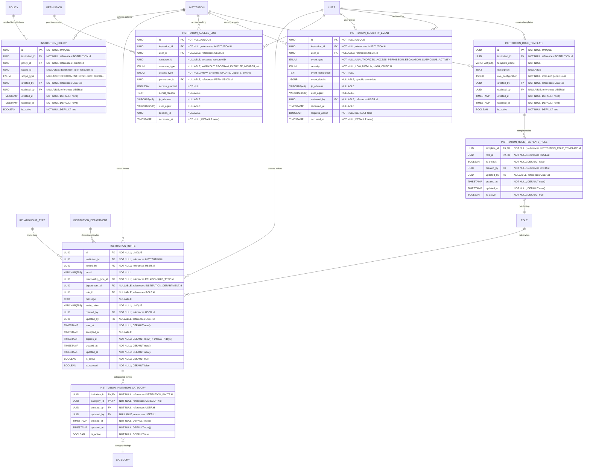

# Access Control, Policies & Invites
**Section:** Institution
**Subsection:** Access Control, Policies & Invites

## Diagram

## Notes
This diagram represents the access control, policies & invites structure with unified permission management and comprehensive audit trails within the institution domain.

---
*Generated from diagram extraction script*