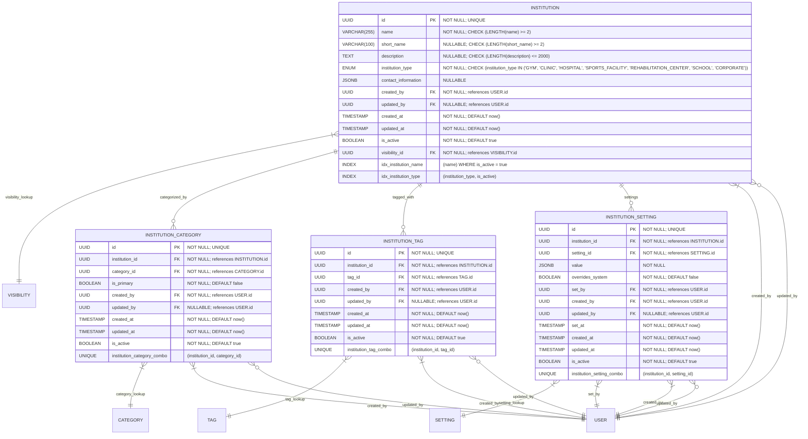

# Institution Core Definition
**Domain:** Institution
**Layer:** Core

```mermaid
erDiagram
  INSTITUTION {
    UUID id PK                        "NOT NULL; UNIQUE"
    VARCHAR(255) name                 "NOT NULL; CHECK (LENGTH(name) >= 2)"
    VARCHAR(100) short_name           "NULLABLE; CHECK (LENGTH(short_name) >= 2)"
    TEXT description                  "NULLABLE; CHECK (LENGTH(description) <= 2000)"
    ENUM institution_type             "NOT NULL; CHECK (institution_type IN ('GYM', 'CLINIC', 'HOSPITAL', 'SPORTS_FACILITY', 'REHABILITATION_CENTER', 'SCHOOL', 'CORPORATE'))"
    JSONB contact_information         "NULLABLE"
    UUID created_by FK                "NOT NULL; references USER.id"
    UUID updated_by FK                "NULLABLE; references USER.id"
    TIMESTAMP created_at              "NOT NULL; DEFAULT now()"
    TIMESTAMP updated_at              "NOT NULL; DEFAULT now()"
    BOOLEAN is_active                 "NOT NULL; DEFAULT true"
    UUID visibility_id FK             "NOT NULL; references VISIBILITY.id"
    INDEX idx_institution_name        "(name) WHERE is_active = true"
    INDEX idx_institution_type        "(institution_type, is_active)"
  }
  
  INSTITUTION_CATEGORY {
    UUID id PK                        "NOT NULL; UNIQUE"
    UUID institution_id FK            "NOT NULL; references INSTITUTION.id"
    UUID category_id FK               "NOT NULL; references CATEGORY.id"
    BOOLEAN is_primary                "NOT NULL; DEFAULT false"
    UUID created_by FK                "NOT NULL; references USER.id"
    UUID updated_by FK                "NULLABLE; references USER.id"
    TIMESTAMP created_at              "NOT NULL; DEFAULT now()"
    TIMESTAMP updated_at              "NOT NULL; DEFAULT now()"
    BOOLEAN is_active                 "NOT NULL; DEFAULT true"
    UNIQUE institution_category_combo "(institution_id, category_id)"
  }
  
  INSTITUTION_TAG {
    UUID id PK                        "NOT NULL; UNIQUE"
    UUID institution_id FK            "NOT NULL; references INSTITUTION.id"
    UUID tag_id FK                    "NOT NULL; references TAG.id"
    UUID created_by FK                "NOT NULL; references USER.id"
    UUID updated_by FK                "NULLABLE; references USER.id"
    TIMESTAMP created_at              "NOT NULL; DEFAULT now()"
    TIMESTAMP updated_at              "NOT NULL; DEFAULT now()"
    BOOLEAN is_active                 "NOT NULL; DEFAULT true"
    UNIQUE institution_tag_combo      "(institution_id, tag_id)"
  }
  
  INSTITUTION_SETTING {
    UUID id PK                        "NOT NULL; UNIQUE"
    UUID institution_id FK            "NOT NULL; references INSTITUTION.id"
    UUID setting_id FK                "NOT NULL; references SETTING.id"
    JSONB value                       "NOT NULL"
    BOOLEAN overrides_system          "NOT NULL; DEFAULT false"
    UUID set_by FK                    "NOT NULL; references USER.id"
    UUID created_by FK                "NOT NULL; references USER.id"
    UUID updated_by FK                "NULLABLE; references USER.id"
    TIMESTAMP set_at                  "NOT NULL; DEFAULT now()"
    TIMESTAMP created_at              "NOT NULL; DEFAULT now()"
    TIMESTAMP updated_at              "NOT NULL; DEFAULT now()"
    BOOLEAN is_active                 "NOT NULL; DEFAULT true"
    UNIQUE institution_setting_combo  "(institution_id, setting_id)"
  }

  INSTITUTION }|--|| VISIBILITY : "visibility_lookup"
  INSTITUTION ||--o{ INSTITUTION_CATEGORY : "categorized_by"
  INSTITUTION ||--o{ INSTITUTION_TAG : "tagged_with"
  INSTITUTION ||--o{ INSTITUTION_SETTING : "settings"
  INSTITUTION_CATEGORY }|--|| CATEGORY : "category_lookup"
  INSTITUTION_TAG }|--|| TAG : "tag_lookup"
  INSTITUTION_SETTING }|--|| SETTING : "setting_lookup"
  INSTITUTION_SETTING }|--|| USER : "set_by"
  INSTITUTION }|--|| USER : "created_by"
  INSTITUTION }o--|| USER : "updated_by"
  INSTITUTION_CATEGORY }|--|| USER : "created_by"
  INSTITUTION_CATEGORY }o--|| USER : "updated_by"
  INSTITUTION_TAG }|--|| USER : "created_by"
  INSTITUTION_TAG }o--|| USER : "updated_by"
  INSTITUTION_SETTING }|--|| USER : "created_by"
  INSTITUTION_SETTING }o--|| USER : "updated_by"
```

