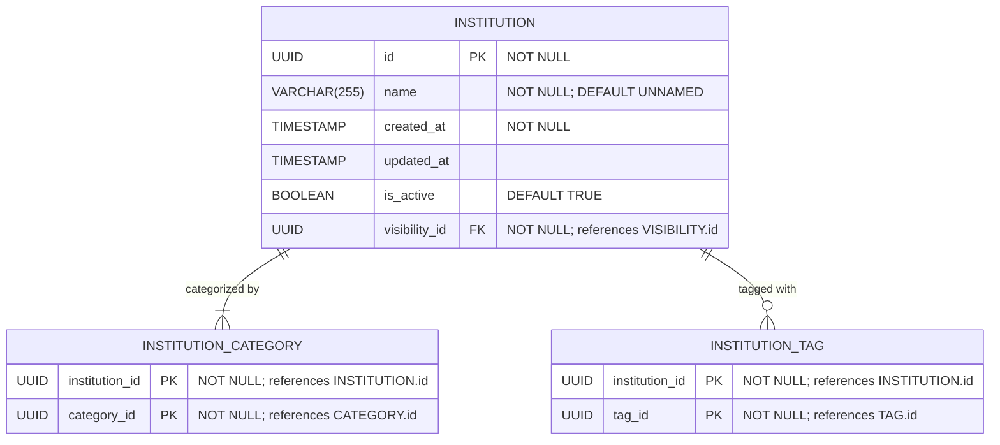

# Core “Institution” Definition & Basic Metadata

**Section:** Program
**Subsection:** Core “Institution” Definition & Basic Metadata

## Diagram

## Notes

This diagram represents the core “institution” definition & basic metadata structure and relationships within the program domain.

---
*Generated from diagram extraction script*
