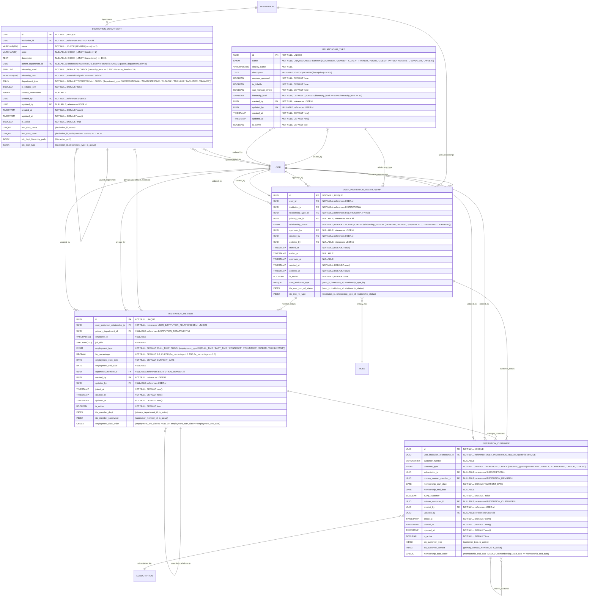

# Institution Organization Structure
**Domain:** Institution
**Layer:** Organization

```mermaid
erDiagram
  RELATIONSHIP_TYPE {
    UUID id PK                        "NOT NULL; UNIQUE"
    ENUM name                         "NOT NULL; UNIQUE; CHECK (name IN ('CUSTOMER', 'MEMBER', 'COACH', 'TRAINER', 'ADMIN', 'GUEST', 'PHYSIOTHERAPIST', 'MANAGER', 'OWNER'))"
    VARCHAR(255) display_name         "NOT NULL"
    TEXT description                  "NULLABLE; CHECK (LENGTH(description) <= 500)"
    BOOLEAN requires_approval         "NOT NULL; DEFAULT false"
    BOOLEAN is_billable               "NOT NULL; DEFAULT false"
    BOOLEAN can_manage_others         "NOT NULL; DEFAULT false"
    SMALLINT hierarchy_level          "NOT NULL; DEFAULT 0; CHECK (hierarchy_level >= 0 AND hierarchy_level <= 10)"
    UUID created_by FK                "NOT NULL; references USER.id"
    UUID updated_by FK                "NULLABLE; references USER.id"
    TIMESTAMP created_at              "NOT NULL; DEFAULT now()"
    TIMESTAMP updated_at              "NOT NULL; DEFAULT now()"
    BOOLEAN is_active                 "NOT NULL; DEFAULT true"
  }
  
  USER_INSTITUTION_RELATIONSHIP {
    UUID id PK                        "NOT NULL; UNIQUE"
    UUID user_id FK                   "NOT NULL; references USER.id"
    UUID institution_id FK            "NOT NULL; references INSTITUTION.id"
    UUID relationship_type_id FK      "NOT NULL; references RELATIONSHIP_TYPE.id"
    UUID primary_role_id FK           "NULLABLE; references ROLE.id"
    ENUM relationship_status          "NOT NULL; DEFAULT 'ACTIVE'; CHECK (relationship_status IN ('PENDING', 'ACTIVE', 'SUSPENDED', 'TERMINATED', 'EXPIRED'))"
    UUID approved_by FK               "NULLABLE; references USER.id"
    UUID created_by FK                "NOT NULL; references USER.id"
    UUID updated_by FK                "NULLABLE; references USER.id"
    TIMESTAMP started_at              "NOT NULL; DEFAULT now()"
    TIMESTAMP ended_at                "NULLABLE"
    TIMESTAMP approved_at             "NULLABLE"
    TIMESTAMP created_at              "NOT NULL; DEFAULT now()"
    TIMESTAMP updated_at              "NOT NULL; DEFAULT now()"
    BOOLEAN is_active                 "NOT NULL; DEFAULT true"
    UNIQUE user_institution_type      "(user_id, institution_id, relationship_type_id)"
    INDEX idx_user_inst_rel_status    "(user_id, institution_id, relationship_status)"
    INDEX idx_inst_rel_type           "(institution_id, relationship_type_id, relationship_status)"
  }
  
  INSTITUTION_DEPARTMENT {
    UUID id PK                        "NOT NULL; UNIQUE"
    UUID institution_id FK            "NOT NULL; references INSTITUTION.id"
    VARCHAR(100) name                 "NOT NULL; CHECK (LENGTH(name) >= 2)"
    VARCHAR(50) code                  "NULLABLE; CHECK (LENGTH(code) >= 2)"
    TEXT description                  "NULLABLE; CHECK (LENGTH(description) <= 1000)"
    UUID parent_department_id FK      "NULLABLE; references INSTITUTION_DEPARTMENT.id; CHECK (parent_department_id != id)"
    SMALLINT hierarchy_level          "NOT NULL; DEFAULT 0; CHECK (hierarchy_level >= 0 AND hierarchy_level <= 10)"
    VARCHAR(500) hierarchy_path       "NOT NULL; materialized path; FORMAT: '/1/2/3/'"
    ENUM department_type              "NOT NULL; DEFAULT 'OPERATIONAL'; CHECK (department_type IN ('OPERATIONAL', 'ADMINISTRATIVE', 'CLINICAL', 'TRAINING', 'FACILITIES', 'FINANCE'))"
    BOOLEAN is_billable_unit          "NOT NULL; DEFAULT false"
    JSONB contact_information         "NULLABLE"
    UUID created_by FK                "NOT NULL; references USER.id"
    UUID updated_by FK                "NULLABLE; references USER.id"
    TIMESTAMP created_at              "NOT NULL; DEFAULT now()"
    TIMESTAMP updated_at              "NOT NULL; DEFAULT now()"
    BOOLEAN is_active                 "NOT NULL; DEFAULT true"
    UNIQUE inst_dept_name             "(institution_id, name)"
    UNIQUE inst_dept_code             "(institution_id, code) WHERE code IS NOT NULL"
    INDEX idx_dept_hierarchy_path     "(hierarchy_path)"
    INDEX idx_dept_type               "(institution_id, department_type, is_active)"
  }
  
  INSTITUTION_MEMBER {
    UUID id PK                        "NOT NULL; UNIQUE"
    UUID user_institution_relationship_id FK "NOT NULL; references USER_INSTITUTION_RELATIONSHIP.id; UNIQUE"
    UUID primary_department_id FK     "NULLABLE; references INSTITUTION_DEPARTMENT.id"
    VARCHAR(50) employee_id           "NULLABLE"
    VARCHAR(100) job_title            "NULLABLE"
    ENUM employment_type              "NOT NULL; DEFAULT 'FULL_TIME'; CHECK (employment_type IN ('FULL_TIME', 'PART_TIME', 'CONTRACT', 'VOLUNTEER', 'INTERN', 'CONSULTANT'))"
    DECIMAL fte_percentage            "NOT NULL; DEFAULT 1.0; CHECK (fte_percentage > 0 AND fte_percentage <= 1.0)"
    DATE employment_start_date        "NOT NULL; DEFAULT CURRENT_DATE"
    DATE employment_end_date          "NULLABLE"
    UUID supervisor_member_id FK      "NULLABLE; references INSTITUTION_MEMBER.id"
    UUID created_by FK                "NOT NULL; references USER.id"
    UUID updated_by FK                "NULLABLE; references USER.id"
    TIMESTAMP joined_at               "NOT NULL; DEFAULT now()"
    TIMESTAMP created_at              "NOT NULL; DEFAULT now()"
    TIMESTAMP updated_at              "NOT NULL; DEFAULT now()"
    BOOLEAN is_active                 "NOT NULL; DEFAULT true"
    INDEX idx_member_dept             "(primary_department_id, is_active)"
    INDEX idx_member_supervisor       "(supervisor_member_id, is_active)"
    CHECK employment_date_order       "(employment_end_date IS NULL OR employment_start_date <= employment_end_date)"
  }
  
  INSTITUTION_CUSTOMER {
    UUID id PK                        "NOT NULL; UNIQUE"
    UUID user_institution_relationship_id FK "NOT NULL; references USER_INSTITUTION_RELATIONSHIP.id; UNIQUE"
    VARCHAR(50) customer_number       "NULLABLE"
    ENUM customer_type                "NOT NULL; DEFAULT 'INDIVIDUAL'; CHECK (customer_type IN ('INDIVIDUAL', 'FAMILY', 'CORPORATE', 'GROUP', 'GUEST'))"
    UUID subscription_id FK           "NULLABLE; references SUBSCRIPTION.id"
    UUID primary_contact_member_id FK "NULLABLE; references INSTITUTION_MEMBER.id"
    DATE membership_start_date        "NOT NULL; DEFAULT CURRENT_DATE"
    DATE membership_end_date          "NULLABLE"
    BOOLEAN is_vip_customer           "NOT NULL; DEFAULT false"
    UUID referrer_customer_id FK      "NULLABLE; references INSTITUTION_CUSTOMER.id"
    UUID created_by FK                "NOT NULL; references USER.id"
    UUID updated_by FK                "NULLABLE; references USER.id"
    TIMESTAMP linked_at               "NOT NULL; DEFAULT now()"
    TIMESTAMP created_at              "NOT NULL; DEFAULT now()"
    TIMESTAMP updated_at              "NOT NULL; DEFAULT now()"
    BOOLEAN is_active                 "NOT NULL; DEFAULT true"
    INDEX idx_customer_type           "(customer_type, is_active)"
    INDEX idx_customer_contact        "(primary_contact_member_id, is_active)"
    CHECK membership_date_order       "(membership_end_date IS NULL OR membership_start_date <= membership_end_date)"
  }

  USER ||--o{ USER_INSTITUTION_RELATIONSHIP : "institution_relationships"
  INSTITUTION ||--o{ USER_INSTITUTION_RELATIONSHIP : "user_relationships"
  INSTITUTION ||--o{ INSTITUTION_DEPARTMENT : "departments"
  USER_INSTITUTION_RELATIONSHIP }|--|| RELATIONSHIP_TYPE : "relationship_type"
  USER_INSTITUTION_RELATIONSHIP }o--|| ROLE : "primary_role"
  USER_INSTITUTION_RELATIONSHIP }o--|| USER : "approved_by"
  USER_INSTITUTION_RELATIONSHIP ||--o{ INSTITUTION_MEMBER : "member_details"
  USER_INSTITUTION_RELATIONSHIP ||--o{ INSTITUTION_CUSTOMER : "customer_details"
  INSTITUTION_DEPARTMENT ||--o{ INSTITUTION_DEPARTMENT : "parent_department"
  INSTITUTION_DEPARTMENT ||--o{ INSTITUTION_MEMBER : "primary_department_members"
  INSTITUTION_MEMBER ||--o{ INSTITUTION_MEMBER : "supervisor_relationship"
  INSTITUTION_MEMBER ||--o{ INSTITUTION_CUSTOMER : "managed_customers"
  INSTITUTION_CUSTOMER }o--|| SUBSCRIPTION : "subscription_link"
  INSTITUTION_CUSTOMER }o--|| INSTITUTION_CUSTOMER : "referrer_customer"
  RELATIONSHIP_TYPE }|--|| USER : "created_by"
  RELATIONSHIP_TYPE }o--|| USER : "updated_by"
  USER_INSTITUTION_RELATIONSHIP }|--|| USER : "created_by"
  USER_INSTITUTION_RELATIONSHIP }o--|| USER : "updated_by"
  INSTITUTION_DEPARTMENT }|--|| USER : "created_by"
  INSTITUTION_DEPARTMENT }o--|| USER : "updated_by"
  INSTITUTION_MEMBER }|--|| USER : "created_by"
  INSTITUTION_MEMBER }o--|| USER : "updated_by"
  INSTITUTION_CUSTOMER }|--|| USER : "created_by"
  INSTITUTION_CUSTOMER }o--|| USER : "updated_by"
```

