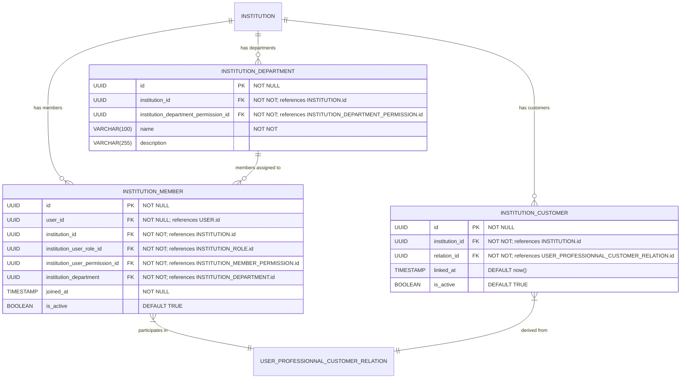

# Organizational Structure (Members, Departments, Customers)

**Section:** Program
**Subsection:** Organizational Structure (Members, Departments, Customers)

## Diagram

## Notes

This diagram represents the organizational structure (members, departments, customers) structure and relationships within the program domain.

---
*Generated from diagram extraction script*
