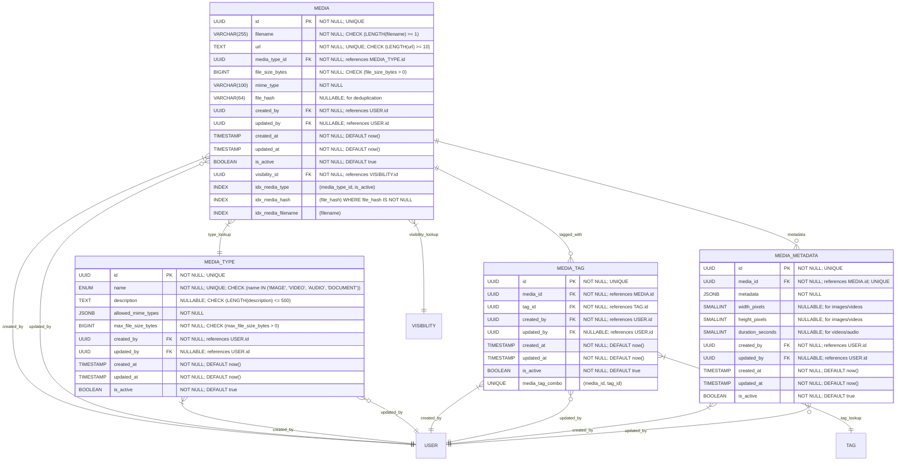

# Media Management
**Domain:** Media
**Layer:** Core

```mermaid
erDiagram
  MEDIA {
    UUID id PK                        "NOT NULL; UNIQUE"
    VARCHAR(255) filename             "NOT NULL; CHECK (LENGTH(filename) >= 1)"
    TEXT url                          "NOT NULL; UNIQUE; CHECK (LENGTH(url) >= 10)"
    UUID media_type_id FK             "NOT NULL; references MEDIA_TYPE.id"
    BIGINT file_size_bytes            "NOT NULL; CHECK (file_size_bytes > 0)"
    VARCHAR(100) mime_type            "NOT NULL"
    VARCHAR(64) file_hash             "NULLABLE; for deduplication"
    UUID created_by FK                "NOT NULL; references USER.id"
    UUID updated_by FK                "NULLABLE; references USER.id"
    TIMESTAMP created_at              "NOT NULL; DEFAULT now()"
    TIMESTAMP updated_at              "NOT NULL; DEFAULT now()"
    BOOLEAN is_active                 "NOT NULL; DEFAULT true"
    UUID visibility_id FK             "NOT NULL; references VISIBILITY.id"
    INDEX idx_media_type              "(media_type_id, is_active)"
    INDEX idx_media_hash              "(file_hash) WHERE file_hash IS NOT NULL"
    INDEX idx_media_filename          "(filename)"
  }
  
  MEDIA_TYPE {
    UUID id PK                        "NOT NULL; UNIQUE"
    ENUM name                         "NOT NULL; UNIQUE; CHECK (name IN ('IMAGE', 'VIDEO', 'AUDIO', 'DOCUMENT'))"
    TEXT description                  "NULLABLE; CHECK (LENGTH(description) <= 500)"
    JSONB allowed_mime_types          "NOT NULL"
    BIGINT max_file_size_bytes        "NOT NULL; CHECK (max_file_size_bytes > 0)"
    UUID created_by FK                "NOT NULL; references USER.id"
    UUID updated_by FK                "NULLABLE; references USER.id"
    TIMESTAMP created_at              "NOT NULL; DEFAULT now()"
    TIMESTAMP updated_at              "NOT NULL; DEFAULT now()"
    BOOLEAN is_active                 "NOT NULL; DEFAULT true"
  }
  
  MEDIA_TAG {
    UUID id PK                        "NOT NULL; UNIQUE"
    UUID media_id FK                  "NOT NULL; references MEDIA.id"
    UUID tag_id FK                    "NOT NULL; references TAG.id"
    UUID created_by FK                "NOT NULL; references USER.id"
    UUID updated_by FK                "NULLABLE; references USER.id"
    TIMESTAMP created_at              "NOT NULL; DEFAULT now()"
    TIMESTAMP updated_at              "NOT NULL; DEFAULT now()"
    BOOLEAN is_active                 "NOT NULL; DEFAULT true"
    UNIQUE media_tag_combo            "(media_id, tag_id)"
  }
  
  MEDIA_METADATA {
    UUID id PK                        "NOT NULL; UNIQUE"
    UUID media_id FK                  "NOT NULL; references MEDIA.id; UNIQUE"
    JSONB metadata                    "NOT NULL"
    SMALLINT width_pixels             "NULLABLE; for images/videos"
    SMALLINT height_pixels            "NULLABLE; for images/videos"
    SMALLINT duration_seconds         "NULLABLE; for videos/audio"
    UUID created_by FK                "NOT NULL; references USER.id"
    UUID updated_by FK                "NULLABLE; references USER.id"
    TIMESTAMP created_at              "NOT NULL; DEFAULT now()"
    TIMESTAMP updated_at              "NOT NULL; DEFAULT now()"
    BOOLEAN is_active                 "NOT NULL; DEFAULT true"
  }

  MEDIA }|--|| MEDIA_TYPE : "type_lookup"
  MEDIA }|--|| VISIBILITY : "visibility_lookup"
  MEDIA ||--o{ MEDIA_TAG : "tagged_with"
  MEDIA ||--o{ MEDIA_METADATA : "metadata"
  MEDIA_TAG }|--|| TAG : "tag_lookup"
  MEDIA }|--|| USER : "created_by"
  MEDIA }o--|| USER : "updated_by"
  MEDIA_TYPE }|--|| USER : "created_by"
  MEDIA_TYPE }o--|| USER : "updated_by"
  MEDIA_TAG }|--|| USER : "created_by"
  MEDIA_TAG }o--|| USER : "updated_by"
  MEDIA_METADATA }|--|| USER : "created_by"
  MEDIA_METADATA }o--|| USER : "updated_by"
```

