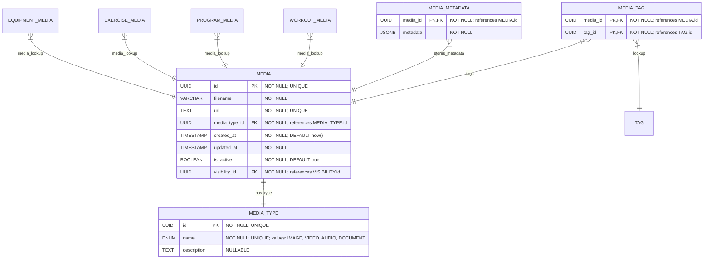

# Media

**Section:** Media

## Diagram

```mermaid
erDiagram

  %% ================================
  %% 1) Core Media Tables
  %% ================================

  MEDIA {
    UUID id PK                           "NOT NULL; UNIQUE"
    VARCHAR filename                     "NOT NULL"
    TEXT url                              "NOT NULL; UNIQUE"
    UUID media_type_id FK                "NOT NULL; references MEDIA_TYPE.id"
    TIMESTAMP created_at                 "NOT NULL; DEFAULT now()"
    TIMESTAMP updated_at                 "NOT NULL"
    BOOLEAN is_active                    "NOT NULL; DEFAULT true"
    UUID visibility_id FK               "NOT NULL; references VISIBILITY.id"
  }

  MEDIA_TYPE {
    UUID id PK                          "NOT NULL; UNIQUE"
    ENUM name                            "NOT NULL; UNIQUE; values: IMAGE, VIDEO, AUDIO, DOCUMENT"
    TEXT description                     "NULLABLE"
  }

  %% =========================================
  %% 2) Media Tagging & Metadata
  %% =========================================

  MEDIA_TAG {
    UUID media_id PK,FK                 "NOT NULL; references MEDIA.id"
    UUID tag_id PK,FK                       "NOT NULL; references TAG.id"
  }

  MEDIA_METADATA {
    UUID media_id PK,FK                 "NOT NULL; references MEDIA.id"
    JSONB metadata                       "NOT NULL"
  }

  %% ================================
  %% 3) Internal Relationships
  %% ================================

  MEDIA                ||--||         MEDIA_TYPE       : "has_type"
  MEDIA_TAG            }|--||         MEDIA             : "tags"
  MEDIA_TAG            }|--||         TAG               : "lookup"
  MEDIA_METADATA       }|--||         MEDIA             : "stores_metadata"

  %% =========================================
  %% 4) External Relationships (Examples)
  %% =========================================

  WORKOUT_MEDIA        }|--||         MEDIA             : "media_lookup"
  PROGRAM_MEDIA        }|--||         MEDIA             : "media_lookup"
  EXERCISE_MEDIA       }|--||         MEDIA             : "media_lookup"
  EQUIPMENT_MEDIA      }|--||         MEDIA             : "media_lookup"

```

## Notes

This diagram represents the media structure and relationships within the program domain.

---
*Generated from diagram extraction script*
