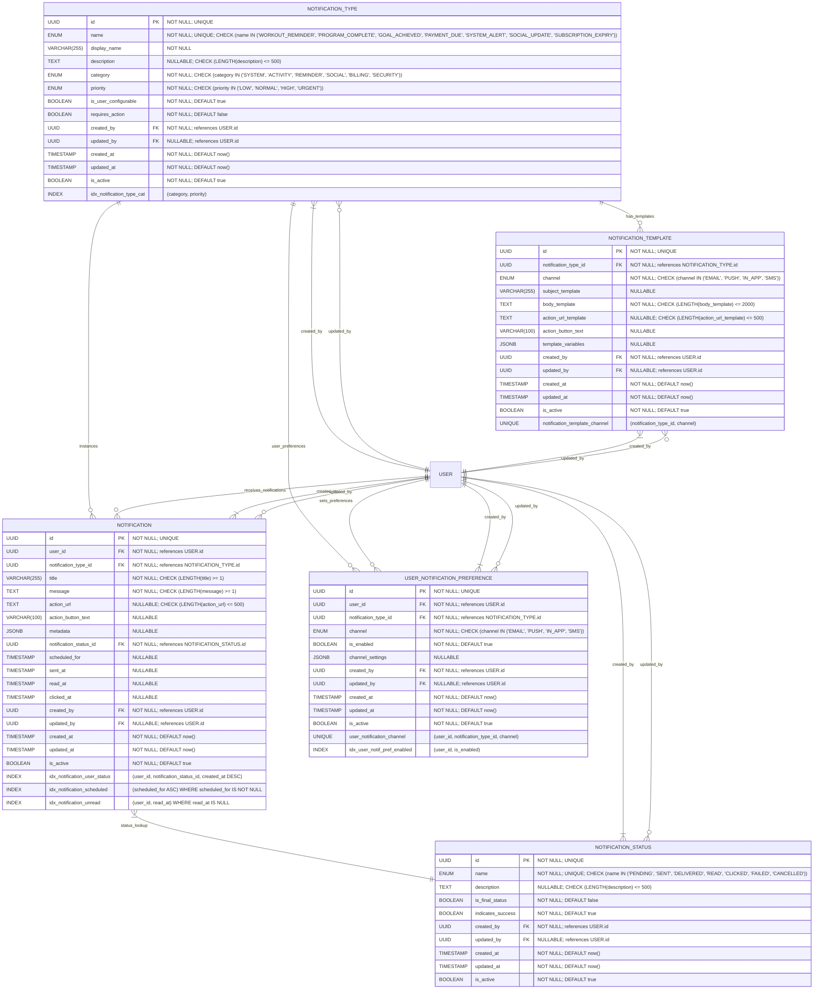

# Notification Management System
**Domain:** Notifications
**Layer:** Core

```mermaid
erDiagram
  NOTIFICATION_TYPE {
    UUID id PK                        "NOT NULL; UNIQUE"
    ENUM name                         "NOT NULL; UNIQUE; CHECK (name IN ('WORKOUT_REMINDER', 'PROGRAM_COMPLETE', 'GOAL_ACHIEVED', 'PAYMENT_DUE', 'SYSTEM_ALERT', 'SOCIAL_UPDATE', 'SUBSCRIPTION_EXPIRY'))"
    VARCHAR(255) display_name         "NOT NULL"
    TEXT description                  "NULLABLE; CHECK (LENGTH(description) <= 500)"
    ENUM category                     "NOT NULL; CHECK (category IN ('SYSTEM', 'ACTIVITY', 'REMINDER', 'SOCIAL', 'BILLING', 'SECURITY'))"
    ENUM priority                     "NOT NULL; CHECK (priority IN ('LOW', 'NORMAL', 'HIGH', 'URGENT'))"
    BOOLEAN is_user_configurable      "NOT NULL; DEFAULT true"
    BOOLEAN requires_action           "NOT NULL; DEFAULT false"
    UUID created_by FK                "NOT NULL; references USER.id"
    UUID updated_by FK                "NULLABLE; references USER.id"
    TIMESTAMP created_at              "NOT NULL; DEFAULT now()"
    TIMESTAMP updated_at              "NOT NULL; DEFAULT now()"
    BOOLEAN is_active                 "NOT NULL; DEFAULT true"
    INDEX idx_notification_type_cat   "(category, priority)"
  }
  
  NOTIFICATION_TEMPLATE {
    UUID id PK                        "NOT NULL; UNIQUE"
    UUID notification_type_id FK      "NOT NULL; references NOTIFICATION_TYPE.id"
    ENUM channel                      "NOT NULL; CHECK (channel IN ('EMAIL', 'PUSH', 'IN_APP', 'SMS'))"
    VARCHAR(255) subject_template     "NULLABLE"
    TEXT body_template                "NOT NULL; CHECK (LENGTH(body_template) <= 2000)"
    TEXT action_url_template          "NULLABLE; CHECK (LENGTH(action_url_template) <= 500)"
    VARCHAR(100) action_button_text   "NULLABLE"
    JSONB template_variables          "NULLABLE"
    UUID created_by FK                "NOT NULL; references USER.id"
    UUID updated_by FK                "NULLABLE; references USER.id"
    TIMESTAMP created_at              "NOT NULL; DEFAULT now()"
    TIMESTAMP updated_at              "NOT NULL; DEFAULT now()"
    BOOLEAN is_active                 "NOT NULL; DEFAULT true"
    UNIQUE notification_template_channel "(notification_type_id, channel)"
  }
  
  NOTIFICATION {
    UUID id PK                        "NOT NULL; UNIQUE"
    UUID user_id FK                   "NOT NULL; references USER.id"
    UUID notification_type_id FK      "NOT NULL; references NOTIFICATION_TYPE.id"
    VARCHAR(255) title                "NOT NULL; CHECK (LENGTH(title) >= 1)"
    TEXT message                      "NOT NULL; CHECK (LENGTH(message) >= 1)"
    TEXT action_url                   "NULLABLE; CHECK (LENGTH(action_url) <= 500)"
    VARCHAR(100) action_button_text   "NULLABLE"
    JSONB metadata                    "NULLABLE"
    UUID notification_status_id FK    "NOT NULL; references NOTIFICATION_STATUS.id"
    TIMESTAMP scheduled_for           "NULLABLE"
    TIMESTAMP sent_at                 "NULLABLE"
    TIMESTAMP read_at                 "NULLABLE"
    TIMESTAMP clicked_at              "NULLABLE"
    UUID created_by FK                "NOT NULL; references USER.id"
    UUID updated_by FK                "NULLABLE; references USER.id"
    TIMESTAMP created_at              "NOT NULL; DEFAULT now()"
    TIMESTAMP updated_at              "NOT NULL; DEFAULT now()"
    BOOLEAN is_active                 "NOT NULL; DEFAULT true"
    INDEX idx_notification_user_status "(user_id, notification_status_id, created_at DESC)"
    INDEX idx_notification_scheduled  "(scheduled_for ASC) WHERE scheduled_for IS NOT NULL"
    INDEX idx_notification_unread     "(user_id, read_at) WHERE read_at IS NULL"
  }
  
  NOTIFICATION_STATUS {
    UUID id PK                        "NOT NULL; UNIQUE"
    ENUM name                         "NOT NULL; UNIQUE; CHECK (name IN ('PENDING', 'SENT', 'DELIVERED', 'READ', 'CLICKED', 'FAILED', 'CANCELLED'))"
    TEXT description                  "NULLABLE; CHECK (LENGTH(description) <= 500)"
    BOOLEAN is_final_status           "NOT NULL; DEFAULT false"
    BOOLEAN indicates_success         "NOT NULL; DEFAULT true"
    UUID created_by FK                "NOT NULL; references USER.id"
    UUID updated_by FK                "NULLABLE; references USER.id"
    TIMESTAMP created_at              "NOT NULL; DEFAULT now()"
    TIMESTAMP updated_at              "NOT NULL; DEFAULT now()"
    BOOLEAN is_active                 "NOT NULL; DEFAULT true"
  }
  
  USER_NOTIFICATION_PREFERENCE {
    UUID id PK                        "NOT NULL; UNIQUE"
    UUID user_id FK                   "NOT NULL; references USER.id"
    UUID notification_type_id FK      "NOT NULL; references NOTIFICATION_TYPE.id"
    ENUM channel                      "NOT NULL; CHECK (channel IN ('EMAIL', 'PUSH', 'IN_APP', 'SMS'))"
    BOOLEAN is_enabled                "NOT NULL; DEFAULT true"
    JSONB channel_settings            "NULLABLE"
    UUID created_by FK                "NOT NULL; references USER.id"
    UUID updated_by FK                "NULLABLE; references USER.id"
    TIMESTAMP created_at              "NOT NULL; DEFAULT now()"
    TIMESTAMP updated_at              "NOT NULL; DEFAULT now()"
    BOOLEAN is_active                 "NOT NULL; DEFAULT true"
    UNIQUE user_notification_channel  "(user_id, notification_type_id, channel)"
    INDEX idx_user_notif_pref_enabled "(user_id, is_enabled)"
  }

  NOTIFICATION_TYPE ||--o{ NOTIFICATION_TEMPLATE : "has_templates"
  NOTIFICATION_TYPE ||--o{ NOTIFICATION : "instances"
  NOTIFICATION_TYPE ||--o{ USER_NOTIFICATION_PREFERENCE : "user_preferences"
  NOTIFICATION }|--|| NOTIFICATION_STATUS : "status_lookup"
  USER ||--o{ NOTIFICATION : "receives_notifications"
  USER ||--o{ USER_NOTIFICATION_PREFERENCE : "sets_preferences"
  NOTIFICATION_TYPE }|--|| USER : "created_by"
  NOTIFICATION_TYPE }o--|| USER : "updated_by"
  NOTIFICATION_TEMPLATE }|--|| USER : "created_by"
  NOTIFICATION_TEMPLATE }o--|| USER : "updated_by"
  NOTIFICATION }|--|| USER : "created_by"
  NOTIFICATION }o--|| USER : "updated_by"
  NOTIFICATION_STATUS }|--|| USER : "created_by"
  NOTIFICATION_STATUS }o--|| USER : "updated_by"
  USER_NOTIFICATION_PREFERENCE }|--|| USER : "created_by"
  USER_NOTIFICATION_PREFERENCE }o--|| USER : "updated_by"
```

