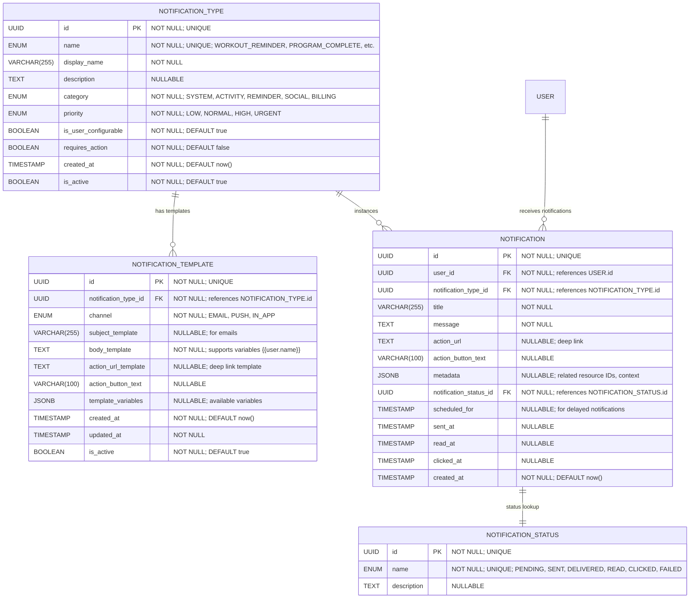

# Core "Notification" Definition & Classification

**Section:** Notifications
**Subsection:** Core "Notification" Definition & Classification

## Diagram

## Notes

This diagram represents the core "notification" definition & classification structure and relationships within the notifications domain.

---
*Generated from diagram extraction script*
