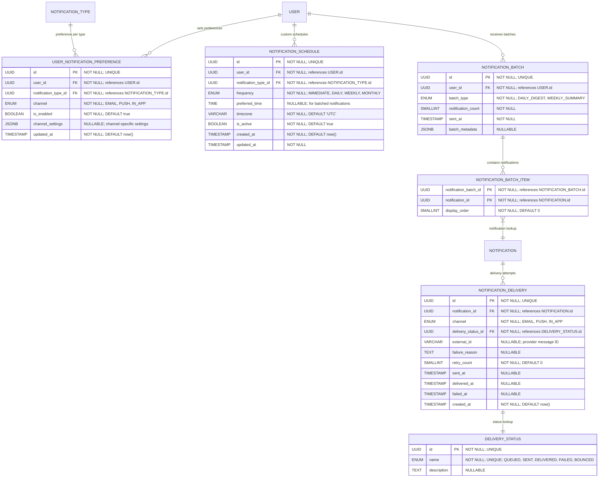

# Notification Preferences & Delivery

**Section:** Notifications
**Subsection:** Notification Preferences & Delivery

## Diagram

## Notes

This diagram represents the notification preferences & delivery structure and relationships within the notifications domain.

---
*Generated from diagram extraction script*
