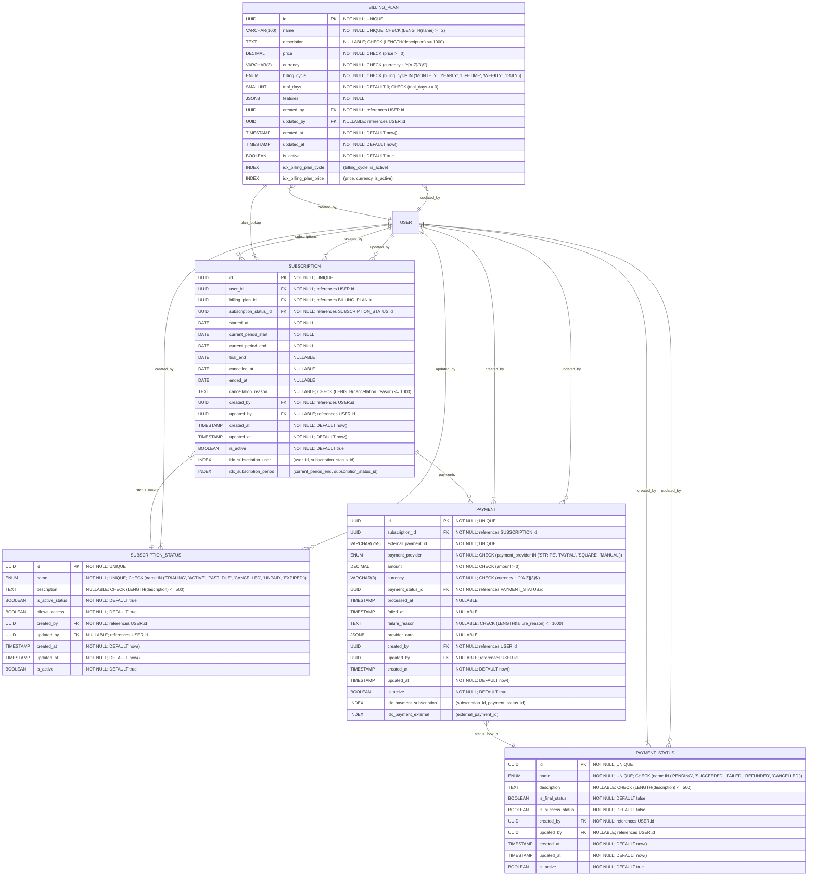

# Payment & Subscription Management
**Domain:** Payment
**Layer:** Core

```mermaid
erDiagram
  BILLING_PLAN {
    UUID id PK                        "NOT NULL; UNIQUE"
    VARCHAR(100) name                 "NOT NULL; UNIQUE; CHECK (LENGTH(name) >= 2)"
    TEXT description                  "NULLABLE; CHECK (LENGTH(description) <= 1000)"
    DECIMAL price                     "NOT NULL; CHECK (price >= 0)"
    VARCHAR(3) currency               "NOT NULL; CHECK (currency ~ '^[A-Z]{3}$')"
    ENUM billing_cycle                "NOT NULL; CHECK (billing_cycle IN ('MONTHLY', 'YEARLY', 'LIFETIME', 'WEEKLY', 'DAILY'))"
    SMALLINT trial_days               "NOT NULL; DEFAULT 0; CHECK (trial_days >= 0)"
    JSONB features                    "NOT NULL"
    UUID created_by FK                "NOT NULL; references USER.id"
    UUID updated_by FK                "NULLABLE; references USER.id"
    TIMESTAMP created_at              "NOT NULL; DEFAULT now()"
    TIMESTAMP updated_at              "NOT NULL; DEFAULT now()"
    BOOLEAN is_active                 "NOT NULL; DEFAULT true"
    INDEX idx_billing_plan_cycle      "(billing_cycle, is_active)"
    INDEX idx_billing_plan_price      "(price, currency, is_active)"
  }
  
  SUBSCRIPTION {
    UUID id PK                        "NOT NULL; UNIQUE"
    UUID user_id FK                   "NOT NULL; references USER.id"
    UUID billing_plan_id FK           "NOT NULL; references BILLING_PLAN.id"
    UUID subscription_status_id FK    "NOT NULL; references SUBSCRIPTION_STATUS.id"
    DATE started_at                   "NOT NULL"
    DATE current_period_start         "NOT NULL"
    DATE current_period_end           "NOT NULL"
    DATE trial_end                    "NULLABLE"
    DATE cancelled_at                 "NULLABLE"
    DATE ended_at                     "NULLABLE"
    TEXT cancellation_reason          "NULLABLE; CHECK (LENGTH(cancellation_reason) <= 1000)"
    UUID created_by FK                "NOT NULL; references USER.id"
    UUID updated_by FK                "NULLABLE; references USER.id"
    TIMESTAMP created_at              "NOT NULL; DEFAULT now()"
    TIMESTAMP updated_at              "NOT NULL; DEFAULT now()"
    BOOLEAN is_active                 "NOT NULL; DEFAULT true"
    INDEX idx_subscription_user       "(user_id, subscription_status_id)"
    INDEX idx_subscription_period     "(current_period_end, subscription_status_id)"
  }
  
  SUBSCRIPTION_STATUS {
    UUID id PK                        "NOT NULL; UNIQUE"
    ENUM name                         "NOT NULL; UNIQUE; CHECK (name IN ('TRIALING', 'ACTIVE', 'PAST_DUE', 'CANCELLED', 'UNPAID', 'EXPIRED'))"
    TEXT description                  "NULLABLE; CHECK (LENGTH(description) <= 500)"
    BOOLEAN is_active_status          "NOT NULL; DEFAULT true"
    BOOLEAN allows_access             "NOT NULL; DEFAULT true"
    UUID created_by FK                "NOT NULL; references USER.id"
    UUID updated_by FK                "NULLABLE; references USER.id"
    TIMESTAMP created_at              "NOT NULL; DEFAULT now()"
    TIMESTAMP updated_at              "NOT NULL; DEFAULT now()"
    BOOLEAN is_active                 "NOT NULL; DEFAULT true"
  }
  
  PAYMENT {
    UUID id PK                        "NOT NULL; UNIQUE"
    UUID subscription_id FK           "NOT NULL; references SUBSCRIPTION.id"
    VARCHAR(255) external_payment_id  "NOT NULL; UNIQUE"
    ENUM payment_provider             "NOT NULL; CHECK (payment_provider IN ('STRIPE', 'PAYPAL', 'SQUARE', 'MANUAL'))"
    DECIMAL amount                    "NOT NULL; CHECK (amount > 0)"
    VARCHAR(3) currency               "NOT NULL; CHECK (currency ~ '^[A-Z]{3}$')"
    UUID payment_status_id FK         "NOT NULL; references PAYMENT_STATUS.id"
    TIMESTAMP processed_at            "NULLABLE"
    TIMESTAMP failed_at               "NULLABLE"
    TEXT failure_reason               "NULLABLE; CHECK (LENGTH(failure_reason) <= 1000)"
    JSONB provider_data               "NULLABLE"
    UUID created_by FK                "NOT NULL; references USER.id"
    UUID updated_by FK                "NULLABLE; references USER.id"
    TIMESTAMP created_at              "NOT NULL; DEFAULT now()"
    TIMESTAMP updated_at              "NOT NULL; DEFAULT now()"
    BOOLEAN is_active                 "NOT NULL; DEFAULT true"
    INDEX idx_payment_subscription    "(subscription_id, payment_status_id)"
    INDEX idx_payment_external        "(external_payment_id)"
  }
  
  PAYMENT_STATUS {
    UUID id PK                        "NOT NULL; UNIQUE"
    ENUM name                         "NOT NULL; UNIQUE; CHECK (name IN ('PENDING', 'SUCCEEDED', 'FAILED', 'REFUNDED', 'CANCELLED'))"
    TEXT description                  "NULLABLE; CHECK (LENGTH(description) <= 500)"
    BOOLEAN is_final_status           "NOT NULL; DEFAULT false"
    BOOLEAN is_success_status         "NOT NULL; DEFAULT false"
    UUID created_by FK                "NOT NULL; references USER.id"
    UUID updated_by FK                "NULLABLE; references USER.id"
    TIMESTAMP created_at              "NOT NULL; DEFAULT now()"
    TIMESTAMP updated_at              "NOT NULL; DEFAULT now()"
    BOOLEAN is_active                 "NOT NULL; DEFAULT true"
  }

  USER ||--o{ SUBSCRIPTION : "subscriptions"
  SUBSCRIPTION }|--|| BILLING_PLAN : "plan_lookup"
  SUBSCRIPTION }|--|| SUBSCRIPTION_STATUS : "status_lookup"
  SUBSCRIPTION ||--o{ PAYMENT : "payments"
  PAYMENT }|--|| PAYMENT_STATUS : "status_lookup"
  BILLING_PLAN }|--|| USER : "created_by"
  BILLING_PLAN }o--|| USER : "updated_by"
  SUBSCRIPTION }|--|| USER : "created_by"
  SUBSCRIPTION }o--|| USER : "updated_by"
  SUBSCRIPTION_STATUS }|--|| USER : "created_by"
  SUBSCRIPTION_STATUS }o--|| USER : "updated_by"
  PAYMENT }|--|| USER : "created_by"
  PAYMENT }o--|| USER : "updated_by"
  PAYMENT_STATUS }|--|| USER : "created_by"
  PAYMENT_STATUS }o--|| USER : "updated_by"
```

