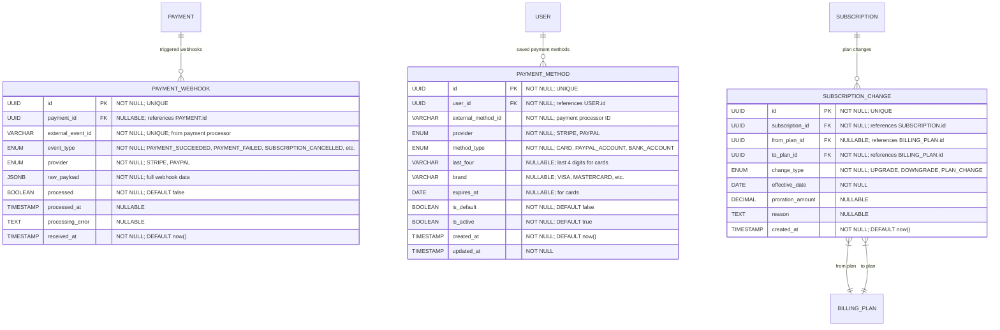

# Payment Events & External Integration

**Section:** Payment
**Subsection:** Payment Events & External Integration

## Diagram

## Notes

This diagram represents the payment events & external integration structure and relationships within the payment domain.

---
*Generated from diagram extraction script*
