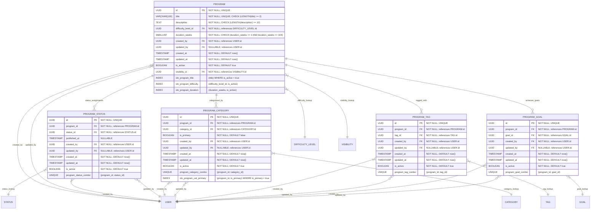

# Program Core Definition
**Domain:** Program
**Layer:** Core

```mermaid
erDiagram
  PROGRAM {
    UUID id PK                        "NOT NULL; UNIQUE"
    VARCHAR(100) title                "NOT NULL; UNIQUE; CHECK (LENGTH(title) >= 2)"
    TEXT description                  "NOT NULL; CHECK (LENGTH(description) >= 10)"
    UUID difficulty_level_id FK       "NOT NULL; references DIFFICULTY_LEVEL.id"
    SMALLINT duration_weeks           "NOT NULL; CHECK (duration_weeks >= 1 AND duration_weeks <= 104)"
    UUID created_by FK                "NOT NULL; references USER.id"
    UUID updated_by FK                "NULLABLE; references USER.id"
    TIMESTAMP created_at              "NOT NULL; DEFAULT now()"
    TIMESTAMP updated_at              "NOT NULL; DEFAULT now()"
    BOOLEAN is_active                 "NOT NULL; DEFAULT true"
    UUID visibility_id FK             "NOT NULL; references VISIBILITY.id"
    INDEX idx_program_title           "(title) WHERE is_active = true"
    INDEX idx_program_difficulty      "(difficulty_level_id, is_active)"
    INDEX idx_program_duration        "(duration_weeks, is_active)"
  }
  
  PROGRAM_STATUS {
    UUID id PK                        "NOT NULL; UNIQUE"
    UUID program_id FK                "NOT NULL; references PROGRAM.id"
    UUID status_id FK                 "NOT NULL; references STATUS.id"
    TIMESTAMP published_at            "NULLABLE"
    UUID created_by FK                "NOT NULL; references USER.id"
    UUID updated_by FK                "NULLABLE; references USER.id"
    TIMESTAMP created_at              "NOT NULL; DEFAULT now()"
    TIMESTAMP updated_at              "NOT NULL; DEFAULT now()"
    BOOLEAN is_active                 "NOT NULL; DEFAULT true"
    UNIQUE program_status_combo       "(program_id, status_id)"
  }
  
  PROGRAM_CATEGORY {
    UUID id PK                        "NOT NULL; UNIQUE"
    UUID program_id FK                "NOT NULL; references PROGRAM.id"
    UUID category_id FK               "NOT NULL; references CATEGORY.id"
    BOOLEAN is_primary                "NOT NULL; DEFAULT false"
    UUID created_by FK                "NOT NULL; references USER.id"
    UUID updated_by FK                "NULLABLE; references USER.id"
    TIMESTAMP created_at              "NOT NULL; DEFAULT now()"
    TIMESTAMP updated_at              "NOT NULL; DEFAULT now()"
    BOOLEAN is_active                 "NOT NULL; DEFAULT true"
    UNIQUE program_category_combo     "(program_id, category_id)"
    INDEX idx_program_cat_primary     "(program_id, is_primary) WHERE is_primary = true"
  }
  
  PROGRAM_TAG {
    UUID id PK                        "NOT NULL; UNIQUE"
    UUID program_id FK                "NOT NULL; references PROGRAM.id"
    UUID tag_id FK                    "NOT NULL; references TAG.id"
    UUID created_by FK                "NOT NULL; references USER.id"
    UUID updated_by FK                "NULLABLE; references USER.id"
    TIMESTAMP created_at              "NOT NULL; DEFAULT now()"
    TIMESTAMP updated_at              "NOT NULL; DEFAULT now()"
    BOOLEAN is_active                 "NOT NULL; DEFAULT true"
    UNIQUE program_tag_combo          "(program_id, tag_id)"
  }
  
  PROGRAM_GOAL {
    UUID id PK                        "NOT NULL; UNIQUE"
    UUID program_id FK                "NOT NULL; references PROGRAM.id"
    UUID goal_id FK                   "NOT NULL; references GOAL.id"
    UUID created_by FK                "NOT NULL; references USER.id"
    UUID updated_by FK                "NULLABLE; references USER.id"
    TIMESTAMP created_at              "NOT NULL; DEFAULT now()"
    TIMESTAMP updated_at              "NOT NULL; DEFAULT now()"
    BOOLEAN is_active                 "NOT NULL; DEFAULT true"
    UNIQUE program_goal_combo         "(program_id, goal_id)"
  }

  PROGRAM }|--|| DIFFICULTY_LEVEL : "difficulty_lookup"
  PROGRAM }|--|| VISIBILITY : "visibility_lookup"
  PROGRAM ||--o{ PROGRAM_STATUS : "status_assignments"
  PROGRAM ||--o{ PROGRAM_CATEGORY : "categorized_by"
  PROGRAM ||--o{ PROGRAM_TAG : "tagged_with"
  PROGRAM ||--o{ PROGRAM_GOAL : "achieves_goals"
  PROGRAM_STATUS }|--|| STATUS : "status_lookup"
  PROGRAM_CATEGORY }|--|| CATEGORY : "category_lookup"
  PROGRAM_TAG }|--|| TAG : "tag_lookup"
  PROGRAM_GOAL }|--|| GOAL : "goal_lookup"
  PROGRAM }|--|| USER : "created_by"
  PROGRAM }o--|| USER : "updated_by"
  PROGRAM_STATUS }|--|| USER : "created_by"
  PROGRAM_STATUS }o--|| USER : "updated_by"
  PROGRAM_CATEGORY }|--|| USER : "created_by"
  PROGRAM_CATEGORY }o--|| USER : "updated_by"
  PROGRAM_TAG }|--|| USER : "created_by"
  PROGRAM_TAG }o--|| USER : "updated_by"
  PROGRAM_GOAL }|--|| USER : "created_by"
  PROGRAM_GOAL }o--|| USER : "updated_by"
```

