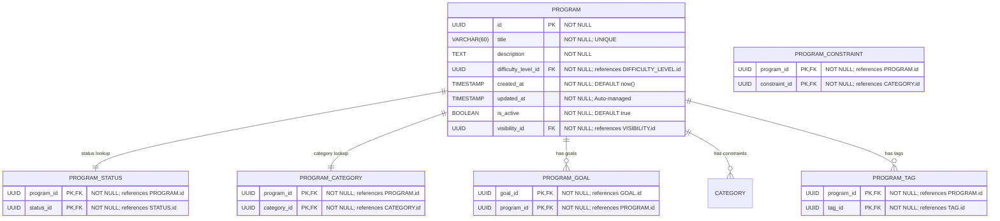

# Core “Program” Definition & Classification

**Section:** Program
**Subsection:** Core “Program” Definition & Classification

## Diagram

## Notes

This diagram represents the core “program” definition & classification structure and relationships within the program domain.

---
*Generated from diagram extraction script*
