# Enums

**Section:** Program
**Subsection:** Enums

## Diagram

```mermaid
erDiagram
  %%========================
  %% 1) Core Lookup Tables
  %%========================

  TAG {
    UUID id PK
    ENUM name    "UNIQUE"
    ENUM type    "e.g. EXPRESS, SKILL, DYNAMIC, HARD"
  }

  CATEGORY {
    UUID id PK
    ENUM name    "UNIQUE"
    ENUM type    "e.g. EXERCISE, PROGRAM, EQUIPMENT"
  }

  STATUS {
    UUID id PK
    VARCHAR name "UNIQUE"
    VARCHAR type "PUBLISHING, SEVERITY, LOG_LEVEL, COMPLETION"
  }

  METRIC {
    UUID id PK
    ENUM name "UNIQUE"
    ENUM type    "UNIT, PROGRESSION, DIFFICULTY"
  }
  
  VISIBILITY {
	  UUID id PK
	  ENUM name "UNIQUE; Default: PRIVATE, SHARED, PUBLIC, INSTITUTION, INSTITUTION_DEPARTMENT, INSTITUTION_MEMBER, INSTITUTION_CUSTOMER, CUSTOMER_SHARED, GROUP_BASED, ROLE_BASED, INTERNAL, SYSTEM"
	  ENUM ressource "NOT NULL; UNIQUE; EXERCISE, WORKOUT, PROGRAM, INSTITUTION, etc."
    TEXT description "NULLABLE; what this level of visibility means"
  }
 
  %%====================================
  %% 2) STATUS‐Subclass: Log/Severity Pair
  %%====================================

  LOG_LEVEL_STATUS {
    UUID id PK
    UUID log_level_id FK  "NOT NULL; references STATUS.id"
    UUID severity_id FK   "NOT NULL; references STATUS.id"
  }

  %%================================================================
  %% 3) METRIC‐Subtypes (each “points back” to METRIC.id as a child)
  %%================================================================

  MEASUREMENT_UNIT {
    UUID id PK
    UUID metric_id FK     "NOT NULL; references METRIC.id"
  }

  PROGRESSION_METRIC {
    UUID id PK
    UUID metric_id FK     "NOT NULL; references METRIC.id"
  }

  DIFFICULTY_LEVEL {
    UUID id PK
    UUID metric_id FK     "NOT NULL; references METRIC.id"
  }

  %%============================
  %% 4) Relationships Declaration
  %%============================

  %%— METRIC → its subtypes
  METRIC ||--o{ MEASUREMENT_UNIT   : "has units"
  METRIC ||--o{ PROGRESSION_METRIC  : "tracks progression"
  METRIC ||--o{ DIFFICULTY_LEVEL    : "defines difficulty"

  %%— LOG_LEVEL_STATUS → STATUS (two roles)
  LOG_LEVEL_STATUS }|--|| STATUS    : "log_level"
  LOG_LEVEL_STATUS }|--|| STATUS    : "severity"

```

## Notes

This diagram represents the enums structure and relationships within the program domain.

---
*Generated from diagram extraction script*
