# Equipment

**Section:** Program
**Subsection:** Equipment

## Diagram

```mermaid
erDiagram

  %% ===================================
  %% 1) Core Equipment Table
  %% ===================================

  EQUIPMENT {
    UUID id PK                       "NOT NULL; UNIQUE"
    VARCHAR name                     "NOT NULL; UNIQUE"
    TEXT description                 "NULLABLE"
    TIMESTAMP created_at             "NOT NULL; DEFAULT now()"
    TIMESTAMP updated_at             "NOT NULL"
    BOOLEAN is_active                "NOT NULL; DEFAULT true"
    UUID visibility_id FK               "NOT NULL; references VISIBILITY.id"
  }

  %% ===================================
  %% 2) Classification Tables
  %% ===================================

  EQUIPMENT_CATEGORY {
    UUID equipment_id PK, FK         "NOT NULL; references EQUIPMENT.id"
    UUID category_id PK              "NOT NULL; references CATEGORY.id"
  }

  EQUIPMENT_TAG {
    UUID equipment_id PK, FK         "NOT NULL; references EQUIPMENT.id"
    UUID tag_id PK                   "NOT NULL; references TAG.id"
  }

  %% ===================================
  %% 3) Media Association
  %% ===================================

  EQUIPMENT_MEDIA {
    UUID id PK                       "NOT NULL; UNIQUE"
    UUID equipment_id FK             "NOT NULL; references EQUIPMENT.id"
    UUID media_id FK                 "NOT NULL; references MEDIA.id"
    TIMESTAMP added_at               "NOT NULL; DEFAULT now()"
  }

  %% ===================================
  %% 4) Internal Relationships
  %% ===================================

  EQUIPMENT        ||--o{ EQUIPMENT_CATEGORY : "categorized by"
  EQUIPMENT        ||--o{ EQUIPMENT_TAG      : "tagged with"
  EQUIPMENT        ||--o{ EQUIPMENT_MEDIA    : "has media"

  %% ===================================
  %% 5) External Lookups
  %% ===================================

  EQUIPMENT_CATEGORY }|--|| CATEGORY   : "category lookup"
  EQUIPMENT_TAG      }|--|| TAG        : "tag lookup"
  EQUIPMENT_MEDIA    }|--|| MEDIA      : "media lookup"

```

## Notes

This diagram represents the equipment structure and relationships within the program domain.

---
*Generated from diagram extraction script*
