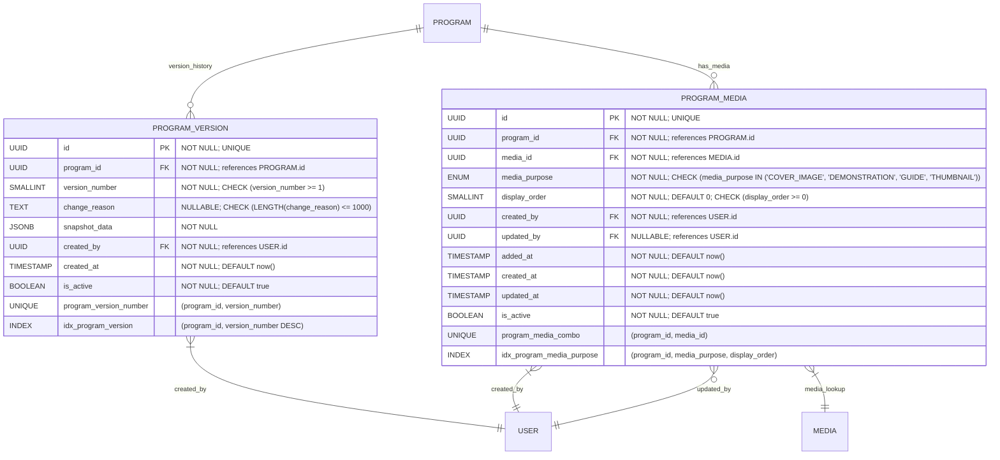

# Program Extensions & Media
**Domain:** Program
**Layer:** Extensions

```mermaid
erDiagram
  PROGRAM_VERSION {
    UUID id PK                        "NOT NULL; UNIQUE"
    UUID program_id FK                "NOT NULL; references PROGRAM.id"
    SMALLINT version_number           "NOT NULL; CHECK (version_number >= 1)"
    TEXT change_reason                "NULLABLE; CHECK (LENGTH(change_reason) <= 1000)"
    JSONB snapshot_data               "NOT NULL"
    UUID created_by FK                "NOT NULL; references USER.id"
    TIMESTAMP created_at              "NOT NULL; DEFAULT now()"
    BOOLEAN is_active                 "NOT NULL; DEFAULT true"
    UNIQUE program_version_number     "(program_id, version_number)"
    INDEX idx_program_version         "(program_id, version_number DESC)"
  }
  
  PROGRAM_MEDIA {
    UUID id PK                        "NOT NULL; UNIQUE"
    UUID program_id FK                "NOT NULL; references PROGRAM.id"
    UUID media_id FK                  "NOT NULL; references MEDIA.id"
    ENUM media_purpose                "NOT NULL; CHECK (media_purpose IN ('COVER_IMAGE', 'DEMONSTRATION', 'GUIDE', 'THUMBNAIL'))"
    SMALLINT display_order            "NOT NULL; DEFAULT 0; CHECK (display_order >= 0)"
    UUID created_by FK                "NOT NULL; references USER.id"
    UUID updated_by FK                "NULLABLE; references USER.id"
    TIMESTAMP added_at                "NOT NULL; DEFAULT now()"
    TIMESTAMP created_at              "NOT NULL; DEFAULT now()"
    TIMESTAMP updated_at              "NOT NULL; DEFAULT now()"
    BOOLEAN is_active                 "NOT NULL; DEFAULT true"
    UNIQUE program_media_combo        "(program_id, media_id)"
    INDEX idx_program_media_purpose   "(program_id, media_purpose, display_order)"
  }

  PROGRAM ||--o{ PROGRAM_VERSION : "version_history"
  PROGRAM ||--o{ PROGRAM_MEDIA : "has_media"
  PROGRAM_MEDIA }|--|| MEDIA : "media_lookup"
  PROGRAM_VERSION }|--|| USER : "created_by"
  PROGRAM_MEDIA }|--|| USER : "created_by"
  PROGRAM_MEDIA }o--|| USER : "updated_by"
```

