# Permission

**Section:** Program
**Subsection:** Permission

## Diagram

```mermaid
erDiagram

  %%========================================
  %% 1) CORE ENTITIES & HIERARCHIES
  %%========================================

  ROLE {
    UUID id PK                       "NOT NULL; UNIQUE"
    VARCHAR name                     "NOT NULL; UNIQUE"
    ENUM type                        "NOT NULL; values: ADMIN, GUEST, TRAINER, PHYSIOTHERAPIST, etc."
    UUID parent_role FK              "NULLABLE; self‐reference; DEFAULT NULL"
  }

  PERMISSION_GROUP {
    UUID id PK                       "NOT NULL; UNIQUE"
    VARCHAR name                     "NOT NULL; UNIQUE"
    TEXT description                 "NULLABLE"
  }

  PERMISSION {
    UUID id PK                       "NOT NULL; UNIQUE"
    VARCHAR name                     "NOT NULL; UNIQUE; e.g., USER.WORKOUT.CREATE"
    TEXT description                 "NULLABLE"
    UUID group_id FK                 "NULLABLE; references PERMISSION_GROUP.id"
    VARCHAR actor                    "NOT NULL; e.g., USER, GUEST"
    VARCHAR resource                 "NOT NULL; e.g., WORKOUT, PROGRAM, MEDIA, EXERCISE, EQUIPMENT"
    VARCHAR action                   "NOT NULL; e.g., CREATE, SEE_OWN, SEE_INSTITUTION, SEE_PUBLIC, UPDATE, DELETE, SHARE, ARCHIVE, etc."
    VARCHAR scope                    "NULLABLE; e.g., OWN, INSTITUTION, PUBLIC, RESOURCE_ID"
    BOOLEAN is_global                "DEFAULT FALSE; distinguishes platform‐wide vs scoped permission"
  }

  ROLE_PERMISSION {
    UUID role_id PK,FK               "NOT NULL; references ROLE.id"
    UUID permission_id PK,FK         "NOT NULL; references PERMISSION.id"
    TIMESTAMP assigned_at            "NOT NULL; DEFAULT now()"
  }

  POLICY {
    UUID id PK                       "NOT NULL; UNIQUE"
    VARCHAR name                     "NOT NULL; UNIQUE"
    TEXT description                 "NULLABLE"
  }

  POLICY_ASSIGNMENT {
    UUID id PK                       "NOT NULL; UNIQUE"
    UUID policy_id FK                "NOT NULL; references POLICY.id"
    UUID target_id                   "NOT NULL; references either ROLE.id or PERMISSION.id"
    ENUM target_type                 "NOT NULL; values: ROLE, PERMISSION"
    TIMESTAMP assigned_at            "NOT NULL; DEFAULT now()"
  }
  
%%========================================
%% 2) VISIBILITY SYSTEM
%%========================================

VISIBILITY {
  UUID id PK                          "NOT NULL; UNIQUE"
  ENUM name                           "NOT NULL; UNIQUE; PRIVATE, SHARED, PUBLIC, etc."
  ENUM resource                       "NOT NULL; e.g. WORKOUT, PROGRAM, EXERCISE"
  TEXT description                    "NULLABLE; explains the visibility level"
}

VISIBILITY_POLICY {
  UUID id PK                          "NOT NULL; UNIQUE"
  UUID visibility_id FK               "NOT NULL; references VISIBILITY.id"
  UUID permission_id FK               "NOT NULL; required permission to access this visibility"
  UUID institution_id FK              "NULLABLE; NULL = global"
  UUID role_id FK                     "NULLABLE; overrides visibility per role"
  BOOLEAN allow_guest                 "DEFAULT FALSE; true = guest allowed"
  BOOLEAN is_default                  "DEFAULT FALSE; marks default policy per resource"
  TEXT notes                          "NULLABLE"
}

  %%========================================
  %% 3) RELATIONSHIPS (Core Only)
  %%========================================

  %% Role ↔ Permission
  ROLE               ||--o{ ROLE_PERMISSION      : "has_permissions"
  PERMISSION         ||--o{ ROLE_PERMISSION      : "assigned_to_roles"

  %% Permission grouping
  PERMISSION_GROUP   ||--o{ PERMISSION           : "contains"

  %% Role hierarchy
  ROLE               ||--o{ ROLE                 : "parent_of"

  %% Global Policy assignments
  POLICY             ||--o{ POLICY_ASSIGNMENT    : "applies_to"

%% Relationship
VISIBILITY       ||--o{ VISIBILITY_POLICY           : "controlled_by_policy"
PERMISSION       ||--o{ VISIBILITY_POLICY           : "maps_to_permission"
INSTITUTION      ||--o{ VISIBILITY_POLICY           : "institution_scoped_policy"
ROLE             ||--o{ VISIBILITY_POLICY           : "role_override"

%% Resources → VISIBILITY
WORKOUT          }o--|| VISIBILITY                  : "has_visibility"
PROGRAM          }o--|| VISIBILITY                  : "has_visibility"
EXERCISE         }o--|| VISIBILITY                  : "has_visibility"
MEDIA            }o--|| VISIBILITY                  : "has_visibility"
EQUIPMENT        }o--|| VISIBILITY                  : "has_visibility"

```

## Notes

This diagram represents the permission structure and relationships within the program domain.

---
*Generated from diagram extraction script*
