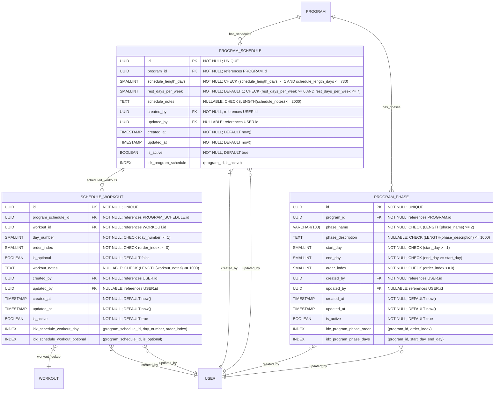

# Program Schedule & Workout Composition
**Domain:** Program
**Layer:** Composition

```mermaid
erDiagram
  PROGRAM_SCHEDULE {
    UUID id PK                        "NOT NULL; UNIQUE"
    UUID program_id FK                "NOT NULL; references PROGRAM.id"
    SMALLINT schedule_length_days     "NOT NULL; CHECK (schedule_length_days >= 1 AND schedule_length_days <= 730)"
    SMALLINT rest_days_per_week       "NOT NULL; DEFAULT 1; CHECK (rest_days_per_week >= 0 AND rest_days_per_week <= 7)"
    TEXT schedule_notes               "NULLABLE; CHECK (LENGTH(schedule_notes) <= 2000)"
    UUID created_by FK                "NOT NULL; references USER.id"
    UUID updated_by FK                "NULLABLE; references USER.id"
    TIMESTAMP created_at              "NOT NULL; DEFAULT now()"
    TIMESTAMP updated_at              "NOT NULL; DEFAULT now()"
    BOOLEAN is_active                 "NOT NULL; DEFAULT true"
    INDEX idx_program_schedule        "(program_id, is_active)"
  }
  
  SCHEDULE_WORKOUT {
    UUID id PK                        "NOT NULL; UNIQUE"
    UUID program_schedule_id FK       "NOT NULL; references PROGRAM_SCHEDULE.id"
    UUID workout_id FK                "NOT NULL; references WORKOUT.id"
    SMALLINT day_number               "NOT NULL; CHECK (day_number >= 1)"
    SMALLINT order_index              "NOT NULL; CHECK (order_index >= 0)"
    BOOLEAN is_optional               "NOT NULL; DEFAULT false"
    TEXT workout_notes                "NULLABLE; CHECK (LENGTH(workout_notes) <= 1000)"
    UUID created_by FK                "NOT NULL; references USER.id"
    UUID updated_by FK                "NULLABLE; references USER.id"
    TIMESTAMP created_at              "NOT NULL; DEFAULT now()"
    TIMESTAMP updated_at              "NOT NULL; DEFAULT now()"
    BOOLEAN is_active                 "NOT NULL; DEFAULT true"
    INDEX idx_schedule_workout_day    "(program_schedule_id, day_number, order_index)"
    INDEX idx_schedule_workout_optional "(program_schedule_id, is_optional)"
  }
  
  PROGRAM_PHASE {
    UUID id PK                        "NOT NULL; UNIQUE"
    UUID program_id FK                "NOT NULL; references PROGRAM.id"
    VARCHAR(100) phase_name           "NOT NULL; CHECK (LENGTH(phase_name) >= 2)"
    TEXT phase_description            "NULLABLE; CHECK (LENGTH(phase_description) <= 1000)"
    SMALLINT start_day                "NOT NULL; CHECK (start_day >= 1)"
    SMALLINT end_day                  "NOT NULL; CHECK (end_day >= start_day)"
    SMALLINT order_index              "NOT NULL; CHECK (order_index >= 0)"
    UUID created_by FK                "NOT NULL; references USER.id"
    UUID updated_by FK                "NULLABLE; references USER.id"
    TIMESTAMP created_at              "NOT NULL; DEFAULT now()"
    TIMESTAMP updated_at              "NOT NULL; DEFAULT now()"
    BOOLEAN is_active                 "NOT NULL; DEFAULT true"
    INDEX idx_program_phase_order     "(program_id, order_index)"
    INDEX idx_program_phase_days      "(program_id, start_day, end_day)"
  }

  PROGRAM ||--o{ PROGRAM_SCHEDULE : "has_schedules"
  PROGRAM ||--o{ PROGRAM_PHASE : "has_phases"
  PROGRAM_SCHEDULE ||--o{ SCHEDULE_WORKOUT : "scheduled_workouts"
  SCHEDULE_WORKOUT }|--|| WORKOUT : "workout_lookup"
  PROGRAM_SCHEDULE }|--|| USER : "created_by"
  PROGRAM_SCHEDULE }o--|| USER : "updated_by"
  SCHEDULE_WORKOUT }|--|| USER : "created_by"
  SCHEDULE_WORKOUT }o--|| USER : "updated_by"
  PROGRAM_PHASE }|--|| USER : "created_by"
  PROGRAM_PHASE }o--|| USER : "updated_by"
```

