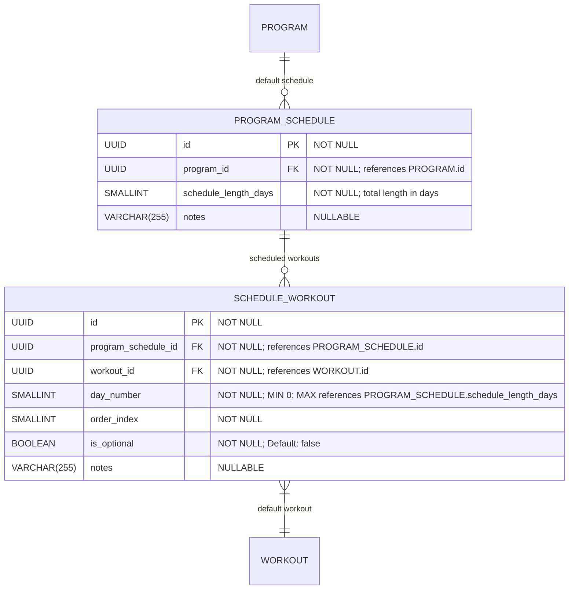

# Schedule & Workout Composition

**Section:** Program
**Subsection:** Schedule & Workout Composition

## Diagram

## Notes

This diagram represents the schedule & workout composition structure and relationships within the program domain.

---
*Generated from diagram extraction script*
