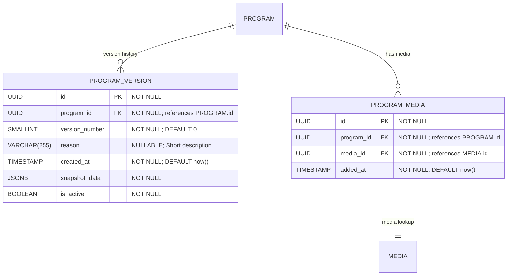

# Versions, Media & Extensions

**Section:** Program
**Subsection:** Versions, Media & Extensions

## Diagram

## Notes

This diagram represents the versions, media & extensions structure and relationships within the program domain.

---
*Generated from diagram extraction script*
