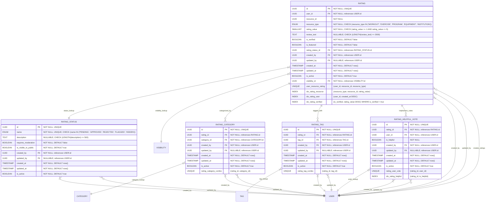

# Rating & Review System
**Domain:** Rating
**Layer:** Core

```mermaid
erDiagram
  RATING {
    UUID id PK                        "NOT NULL; UNIQUE"
    UUID user_id FK                   "NOT NULL; references USER.id"
    UUID resource_id                  "NOT NULL"
    ENUM resource_type                "NOT NULL; CHECK (resource_type IN ('WORKOUT', 'EXERCISE', 'PROGRAM', 'EQUIPMENT', 'INSTITUTION'))"
    SMALLINT rating_value             "NOT NULL; CHECK (rating_value >= 1 AND rating_value <= 5)"
    TEXT review_text                  "NULLABLE; CHECK (LENGTH(review_text) <= 2000)"
    BOOLEAN is_verified               "NOT NULL; DEFAULT false"
    BOOLEAN is_featured               "NOT NULL; DEFAULT false"
    UUID rating_status_id FK          "NOT NULL; references RATING_STATUS.id"
    UUID created_by FK                "NOT NULL; references USER.id"
    UUID updated_by FK                "NULLABLE; references USER.id"
    TIMESTAMP created_at              "NOT NULL; DEFAULT now()"
    TIMESTAMP updated_at              "NOT NULL; DEFAULT now()"
    BOOLEAN is_active                 "NOT NULL; DEFAULT true"
    UUID visibility_id FK             "NOT NULL; references VISIBILITY.id"
    UNIQUE user_resource_rating       "(user_id, resource_id, resource_type)"
    INDEX idx_rating_resource         "(resource_type, resource_id, rating_value)"
    INDEX idx_rating_user             "(user_id, created_at DESC)"
    INDEX idx_rating_verified         "(is_verified, rating_value DESC) WHERE is_verified = true"
  }
  
  RATING_STATUS {
    UUID id PK                        "NOT NULL; UNIQUE"
    ENUM name                         "NOT NULL; UNIQUE; CHECK (name IN ('PENDING', 'APPROVED', 'REJECTED', 'FLAGGED', 'HIDDEN'))"
    TEXT description                  "NULLABLE; CHECK (LENGTH(description) <= 500)"
    BOOLEAN requires_moderation       "NOT NULL; DEFAULT false"
    BOOLEAN is_visible_to_public      "NOT NULL; DEFAULT true"
    UUID created_by FK                "NOT NULL; references USER.id"
    UUID updated_by FK                "NULLABLE; references USER.id"
    TIMESTAMP created_at              "NOT NULL; DEFAULT now()"
    TIMESTAMP updated_at              "NOT NULL; DEFAULT now()"
    BOOLEAN is_active                 "NOT NULL; DEFAULT true"
  }
  
  RATING_CATEGORY {
    UUID id PK                        "NOT NULL; UNIQUE"
    UUID rating_id FK                 "NOT NULL; references RATING.id"
    UUID category_id FK               "NOT NULL; references CATEGORY.id"
    UUID created_by FK                "NOT NULL; references USER.id"
    UUID updated_by FK                "NULLABLE; references USER.id"
    TIMESTAMP created_at              "NOT NULL; DEFAULT now()"
    TIMESTAMP updated_at              "NOT NULL; DEFAULT now()"
    BOOLEAN is_active                 "NOT NULL; DEFAULT true"
    UNIQUE rating_category_combo      "(rating_id, category_id)"
  }
  
  RATING_TAG {
    UUID id PK                        "NOT NULL; UNIQUE"
    UUID rating_id FK                 "NOT NULL; references RATING.id"
    UUID tag_id FK                    "NOT NULL; references TAG.id"
    UUID created_by FK                "NOT NULL; references USER.id"
    UUID updated_by FK                "NULLABLE; references USER.id"
    TIMESTAMP created_at              "NOT NULL; DEFAULT now()"
    TIMESTAMP updated_at              "NOT NULL; DEFAULT now()"
    BOOLEAN is_active                 "NOT NULL; DEFAULT true"
    UNIQUE rating_tag_combo           "(rating_id, tag_id)"
  }
  
  RATING_HELPFUL_VOTE {
    UUID id PK                        "NOT NULL; UNIQUE"
    UUID rating_id FK                 "NOT NULL; references RATING.id"
    UUID user_id FK                   "NOT NULL; references USER.id"
    BOOLEAN is_helpful                "NOT NULL"
    UUID created_by FK                "NOT NULL; references USER.id"
    UUID updated_by FK                "NULLABLE; references USER.id"
    TIMESTAMP created_at              "NOT NULL; DEFAULT now()"
    TIMESTAMP updated_at              "NOT NULL; DEFAULT now()"
    BOOLEAN is_active                 "NOT NULL; DEFAULT true"
    UNIQUE rating_user_vote           "(rating_id, user_id)"
    INDEX idx_rating_helpful          "(rating_id, is_helpful)"
  }

  USER ||--o{ RATING : "creates_ratings"
  RATING }|--|| RATING_STATUS : "status_lookup"
  RATING }|--|| VISIBILITY : "visibility_lookup"
  RATING ||--o{ RATING_CATEGORY : "categorized_by"
  RATING ||--o{ RATING_TAG : "tagged_with"
  RATING ||--o{ RATING_HELPFUL_VOTE : "helpfulness_votes"
  RATING_CATEGORY }|--|| CATEGORY : "category_lookup"
  RATING_TAG }|--|| TAG : "tag_lookup"
  RATING_HELPFUL_VOTE }|--|| USER : "voter_lookup"
  RATING }|--|| USER : "created_by"
  RATING }o--|| USER : "updated_by"
  RATING_STATUS }|--|| USER : "created_by"
  RATING_STATUS }o--|| USER : "updated_by"
  RATING_CATEGORY }|--|| USER : "created_by"
  RATING_CATEGORY }o--|| USER : "updated_by"
  RATING_TAG }|--|| USER : "created_by"
  RATING_TAG }o--|| USER : "updated_by"
  RATING_HELPFUL_VOTE }|--|| USER : "created_by"
  RATING_HELPFUL_VOTE }o--|| USER : "updated_by"
```

